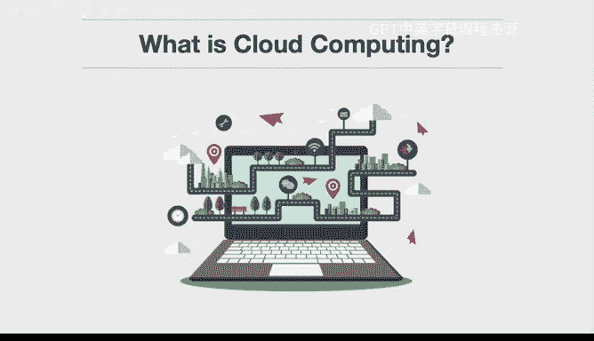
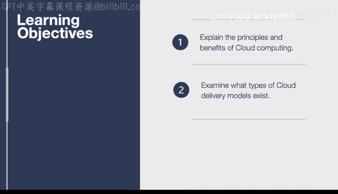
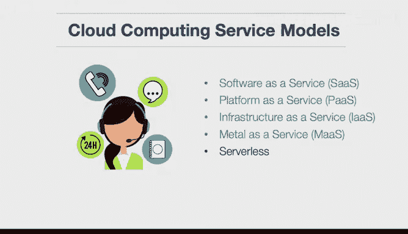

# 构建大规模云计算解决方案：1-2：云计算介绍 ☁️

在本节课中，我们将学习云计算的核心能力，并了解它与传统计算的区别。

## 概述

我们将首先探讨云计算的定义及其核心特征。接着，我们会详细介绍不同类型的云交付模型。通过本节内容，你将理解云计算的基本概念及其服务模式。

## 什么是云计算？

云计算是一种通过互联网按需提供计算资源（如服务器、存储、数据库、网络、软件等）的服务模式。它的核心在于按需自助服务、广泛的网络访问、资源池化、快速弹性以及可度量的服务。

## 云计算的核心特征

上一节我们定义了云计算，本节中我们来看看它的五个核心特征。

以下是云计算的五个核心特征：

1.  **按需自助服务**：用户可以根据需要，无需与服务提供商人工交互，自动配置计算资源。
2.  **广泛的网络访问**：功能通过网络提供，并通过标准机制访问，支持各种客户端设备。
3.  **资源池化**：提供商的计算资源被集中起来，通过多租户模式服务多个用户，根据用户需求动态分配和再分配物理和虚拟资源。
4.  **快速弹性**：资源可以快速、弹性地供应和释放，对于用户而言，可供应的资源近乎无限，并可在任何时间购买任何数量。
5.  **可度量的服务**：云系统通过利用适用于服务类型的某种抽象级别的计量能力，自动控制和优化资源使用。资源使用情况可被监控、控制和报告，为提供商和用户提供透明度。

## 云计算服务模型

理解了核心特征后，我们来看看云计算是如何通过不同的服务模型交付给用户的。这些模型定义了用户管理和控制的范围。

以下是几种重要的云计算服务模型：

*   **软件即服务**：指可以“租用”的软件，并将其集成到自己的基础设施中。例如电子商务系统、薪资系统或监控系统。用户无需编写该软件，只需支付费用即可使用。
    *   **公式/代码示例**：`SaaS = 租用的应用软件`
*   **平台即服务**：这是一个高级抽象层，允许软件开发团队只专注于业务逻辑，而基础设施提供商负责将其部署到生产环境的其余工作。
    *   **公式/代码示例**：`PaaS = 开发平台 + 托管环境`
*   **基础设施即服务**：这很像大型仓储式商店，你可以批量获取资源（如虚拟机、存储、网络），但仍需负责配置和整合所有这些设备。
    *   **公式/代码示例**：`IaaS = 虚拟化的计算、存储、网络资源`
*   **裸机即服务**：这是一个较新的术语，意味着许多云范式可以应用于物理硬件。这适用于需要处理特殊情况的场景，如GPU编程或大型存储系统。
    *   **公式/代码示例**：`Bare-Metal-as-a-Service = 专用的物理服务器`
*   **无服务器计算**：这是较新的服务模型之一。“无服务器”指的是完全无需担心底层基础设施。它与平台即服务有许多相似之处和重叠。一个著名的例子是AWS Lambda，本质上是一个可以放入云中的函数，你可以将事件映射到它来执行。
    *   **公式/代码示例**：`Serverless = 事件驱动的函数执行 (例如：AWS Lambda)`

## 总结

本节课中，我们一起学习了云计算的基本概念。我们首先定义了云计算，然后分析了其按需自助、广泛访问、资源池化、快速弹性和可度量服务这五个核心特征。最后，我们探讨了从软件即服务到无服务器计算等多种云服务模型，了解了每种模型为用户提供的不同抽象级别和管理责任。理解这些基础是构建大规模云解决方案的第一步。