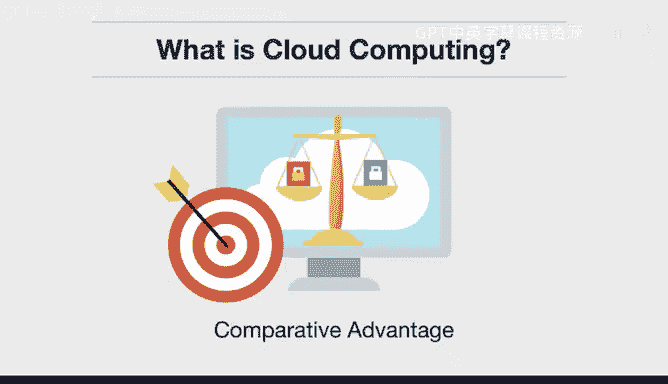

# 构建大规模云计算解决方案：1-2：什么是云计算 ☁️

在本节课中，我们将要学习云计算的核心概念。我们将探讨其四个关键特征，这些特征共同定义了云计算的本质，并使其成为现代技术基础设施的基石。

## 概述

云计算是什么？这是一个至关重要的问题。我们将避免使用大量术语，而是聚焦于四个核心特征：近乎无限的计算能力、消除前期成本、按使用付费的效用模型以及比较优势理论。理解这些特征，是掌握云计算价值的基础。

## 近乎无限的计算能力 💾

上一节我们概述了云计算的四个特征，本节中我们首先来看看第一个，也是最重要的概念：近乎无限的计算能力。

你的个人笔记本电脑无法存储PB级的数据。即使是企业自有的物理数据中心，要处理PB级数据也会面临挑战。但在云环境中，你拥有近乎无限的存储、近乎无限的计算能力和近乎无限的CPU资源。我们可以将其概括为：

**资源 = CPU + 存储 + 内存**

这个概念是云计算如此强大的根本原因。许多机制，例如一个消息队列系统，其处理能力可以远超你所能发送的流量上限。

## 消除前期成本 💰

了解了无限的计算资源后，我们来看看第二个特征：消除前期成本。

这对于初创公司尤其关键。如果你希望从一开始就构建一个全球规模的基础设施，你无需亲自处理。云服务已经为你搭建好了这个平台，你直接消除了构建全球基础设施的需求。通过使用云计算，你正在利用现成的可用资源。这一点非常重要，我们今天使用的许多服务和产品，如果没有这种消除前期成本的能力，可能根本无法被创造出来。

## 按使用付费的效用模型 ⚡

在消除了资本支出的障碍后，云计算的消费模式也与众不同。接下来我们探讨第三个特征：按使用付费的效用模型。

这就像家中的温控器。如果你将其设置为68华氏度以实现节能，在夏天使用空调时，你就不会支付过高的电费。云计算同理。如果你低效地使用资源，你将支付高昂的费用；但如果你高效地使用，它就更像一种公用事业。最擅长使用云计算的公司正是这样做的：将云资源视为可按需调节、按量付费的效用。

以下是实现高效使用的关键原则：
*   **弹性伸缩**：根据负载自动增加或减少资源。
*   **资源优化**：选择最适合工作负载的实例类型。
*   **监控与成本分析**：持续跟踪支出并识别浪费。

## 专注于核心业务的比较优势 🎯

最后，另一个关键组成部分是比较优势。这是微观经济学中的一个核心概念，指的是专注于你最擅长的事情，而将其他事情交给更专业的人。

一个很好的例子是迈克尔·乔丹。当他在芝加哥公牛队训练时，他应该花时间去修剪草坪，还是应该花钱请人来做？显然，他为公牛队打球赚的钱远多于修剪草坪。因此，他应该专注于篮球。

云计算也遵循类似的概念。如果你的公司专注于软件即服务或构建应用程序，那么你无需担心亲自驱车前往数据中心、安装硬件等事务。许多这类场景都会消失，你可以专注于你最擅长的事情——创造产品价值。

## 总结

本节课中，我们一起学习了云计算的四个核心特征：
1.  **近乎无限的计算能力**：提供可弹性扩展的CPU、内存和存储资源。
2.  **消除前期成本**：无需大量资本投入即可使用世界级的基础设施。
3.  **按使用付费的效用模型**：像使用水电一样，为实际消耗的资源付费。
4.  **比较优势**：让企业能够专注于自身核心业务，而将基础设施的复杂性交给云提供商。

理解这些特征，是有效利用云计算构建可扩展、高效且经济解决方案的第一步。