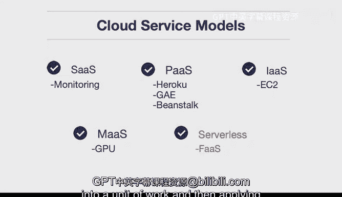

# 杜克大学《构建大规模云计算解决方案（基础、虚拟化，1-2课／共4课Building Cloud Computing Solutions at Scale》 - P38：38_04_04_云计算服务模型.zh_en - GPT中英字幕课程资源 - BV1oT421k7YQ

There are many different types of cloud service models。

 let's go through these step by step first there's software as a service。

A good example of this would be Gmail where you don't have to host your own web server that handles the mail and provide it to clients。

 you can sign up for an account and get that service There's other really common formats for softwares or service though and these often take the place of things like monitoring a good example of this would be you know for example。

 Splunk or datadog or any of these you know large scale IPO companies they build services so that you don't have to provide those services to your company。

Next up another example of a cloud service model is platform as a service Now platform as a service is about abstracting away the infrastructure so the application developer can focus on building applications good example of this would be Heroku that's been a really common platform as a service that's been around for a long time Google has GAE or Google App engine Amazon itself has something called Beanstock there's many examples of this and the core idea is that you as a developer decide to pay a little bit more and they the cloud provider will manage everything for you so this is almost like a full service gasoline fill up at a station versus doing it yourself infrastructure as a service is one of the most extensive offerings that you can get and what this means is that you can get things in bulk and the cost。

Is very low。 So a good example of this would be on Amazon they have EC2 so I can go through and rent a virtual machine and in fact。

 I can even bid on a virtual machine via spot instances and get let's say 10% of the cost of a typical virtual machine so it's a lot like Costco you go into a Costco and there could be 100 pounds of flour you wouldn't necessarily want that if you weren't let's say a restaurant but as a consumer if you needed to。

 you could go in there and buy this large quantity and and make it yourself and this would be very different than buying food that's already package or cooked for you so with infrastructure as a service you as the software engineer or cloud architect need to go through and spin up the virtual machines set up the networking layer but at a significant cost savings so if you have the skills in your organization this is really a tempting offering another newer。

Option here would be metal as a service and metal as a service what it provides is the ability to spin up and provision machines yourself and so with metal as a service you can actually physically control and these other options here a lot of these are actually more suited towards let's say virtualization and that's really a core component of most cloud computing but there are ways to physically control servers。

Why would you want to do this。 Well， a good example would be GPU。

 You may have a very specialized multi GPpU set up for。

 let's say machine learning or a specialized database。

 and you may want to control that physical hardware。 So that's another type of cloud offering。

 Finally， there's serverless which is in a way very similar to platform as a service with the one exception of it's really based around function。

 So you could also call serverless FA or function as a service。

And the reason for this is it's a different paradigm of developing software。

 a lot of it is around this piece of logic and this piece of logic you put it into the cloud somewhere and you hook it up to an event so it's maybe a little bit like having a light bulb in your garage how you could say I want that light bulb to turn on at night。

 but I also want that light bulb to open when the garage door opens and then also I want it to be able to be flipped on if I flip it on with a switch so a serverless is really a way of abstracting the business logic into a unit of work and then applying that the work wherever you need to。

