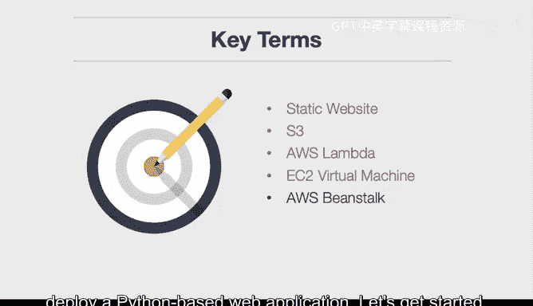

# 构建大规模云计算解决方案：1-2：构建多网站介绍 🚀

在本节课中，我们将学习如何在云环境中构建多种类型的网站。我们将涵盖静态网站、无服务器网站、虚拟化网站以及平台即服务（PaaS）网站。通过具体的AWS服务实践，你将理解每种方法的适用场景与核心概念。

上一节我们介绍了课程的整体目标，本节中我们来看看构建多网站的具体学习目标。

以下是本节课的学习目标：
*   在AWS S3上构建一个静态网站。
*   在AWS Lambda上构建一个无服务器网站。
*   在EC2虚拟机上构建一个网站。
*   使用AWS Beanstalk（PaaS）构建一个网站。

接下来，让我们逐一解析这些核心概念，以便更好地理解后续的实践操作。

**静态网站**是一个常见术语，它意味着你生成HTML文件，并将这些文件存放在类似Amazon S3的地方。这种方法的重要性在于，它消除了对中间服务器来渲染HTML的需求。这确实是现代开发Web应用，特别是内容管理类应用的主流方式。

**S3**是另一个关键术语，它代表对象存储，是亚马逊的对象存储系统，具有11个9的可靠性。这意味着其可靠性为99.999999999%，本质上每年可能只中断约一毫秒，这是S3的关键优势之一。

**AWS Lambda**是一项无服务器技术，允许你编写一个函数（我们将介绍Python版本）并将其与事件挂钩。这些事件可以是网站请求、来自队列的消息，或者是你需要处理的事件，例如一个文件被放入S3存储桶。

**EC2**代表虚拟机。亚马逊提供几种类型，一种是按需实例，价格稍高，但你可以随时启动虚拟机；另一种是竞价实例，允许你出价以获得更低价格，适合用于实验。

**AWS Beanstalk**是AWS提供的一项平台即服务产品。我们将结合Flask使用它来部署一个基于Python的Web应用。

现在，让我们开始实践。

本节课中我们一起学习了构建多种云网站的基础概念，包括静态网站、无服务器架构、虚拟机和平台即服务。我们明确了使用AWS S3、Lambda、EC2和Beanstalk这四项核心服务来实现这些网站类型的目标，为后续动手实践奠定了理论基础。