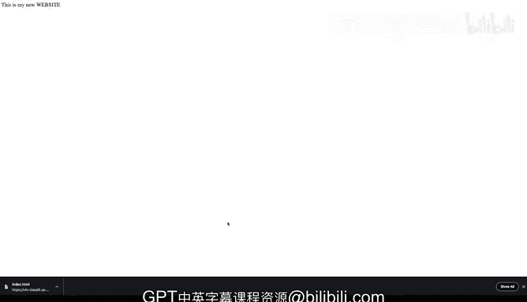

# 构建大规模云计算解决方案：1-2：在AWS上构建静态S3网站 🚀

在本节课中，我们将深入探索亚马逊S3服务，并学习如何利用它来构建一个静态网站。我们将通过将`index.html`文件放入一个S3桶中来实现这一目标。

## 概述

S3可以被理解为一个文件夹，而其中的文件则是对象。通过启用静态网站托管功能，这个对象就能转变为一个网站。我们将要使用的技巧，就是创建一个能在全球范围内访问、具备极高可用性的网站。其背后的可靠性高达“11个9”（即99.999999999%），这是因为对象在后台被存储为多个副本。此外，这是一项无服务器技术，意味着你无需管理任何服务器。

现在，让我们开始动手构建。

## 准备工作

为了创建一个静态托管的网站，我们只需要两样东西：一个`index.html`文件和一个配置了正确权限的S3桶。

首先，我们将在Cloud9环境中创建一个空的`index.html`文件。

以下是创建基本HTML文件的步骤：
1.  创建一个名为`index.html`的空文件。
2.  编辑该文件，添加HTML标签。
3.  在`<title>`标签中设置页面标题，例如“这是一个网站”。
4.  在`<body>`中添加一个段落，例如“这是我的新网站。我会把它做大。”

完成这些步骤后，我们就得到了一个可以托管的基本HTML文档。

## 创建并配置S3桶

上一节我们准备好了网站文件，本节中我们来看看如何创建和配置S3桶来托管它。

以下是创建和配置S3桶的步骤：
1.  在AWS控制台中导航到S3服务，点击“创建桶”。
2.  为桶设置一个**全局唯一**的名称，例如`hello-cloud-for-data`。
3.  为了创建公开网站，需要**启用所有公共访问**（请注意，仅在创建公共网站时这样做），并确认此更改。
4.  点击“创建桶”。

桶创建完成后，我们需要对其进行配置以启用网站托管功能。

以下是配置静态网站托管的步骤：
1.  在桶列表中，找到并点击你刚创建的桶。
2.  切换到“属性”选项卡。
3.  向下滚动到“静态网站托管”部分。
4.  选择“启用”选项。
5.  在“索引文档”字段中，输入你的主页文件名，即`index.html`。
6.  在“错误文档”字段中，可以输入一个错误页面文件名，例如`error.html`（可选）。
7.  点击“保存更改”。

## 设置桶策略

现在，我们需要为桶添加一个策略，以允许公众读取桶中的对象（即我们的网页文件）。

以下是添加桶策略的步骤：
1.  切换到桶的“权限”选项卡。
2.  向下滚动到“桶策略”部分，点击“编辑”。
3.  将以下策略代码粘贴到编辑器中。**请务必将 `Resource` 值中的 `your-bucket-name` 替换为你实际的桶名**。

```json
{
  "Version": "2012-10-27",
  "Statement": [
    {
      "Sid": "PublicReadGetObject",
      "Effect": "Allow",
      "Principal": "*",
      "Action": "s3:GetObject",
      "Resource": "arn:aws:s3:::your-bucket-name/*"
    }
  ]
}
```

4.  点击“保存更改”。此策略将允许世界上任何人读取该桶中的文件。

## 上传文件并测试

最后一步是将我们之前创建的`index.html`文件上传到S3桶中，并测试网站是否正常工作。

以下是上传和测试的步骤：
1.  从Cloud9环境下载`index.html`文件到本地。
2.  回到S3桶的“对象”选项卡。
3.  点击“上传”，选择并上传刚才下载的`index.html`文件。
4.  上传完成后，返回桶的“属性”选项卡。
5.  再次找到“静态网站托管”部分，此时你会看到一个“桶网站端点”的URL。
6.  点击这个URL链接，它将在新标签页中打开你的网站。

如果一切配置正确，你将看到你创建的HTML页面成功显示。

## 总结




本节课中我们一起学习了如何在AWS S3上构建一个静态网站。我们首先创建了一个简单的HTML文件，然后创建并配置了一个S3桶，包括启用静态网站托管和设置公开读取的桶策略，最后上传文件并通过生成的URL访问了网站。整个过程无需管理服务器，即可获得一个高可用、全球分布的网站。