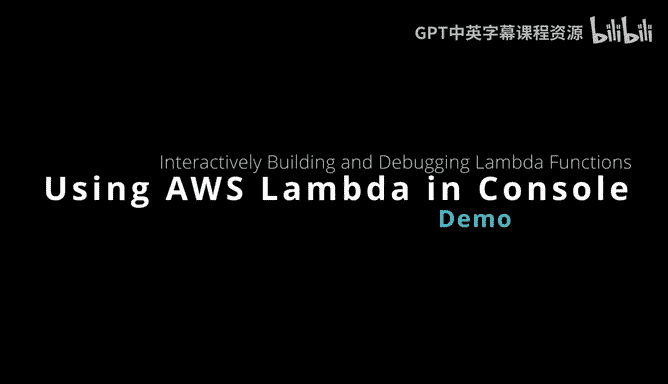
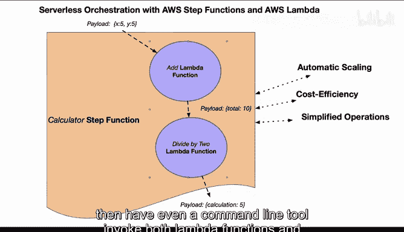

# 构建大规模云计算解决方案：1-2：使用AWS Lambda控制台构建Python Lambda函数 🚀



在本节课中，我们将学习如何在AWS Lambda控制台上快速构建和测试Python函数。我们将创建两个简单的Lambda函数：一个用于加法运算，另一个用于除法运算，并了解如何对它们进行部署和测试。

## 概述

我们将构建两个Lambda函数。第一个函数将接收两个数字 `x` 和 `y`，并返回它们的和。第二个函数将接收第一个函数返回的结果，并将其除以2。最终，我们可以通过无服务器编排工具（如Step Functions）将它们组合起来。本节课将专注于在AWS控制台中使用Python进行快速原型开发。

## 构建加法Lambda函数

首先，我们进入AWS Lambda控制台创建第一个函数。选择使用ARM架构以节省成本，并选择最新的Python 3.11运行时环境。

以下是创建函数的步骤：
1.  点击“创建函数”。
2.  选择“从头开始创作”。
3.  输入函数名称 `add`。
4.  选择运行时为 `Python 3.11`。
5.  在架构中选择 `ARM64`。
6.  点击“创建函数”。

创建完成后，我们进入代码编辑器编写函数逻辑。该函数将从事件（event）中提取 `x` 和 `y` 参数，计算它们的和，并以JSON格式返回结果。

```python
import json

def lambda_handler(event, context):
    # 从传入的事件中获取参数
    x = event['x']
    y = event['y']
    
    # 执行加法计算
    total = x + y
    
    # 构造并返回响应
    return {
        'statusCode': 200,
        'body': json.dumps({
            'total': total
        })
    }
```

编写代码后，点击“部署”按钮保存更改。接下来，我们需要配置一个测试事件来验证函数是否按预期工作。

## 测试加法函数

为了测试函数，我们需要创建一个测试事件来模拟输入。

以下是配置测试事件的步骤：
1.  点击“测试”选项卡。
2.  点击“创建新事件”。
3.  输入事件名称，例如 `addTest`。
4.  在JSON模板中，提供 `x` 和 `y` 的值。
    ```json
    {
      "x": 10,
      "y": 20
    }
    ```
5.  点击“保存”。

保存测试事件后，点击“测试”按钮执行函数。控制台将显示执行结果。如果代码正确，响应体（body）中应包含计算结果 `{"total": 30}`。如果遇到错误（例如缩进或语法问题），修正代码后重新部署并再次测试即可。

## 构建除法Lambda函数

成功创建并测试了加法函数后，接下来我们构建第二个函数。这个函数将接收一个包含 `total` 值的负载，并将其除以2。

我们返回函数列表页面，再次点击“创建函数”。重复之前的创建步骤，将函数命名为 `divideBy2`，运行时和架构选择保持不变。

创建完成后，在代码编辑器中输入以下逻辑：

```python
import json

def lambda_handler(event, context):
    # 解析传入事件中的负载
    # 注意：事件结构取决于调用方式，这里假设负载在body中
    body = json.loads(event['body'])
    input_total = body['total']
    
    # 执行除法计算
    result = input_total / 2
    
    # 构造并返回响应
    return {
        'statusCode': 200,
        'body': json.dumps({
            'calculated': result
        })
    }
```

同样，部署此函数后，我们需要为其创建一个测试事件。这次的事件负载需要模拟第一个函数的输出。

以下是配置除法函数测试事件的步骤：
1.  点击“测试”选项卡。
2.  创建新事件，命名为 `divideTest`。
3.  在JSON模板中，模拟第一个函数的返回结构。
    ```json
    {
      "body": "{\"total\": 30}"
    }
    ```
4.  点击“保存”并执行测试。

如果一切正常，测试结果将显示 `{"calculated": 15.0}`。这表明第二个函数能够正确接收并处理第一个函数的输出。

## 总结



本节课中，我们一起学习了如何在AWS Lambda控制台上使用Python构建和测试无服务器函数。我们创建了两个函数：一个执行加法（`add`），另一个执行除法（`divideBy2`）。我们了解了从创建函数、编写代码、部署到配置测试事件的完整流程。使用Python在控制台内进行原型开发非常快捷方便，适合快速验证想法。虽然对于长期运行的代码可能需要考虑其他语言（如Rust），但Python无疑是快速起步和测试的绝佳选择。在后续课程中，我们可以使用AWS Step Functions等编排服务将这些独立的函数连接起来，构建更复杂的工作流。