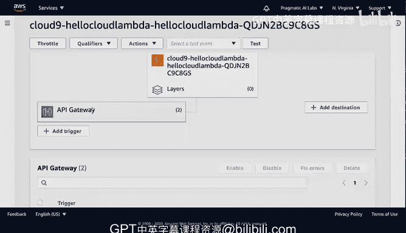

# 构建大规模云计算解决方案：P42：在AWS Lambda上构建无服务器网站 🚀

在本节课中，我们将学习如何使用AWS Lambda构建一个简单的无服务器网站。我们将创建一个Python函数，将其与HTTP触发器（API Gateway）连接，使其能够响应Web请求并返回HTML内容。

---

上一节我们介绍了无服务器计算的概念，本节中我们来看看如何具体实现一个基于AWS Lambda的网站。

AWS Lambda本质上是一个函数。它可以是Python或其他语言编写的函数。在本例中，我们将使用Python。这个Python函数会与一个触发器挂钩。触发器可以是任何能触发函数执行的事件。在本例中，我们将围绕Web构建触发器，即连接一个HTTP触发器。这意味着当我点击一个URL时，该请求会映射到这个函数并调用它。构建AWS Lambda函数就是如此简单。之后，如果我需要将此函数连接到其他类型的事件，例如S3文件上传事件或SQS队列消息，也可以进行配置。但总的来说，它只是一段逻辑代码，我将其挂接到一个事件上，然后就可以对外提供网站服务。现在，让我们开始构建。

我们将再次使用AWS Cloud9环境。我们可以在Cloud9环境中为Lambda构建解决方案。

以下是操作步骤：

1.  在Cloud9界面中，选择“AWS Resources”选项卡。
2.  找到并点击“创建新的Lambda函数”图标。
3.  在弹出的窗口中，填写函数名称和应用程序名称。例如，可以输入 `hello_cloud_lambda`。
4.  系统会自动填充应用程序名称。接着，选择运行时环境。Lambda支持多种运行时，Cloud9支持Node.js和Python。我们选择 **Python 3.6**。
5.  选择函数模板为“空的Python函数”。
6.  接下来配置触发器。由于我们要构建网站，因此选择 **API Gateway** 作为触发器。
7.  API Gateway会询问要映射的URL路径。我们输入根路径 `/`。
8.  出于简化目的，安全性选择“无”。我们只想提供一个非常基础的Web请求。
9.  无需配置特殊权限，因为它只是返回HTML。点击“完成”。

很好，现在我们已经完成了基本设置。系统会为我们在此项目中搭建好脚手架结构。你会看到它创建了整个项目结构，包括一个lambda函数文件、一个虚拟环境和其他文件。实际上，我们只需要修改Lambda函数本身（即处理器）。

在本例中，我们甚至不需要处理事件参数，只需构建返回原始HTML的逻辑。每当你获得这样的脚手架时，都可以将你的逻辑代码放入其中。

我将粘贴一段预先准备好的代码。请注意，我定义了一个变量 `content`，并在其中放入了一些HTML代码。我放置了一个HTML标签，并写入了“这是我的Lambda网站”段落。然后，我返回一个响应。响应的主体就是这个HTML内容。它返回状态码 **200**，表示Web服务成功获取了代码。在响应头中，我告诉Web浏览器我将提供HTML内容。这就是全部。

这与静态网站的区别在于，每次有人发起请求时，这个函数都会被调用。

现在我们已经设置好了代码，我将在本地运行它以进行测试。为此，我转到 `hello_cloud_lambda` 目录，右键点击并选择“运行” -> “在本地运行API Gateway”。这将允许我在本地环境中测试它。这是AWS Cloud9的一个关键优势。

注意，它填充了一个GET请求，这是从应用程序获取信息的一种方式。当我运行它时，它返回了我期望的结果，非常完美。

测试通过后，下一步是部署。我可以在这里右键点击项目，然后选择“部署”。这将把它部署到AWS控制台。我们继续操作。

部署完成后，我可以返回AWS控制台查看。你会看到它现在位于这个位置。这里需要指出的关键点是，它设置了API Gateway触发器。如果需要，我还可以通过选择相应图标来查看我的源代码，并进行编辑和修改。

但总的来说，主要需要关注的是这个API Gateway。如果我向下滚动并选择这个API端点，它将会响应我的HTML请求。让我们来试试看。

成功了！页面上显示了“这是我的Lambda网站”。

总而言之，构建此网站的关键组件是这个Lambda接口，以及我可以将其连接到API Gateway的能力。之后，我还可以添加不同的触发器，或者保留当前这个触发器。这是现代云计算的一项关键能力。

---

本节课中，我们一起学习了如何在AWS Lambda上构建无服务器网站。我们创建了一个Python函数，通过API Gateway配置了HTTP触发器，使其能够响应Web请求并返回动态HTML内容。这个过程展示了无服务器架构的简洁性和灵活性。