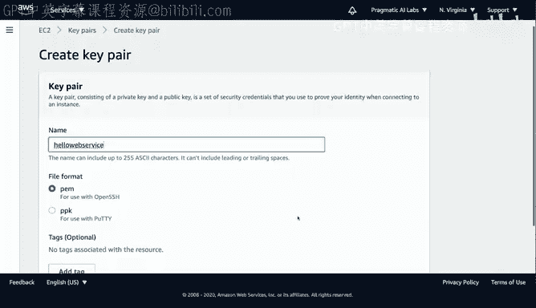
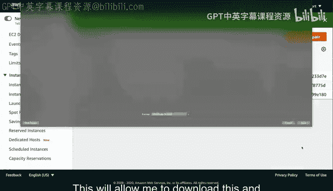

# 构建大规模云计算解决方案：1-2：在EC2虚拟机上构建网站 🚀

在本节中，我们将学习如何在EC2 Spot实例上构建一个简单的网页服务器。我们将从设置开发环境开始，逐步完成创建密钥对、配置安全组、启动Spot实例、安装Web服务器软件，并最终部署一个测试网页的全过程。通过这个实践，你将掌握在云端使用虚拟机快速搭建和测试Web应用原型的基本方法。

## 准备工作

上一节我们介绍了云计算的基本概念，本节中我们来看看如何具体操作。首先，我们需要完成几项准备工作，包括创建密钥对和配置安全组，以便安全地连接到即将启动的虚拟机。





以下是创建密钥对和安全组的步骤：

1.  **创建密钥对**：在AWS控制台中，导航至EC2服务，选择“密钥对”并点击“创建密钥对”。将其命名为 `hello-web-service`，保持默认设置并创建。下载生成的 `.pem` 私钥文件。
2.  **上传密钥对到Cloud9**：在Cloud9开发环境中，通过“文件”->“上传本地文件”功能，将下载的 `.pem` 文件上传至工作区。
3.  **创建安全组**：在EC2控制台中，导航至“安全组”并点击“创建安全组”。将其命名为 `hello-spot-web-service`，描述为“用于Spot Web服务”。
4.  **添加入站规则**：在新建的安全组中，添加两条入站规则：
    *   类型：`SSH`，端口：`22`，来源：`0.0.0.0/0`（允许所有IP进行SSH连接）。
    *   类型：`HTTP`，端口：`80`，来源：`0.0.0.0/0`（允许所有IP访问Web服务）。

## 启动Spot实例

准备工作完成后，我们现在可以启动一个EC2 Spot实例。Spot实例能提供显著的成本节约，非常适合用于原型开发和测试。

以下是启动Spot实例的步骤：

1.  在EC2控制台中，导航至“Spot请求”并点击“请求Spot实例”。
2.  选择一个合适的模板，例如“大数据工作负载”。
3.  将Amazon Machine Image (AMI) 更改为 **Amazon Linux 2**。
4.  在“密钥对”设置中，选择之前创建的 `hello-web-service`。
5.  在“安全组”设置中，选择我们配置好的 `hello-spot-web-service`。
6.  将目标容量设置为1，确认预估折扣（通常为70-80% off），然后提交请求。
7.  请求提交后，状态会变为“已提交”。稍等片刻，可以在“实例”页面看到新实例进入“pending”然后“running”状态。
8.  为实例添加一个易于识别的名称，例如 `spot-web-service`。

## 连接到实例并安装Web服务器

实例运行后，我们需要通过SSH连接到它，并安装Apache Web服务器。

以下是连接和安装的步骤：

1.  **连接实例**：在EC2控制台的实例详情页，点击“连接”按钮。按照提供的SSH连接指令操作。
2.  **设置密钥权限**：首先在Cloud9终端中，运行以下命令修改私钥文件的权限：
    ```bash
    chmod 400 hello-web-service.pem
    ```
3.  **建立SSH连接**：复制并执行控制台提供的SSH连接命令，格式通常如下：
    ```bash
    ssh -i "hello-web-service.pem" ec2-user@<你的实例公有DNS>
    ```
4.  **更新系统与安装Apache**：成功连接后，在实例的终端中依次执行以下命令：
    ```bash
    sudo yum update -y          # 更新系统软件包
    sudo yum install httpd -y   # 安装Apache HTTP服务器
    sudo systemctl start httpd  # 启动Apache服务
    sudo systemctl enable httpd # 设置Apache开机自启
    ```

## 测试与部署网页

Web服务器安装并启动后，我们可以进行测试并部署自定义的网页内容。

以下是测试和部署的步骤：

1.  **测试默认页面**：在浏览器中访问EC2实例的公有IPv4地址或公有DNS。如果看到Apache的测试页面，说明Web服务器运行正常。
2.  **准备Web目录权限**：为了能够编辑网页文件，需要为默认的Web目录设置适当的权限。在实例终端中执行：
    ```bash
    sudo usermod -a -G apache ec2-user  # 将ec2-user加入apache组
    sudo chown -R ec2-user:apache /var/www  # 更改/var/www目录的所有者
    sudo chmod 2775 /var/www && find /var/www -type d -exec sudo chmod 2775 {} \;  # 设置目录权限
    find /var/www -type f -exec sudo chmod 0664 {} \;  # 设置文件权限
    ```
3.  **创建自定义网页**：导航到Web根目录并创建一个简单的HTML文件：
    ```bash
    cd /var/www/html
    touch index.html
    ```
    使用文本编辑器（如`vi`或`nano`）编辑`index.html`文件，输入以下内容：
    ```html
    <html>
      <body>
        <p>Hi</p>
      </body>
    </html>
    ```
4.  **重启服务并验证**：保存文件后，重启Apache服务使更改生效：
    ```bash
    sudo systemctl restart httpd
    ```
    再次在浏览器中刷新实例的公有IP地址，现在应该能看到显示“Hi”的自定义网页。

## 总结

本节课中我们一起学习了在AWS EC2 Spot实例上构建一个完整Web服务器原型的全过程。我们首先创建了密钥对和安全组以确保访问安全，然后启动了高性价比的Spot实例。接着，我们通过SSH连接到实例，安装并配置了Apache HTTP服务器。最后，我们通过修改权限和创建HTML文件，成功部署并测试了一个简单的自定义网页。


这种方法的优势在于你拥有对服务器的完全控制权，搭建过程相对直接。但需要注意的是，与S3托管静态网站相比，运行EC2实例需要持续付费，且需要自行维护服务器。这个流程为在云上使用虚拟机进行应用开发和测试提供了一个可重复使用的模板。