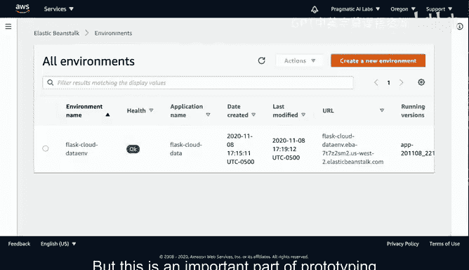

# 杜克大学《构建大规模云计算解决方案（基础、虚拟化，1-2课／共4课Building Cloud Computing Solutions at Scale》 - P44：44_04_09_使用AWS Beanstalk平台即服务构建网站.zh_en - GPT中英字幕课程资源 - BV1oT421k7YQ

Let's build out an elastic beanta configuration here First though。

 let's look at the architecture of what it does。 Elastic Beanstock is a platform as a service offering what that means is that all of the heavy lifting of the deployment is operationalized for you so how would you do this First you would use the cloud9 environment and install the EB tool which we'll go through so we'll go to a GiHub repo that has the latest code from Amazon and that will allow us to install this commandlan tool that will orchestrate behind the scenes an entire ecosystem that we can deploy an application to。

Then this EB tool。Will be hooked up here and it will deliver directly the flask application to this infrastructure。

 there will be a load balancer here， and this load balancer will give us essentially an entire ecosystem of virtual machines that are wired together to accept the appropriate requests。

And also the flask application will be ready to go so this is a very typical pattern of platform as a service offering is there'll be an extremely powerful command line tool that command line tool will provision instances behind the scenes and then allow us to really easily deploy an application you see this in other cloud platforms as well like GCP has Google App Engine and the Azure platform has app services so。

This is a great pattern for many different companies because you don't have to do this anymore。

 this is handled by your service provider and it really adds a lot of value and increases your ability to build things quicker。

One of the best ways to get started with the Elastic Beant command line interface is to spin up an EC2 instance running Cloud 9。

 which we have here。80bush cloud 9 and then also install it locally here and so the official instructions will give you a link to a GiHub repo which will have the latest version of installer to install it if we go to that repo you would need to do a yum install if you're on Amazon Linux of these packages and then also go through clone this repo and then run their installer so I've already done that to speed things up and if you notice I can type in this command EB。

That's just help and we've got this thing running so that's one of the great things about these platform as a service commandland tools is it builds this you know incredible infrastructure to build out an application with so to get started I'm going to follow step by step here the steps to set up a new elastic Beanstock environment so the first thing I'll do is I'll say makeD EB flask。

Next up， I'll seed into that directory。I'll go ahead and create a virtual environment and notice in this case actually I'll use Python 3 M。

Virtual environment， and I can just say virtual environment like this。

 and typically I don't put a virtual environment in my directory。

 but I'll show you why I'm doing this。In a little bit， okay， let's go ahead and source this。

VirVrtual environment band activate and then next up I'll do an installation so I can actually do a PP install of a flask 102。

 so I'll get a very specific version。Great， and then I can also run Pip freeze and what this will show me is that these are the different packages that were installed in that flask application。

So next up， I'll go ahead and write those freeze requirements out to a requirements on TXC fileile。

 and this is nice because if we go and we look at this particular environment here and I look inside of EV flask。

You'll see that it's a great way to get version numbers by installing and then saying freeze Okay。

 now we're ready to go to the next step here， which is to create an application file。

 so I'll go ahead and do that I'll say touch application。😊，PY to create an empty file。

 And I've already got one inside of this repo here。 NoAgi flask elasticastic beanstock。

 And I'm gonna go ahead and just cut and paste this application and explain it。

 So I'll go through here， copy this and put this into our environment So we'll open this file up and paste it in。

 So let's look at what this does。 doesn't do a lot。 It's intentionally very simple here。

 But this application will first import flask。 So we'll say from flask import flask。 And then next。

 it'll also go through here and create a new app。 in this case。

 this will be the flask application here。 And then it will return back。

A hello world route so all this does is say I'm inside a flask and returns back a route here and then this URL。

 this is a route that will allow us to accept a name parameter or any variable basically and then we'll return it back out as a JN dictionary just right here so this is a great way to test out something really simple one does nothing one accept something and just returns it back out。

And I can test this next by running it locally so that's typically the first thing that you'd want to do in a flask gap before you tro out the deployment so we'll say Python applicationpyI so we know have we've got an issue here in that it says application is not set up so how would we go ahead and say that set that up Oh well we need to just change this to application so that's what that warning was there we go and then the same thing can go for the routes we could go through here andll say application route and then also application route so this is one of the nice things about using this development environment is it shows us all the bugs。

Great let's run it again Okay， we've got this running locally and then if I wanted to。

 I could actually very quickly prototype this by doing a curl command。In a new terminal。

 so we'll go here and I'll just do this， I'll just say curl。And look， there we go。 how world works。

 And if I， if I put in name Bob。We can see that。What did I have here， I think I had echo。

 if I say echo。Bob， it's a return back Bob。There we go。Perfect。

 so we've got a successful working application and now we're ready to deploy it。

So the next step in order to deploy this application would be to use the EB environment so what I'm going to do is I'm going to first clean things up locally here notice that I have this virtual environment and we don't want to check that into our elastic bean stock so how are we going to fix this well we'll create a file。

Called dot Eb andO。And this will allow us to ignore that file so I can either edit it in Vim。

Or I could edit it in my editor， but the gist of this is。We want this ignored Okay。

 we've got this thing written out and we're going to ignore it。

 and now I'll need to create a new environment。And in order to do that。

What I can do here is say EBniP， so make a Python 36 flask tutorial environment and I could say flask tutorial or maybe easily I'll say flask cloud data that's a good name for our project。

And this will go behind the scenes and wake up basically what I need my flask environment to do and then。

What we can do is create this。Let's go ahead and create this environment。

 so we'll go ahead and say here， we'll say。Faskask cloud data environments。There we go。So。

Behind the scenes now it's taking everything that we had local and it's doing a deployment process。

 so it took that that initial a knit looked inside of there and said， okay。

 what do I need to create here I need to create。A new environment inside of EC2 and it'll deploy it in US West2 and then it'll go through here and。

呃。Create a particular load balancer， it'll create the security group。

 so these are all things that I would have to normally do by myself if I was setting up a Python based web application。

 but it's all done automatically for me just because I was able to use that commandline tool and so this would mean it would create EC2 instances。

 security groups， load balancers， auto scaling group， the S3 bucket， CloudWch alarms。

 also the infrastructure as code with Cloud formation stack。

 so it does a lot of work for me behind the scenes。And if I want to go ahead and look at it。

 one of the ways I can look at it is by typing an EB open once it's ready to go。

Let's switch over to El Bean stock now。And you'll notice that this elastic bean stock environment is in a pending state and now it's the pending state has switched to OK and from here I actually can see the entire setup of my elastic Bean stock environment and then if I want to test it out。

 I can right click on this and say open link。And this will show us that this beansanstock application is ready to go and if I want to test out that route。

 if we want to make this a little bit bigger， I can go here and could say echo and we'll call this Bob there we go and we see that my service is working successfully。

 maybe we'll do Sally。There we go So our service here was very easily created with this elastic Beanstock chamean tool and it created a sophisticated cloud based development environment that has all the bells and whistles that I would need including load balancing and health checks and other thing so I would recommend elastic Beanstock I think it's a great application for building out you know environments that you don't have to manage yourself so let's go here and clean this up what's the last thing I would need to do to clean this up Well I would type in EB terminate。

😊，And this will get rid of my environment so that I'm not charged for it。

 so what I'll do is I'll type in， take this name here。

 which is the name of the environment and I'll say EB terminate。Flaask cloud data environment。

And we'll go ahead and type this again so that it knows that I really am serious about terminating it。

 let's go ahead and do this。And now it's going to clean this up behind the scenes and you can see that this is going to clean this up because if I go back to my elastic bestock environment and we go back to the interface here and I refresh it you'll see that it'll start to kind of take this thing out and remove it。

 it'll take a little bit of time for all the resources to be cleaned up。

 but this is an important part of prototyping。

Is that you want to make sure that you delete the resources that you set up so that you're not charged for those。

