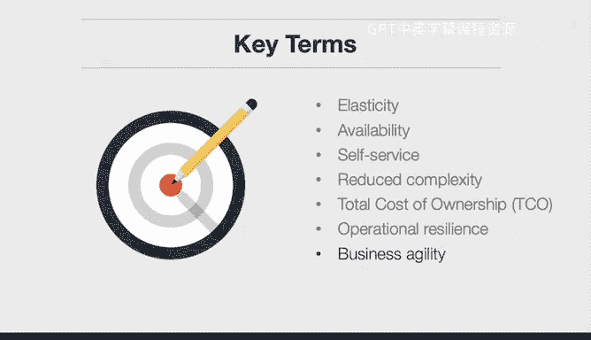

# 杜克大学《构建大规模云计算解决方案（基础、虚拟化，1-2课／共4课Building Cloud Computing Solutions at Scale》 - P47：47_04_02_云计算经济学介绍.zh_en - GPT中英字幕课程资源 - BV1oT421k7YQ

In this lesson we get into the economics of cloud computing into a little bit more detail。

 let's go over the main learning objective。In this course we're going to explain the economics of cloud computing and get into some of the weeds of the material that you'll cover in this course。

 including key terms let's get into those key terms first elasticity elasticity is the ability to expand and contract according to the demand and we'll talk a little bit more about that in a little bit availability so can you respond to a request do you have enough capacity。

A self service means that you can procure things yourself。

 so you don't have to go through an IT procurement process。

 you can put a credit card in and launch a virtual machine。

Reduced complexity is another great key term to understand。

 that means that because the cloud provider is handling a lot of the lower level details like networking or security in the data center。

 you have less complexity for your company to deal with。

Total cost of ownership is related to that and that what is the cost over。

 let's say a five year period that you're spending on software and IT and salary versus the cost you're paying by renting these capacity and oftentimes it's the case that the total cost of ownership when you're using cloud resources is much lower than your own physical data center。

Finally， we'll get into a couple of business terms。

 first operational resilience and this means that can your company withstand， let's say。

 a natural disaster when you use the cloud， they have so much resilience built in you get this as part of your relationship with the cloud vendor Also business agility it's really easy to lose sight of the fact that your company does a specific thing and it's often not anything to do with infrastructure for computing and by leveraging the growing number of services that come with cloud providers。

 you can focus your company on building things quicker and responding to the customer needs let's go ahead and get into the lecture。

