# 构建大规模云计算解决方案：P49：云经济学深度解析 💰

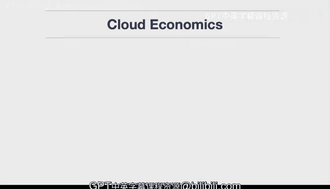

在本节课中，我们将深入探讨云经济学，理解其核心概念如何帮助企业优化成本、提升效率并实现业务敏捷性。我们将逐一解析弹性、可用性、自助服务、降低复杂性、总拥有成本、运营弹性和业务敏捷性这七个关键概念。

## 弹性 🧘

弹性是云经济学的核心概念之一。它意味着当公司拥有的网络服务器流量增加时，系统可以自动响应，获取一台或多台新的虚拟机。同样，当流量下降时，系统可以回收这些虚拟机资源，使其进入无需物理购买的状态。弹性概念的本质是根据需求进行**向上扩展**和**向下缩减**。

我们理解这个概念，是因为它与公用事业的工作原理类似。公用事业是弹性的一个绝佳例子：如果你需要更多空调，可以从电力公司获取更多电力；反之，如果你不需要，可以关闭恒温器，停止消耗电力。同样的概念适用于云计算。掌握这个概念至关重要：当更多流量涌入时，你可以扩展；当流量减少时，你可以缩减。这是实现巨大成本节约的方式。

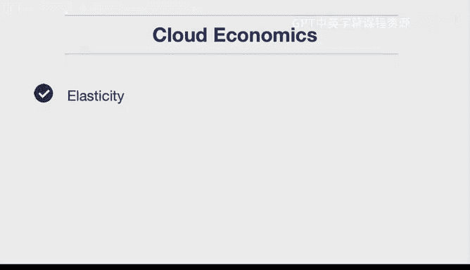

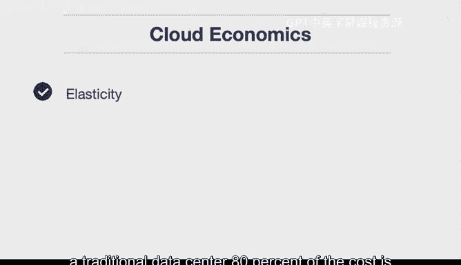

你可以将其视为一种**80/20法则**。在传统数据中心，80%的成本源于必须预先购买所有硬件。但在云环境中，你可以更像一个20%的参与者，因为峰值时可以扩展，而无需在流量回落后继续保留这些实例。大多数情况下，许多技术网站的流量具有周期性。

## 可用性 ✅

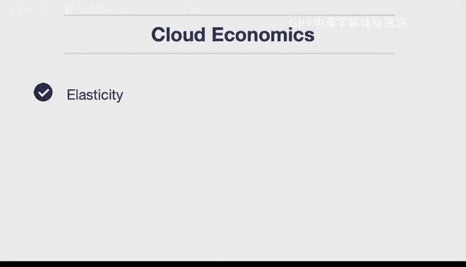

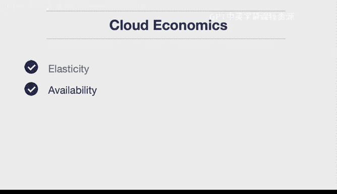

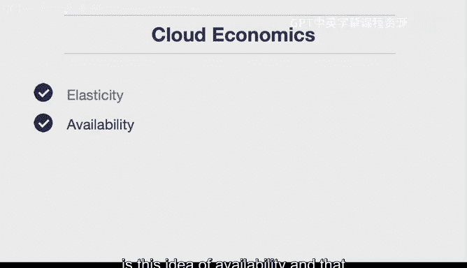

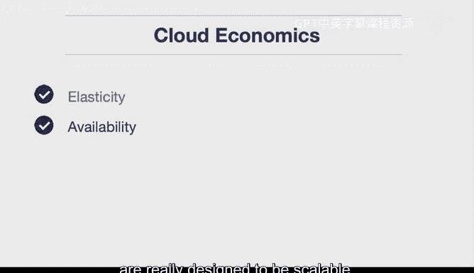

云经济学中另一个重要概念是可用性。这指的是你的网站是否可用。具体含义是：当我发送一个请求时，是否能得到一个健康的响应？无论我试图访问的是何种网络服务，我是否总能得到回应？服务是99.9999%可靠，还是存在可用性问题？

这就是可用性的概念：你使用的服务是真正为可扩展性而设计的。对于一个独立的公司来说，仅仅因为购买所有基础设施的启动成本，几乎不可能自行构建类似的东西。

## 自助服务 🤖

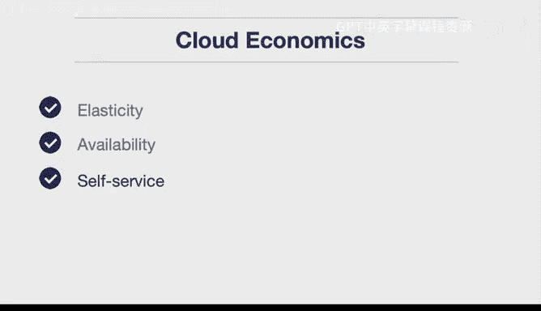

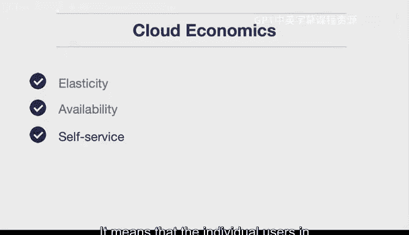

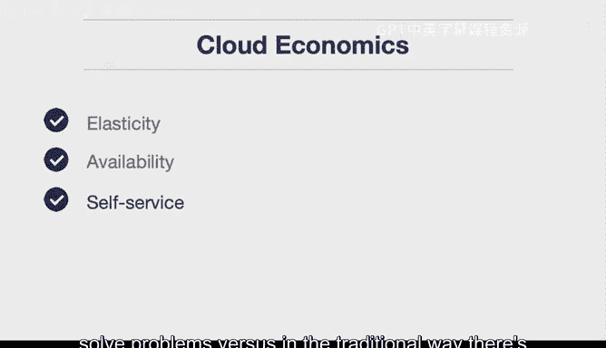

云经济学的另一个关键概念是自助服务。你是否可以在不经过冗长的IT采购流程和涉及多人的官僚主义的情况下获取资源？或者，你是否能以更自助的方式进行操作？

自助服务的一个好例子是自动售货机。如果你想喝水或吃点零食，可以去自动售货机，付款后立即获得。虽然价格可能稍高，但它解决了不需要人工介入的问题。许多云技术正是为此而设计，自助服务可能是云计算的一个核心特性。这意味着公司中的个人用户真正被赋予了用信用卡解决问题的能力，而传统方式则需要一个冗长的流程来完成一般业务。

## 降低复杂性 🧩

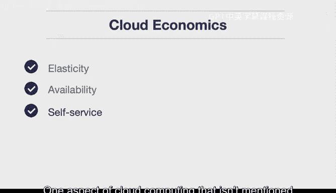

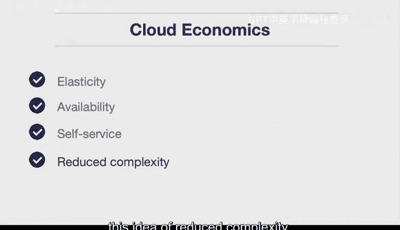

云计算中一个不常被提及但非常重要的方面是降低复杂性的理念。这意味着你可以专注于解决业务问题，而不是去判断数据中心是否存在安全问题，或者网络是否正遭受外部攻击。云供应商能够为你解决所有这些问题，因为他们专门解决这些问题。

因此，我认为这是云计算一个常被忽视的方面：当你使用专家并利用你最擅长的技能时，事情会变得更简单。这是你应该使用云计算的一个比较优势的例子。

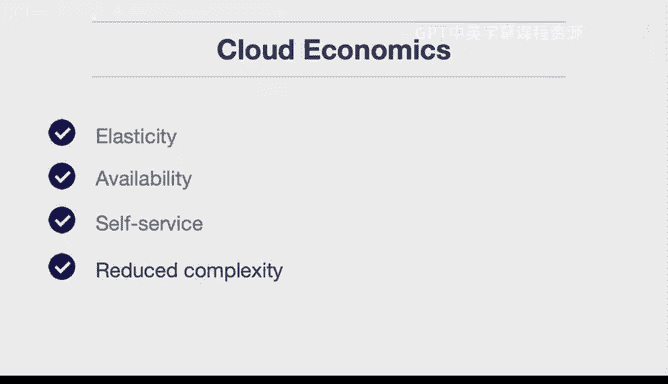

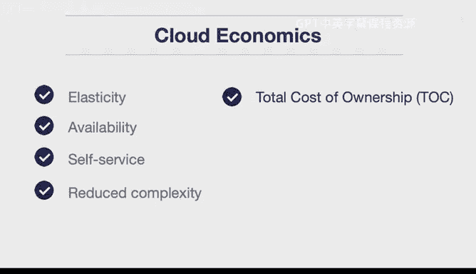

## 总拥有成本 📊

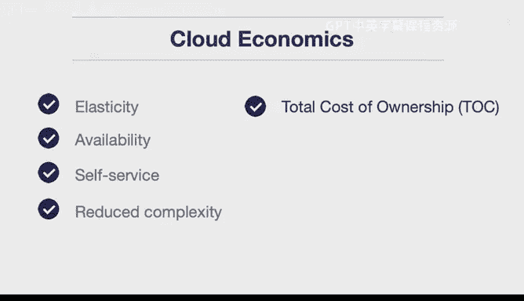

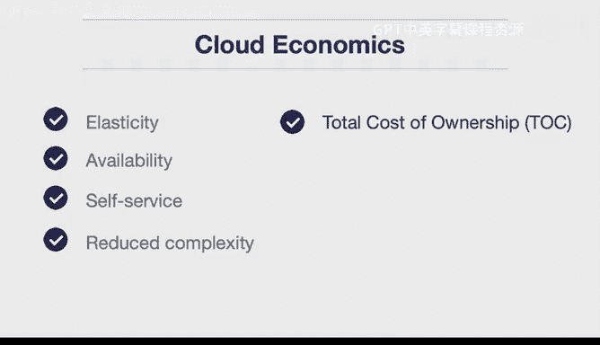

20世纪80年代和90年代最流行的术语之一是“总拥有成本”这个短语，至今仍是一个非常重要的术语，原因很充分。很多时候，人们很容易只关注某物的初始成本，而忽略了总成本。

例如，对于物理数据中心，如果有人只看到他们已经投入的初始或固定投资（也称为沉没成本），他们可能会想：“我们已经有了这些人员和设备，为什么还需要使用云计算？”很多时候，长期成本才是重要的。

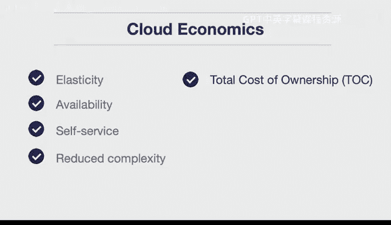

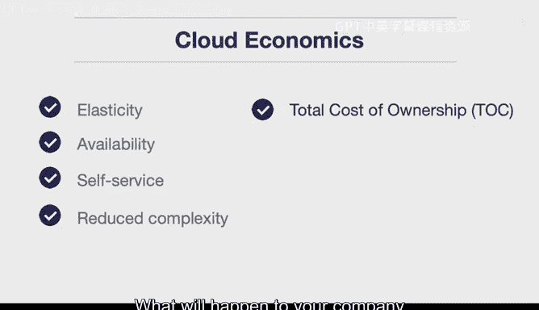

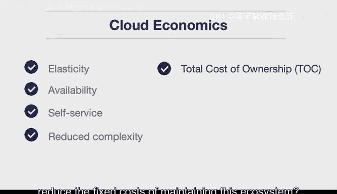

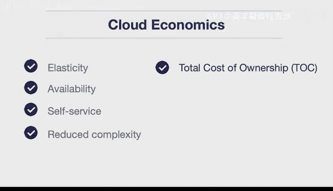

因此，如果你开始从长远角度审视，也许最初没有收益，但最终这些成本会大大降低，因为在生命周期内，你无需支付更高的薪水，也无需支付固定成本。所以，当你考虑总拥有成本时，你关注的是长期影响。如果你的公司降低了维护这个生态系统的薪水和固定成本，会发生什么？很多时候，结果是你的公司会节省资金，因为从长远来看，你正在从前期成本转向可变成本，而可变成本是你可以控制和优化的。

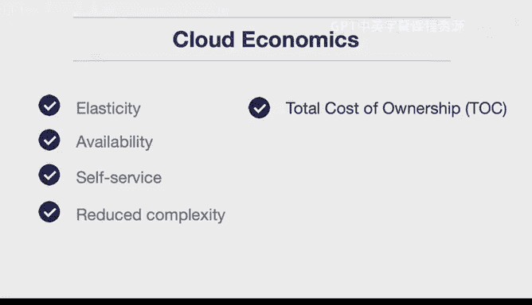

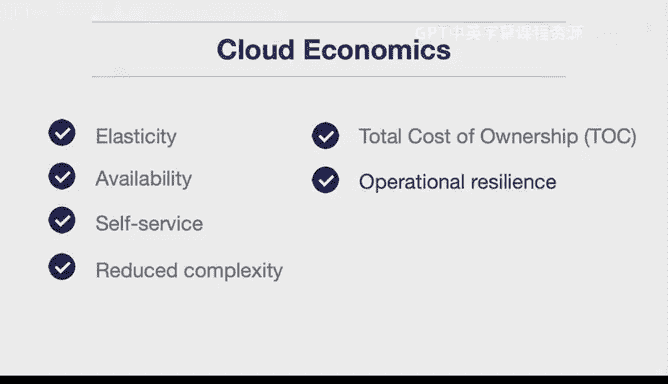

## 运营弹性 🛡️

运营弹性真正回应了这个问题：当出现某种危机时，你的公司如何运作？假设你拥有一个物理数据中心，发生了自然灾害导致其离线。如果你把所有资源都投入到一个物理数据中心，那么你基本上就束手无策，无法解决问题。但当你使用云提供商或利用拥有比你更好资源的公司时，你就获得了这种内在的运营弹性。

因此，从第一天起你就拥有了全球规模。所以，如果出现某个数据中心离线的情况，这并不重要，因为你已经设计了你的应用程序来应对这种情况，并且你知道可以处理这种故障，因为你具备了内置的运营弹性。这是云经济学另一个非常重要但较少被理解的方面：除非你是一家规模极其庞大的软件公司，否则几乎不可能构建出这种弹性。

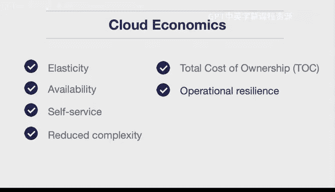

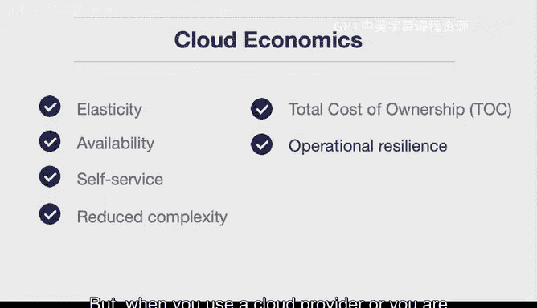

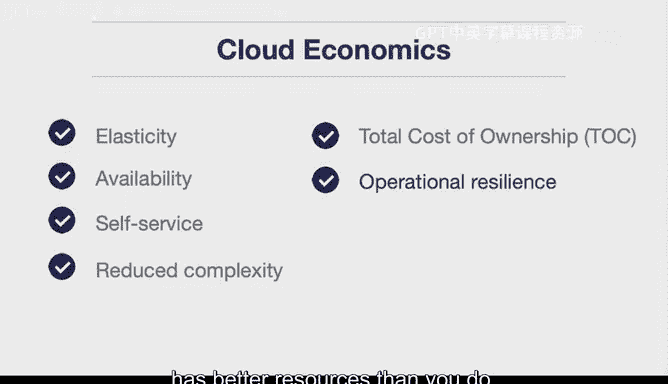

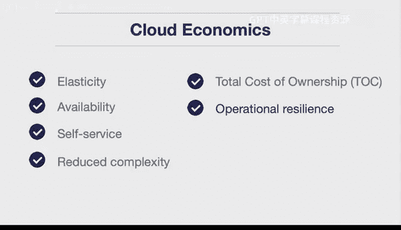

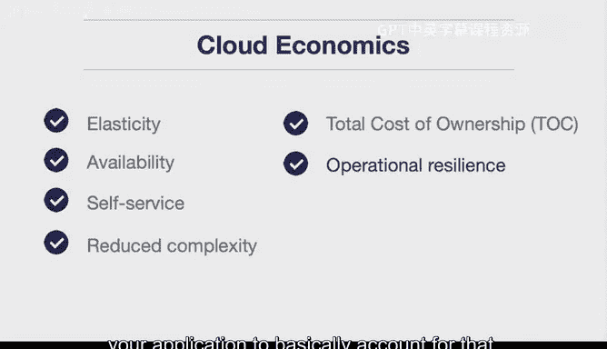

## 业务敏捷性 🏄

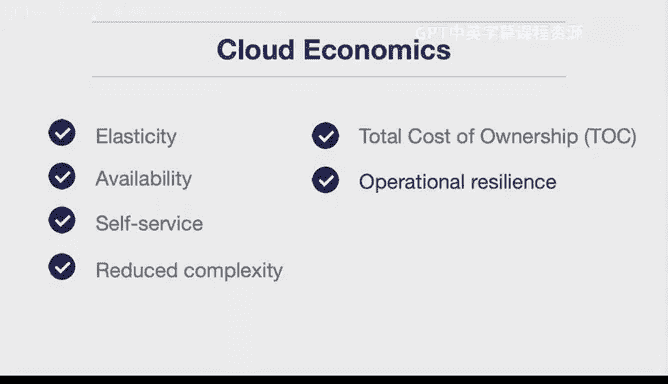

业务敏捷性很像冲浪。你驾驭着浪潮，这是一种极其强大的自然力量，如果你试图对抗它，它可能会摧毁你。但如果你能利用浪潮的能力，冲浪者就能驾驭这些巨浪，他们是顺应浪潮，而不是强迫浪潮做某事。

云计算的业务敏捷性非常相似。通过利用不断发展的云原生资源，你可以专注于公司真正关注的业务核心战略，无论是销售零售商品、提供机器学习应用还是构建移动应用。通过不专注于云提供商已经为你提供的事情，你就是在驾驭浪潮，能够更快地前进，并以更快的速度开发新功能。也许每周，你的公司都能开发新功能，因为你没有浪费时间去做那些别人已经以比你公司可能做到的好得多的方式为你完成的事情。

---

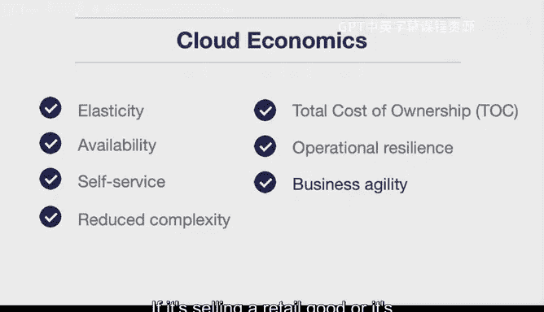

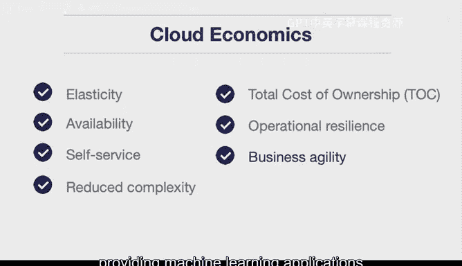

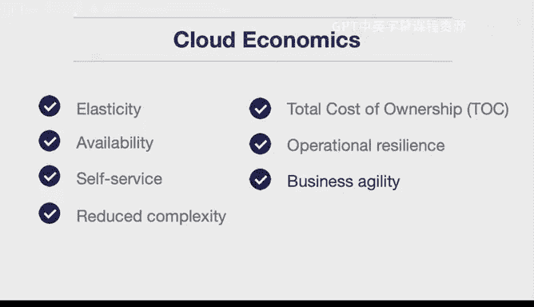

本节课中，我们一起学习了云经济学的七个核心概念：**弹性**、**可用性**、**自助服务**、**降低复杂性**、**总拥有成本**、**运营弹性**和**业务敏捷性**。理解这些概念有助于企业充分利用云计算的优势，实现成本优化、效率提升和快速创新。