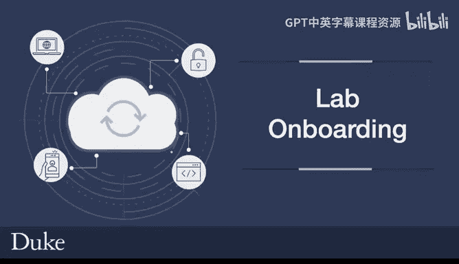
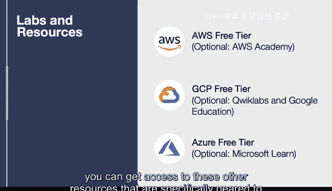

# 杜克大学《构建大规模云计算解决方案（基础、虚拟化，1-2课／共4课Building Cloud Computing Solutions at Scale》 - P4：04_01_01_实验环境入门.zh_en - GPT中英字幕课程资源 - BV1oT421k7YQ

Let's talk about some of the labs and resources that you'll be prepared to use for this course There are labs for AWS。

 GCP and Azure and also free tiers that you can use so for AWS I would recommend you use the AWS free tier and you can accomplish pretty much everything you need by using that if you're a member at your educational institution of AWS Academy you can also get access to many free labs that are very helpful and also prepare you to get AWS certified I teach off of these labs myself。

The GCP platform has a generous free tier and by using the free tier you can get through all of the assignments in this entire course and then you can also get access to optional Quicklabs and use Google education if you're a student so you can ask Google education to get some quicklab credits and also do trial runs that way as well the Azure platform also has a free tier that's very generous and as a student you can get access to that and then if you want to go through some of the labs on your own you can go through Microsoft Learn so in a nutshell everything that we cover in this course can be done for free by using the capabilities of AWS GCP and Azure and also if you're a part of an educational institution like Duke is you can get access to these other resources that are specifically geared to let you do labs in an educational environment。

