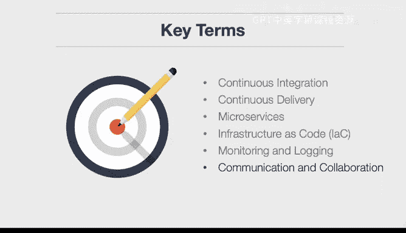

# 构建大规模云计算解决方案：P50：DevOps介绍 🚀

在本节课中，我们将要学习DevOps的核心概念。我们将探讨DevOps的定义、关键实践以及相关术语，帮助你理解它如何弥合软件开发与IT运维之间的鸿沟。

## 什么是DevOps？🤔

上一节我们介绍了课程概述，本节中我们来看看DevOps究竟是什么。DevOps是一种集文化理念、实践与工具于一体的方法论，旨在提高组织高速交付应用程序和服务的能力。它强调软件开发（Dev）与IT运维（Ops）团队之间的协作与沟通，从而实现比传统流程更快速、更可靠的软件构建、测试和发布。

## DevOps的关键实践 🔑

理解了DevOps的基本定义后，我们来深入探讨其核心实践。这些实践共同构成了DevOps方法论的基础。

以下是DevOps中一些关键的共享实践：

*   **持续集成**：这是一种开发实践，要求开发人员频繁地将代码变更合并到共享的主干分支中。每次合并都会触发**自动化构建和测试流程**，以便尽早发现集成错误。其核心公式可表示为：`代码提交 -> 自动构建 -> 自动测试`。
*   **持续交付**：这是持续集成的延伸，确保代码在通过所有测试阶段后，始终处于可部署到生产环境的状态。它意味着任何时刻的代码库都是可发布的。
*   **微服务**：这是一种架构风格，将单个大型应用程序拆分为一组**小型、松散耦合的服务**。每个微服务都专注于完成一项特定的业务功能，并可以独立开发、部署和扩展。
*   **基础设施即代码**：这是一种通过**代码（如YAML、JSON或特定领域语言）来管理和配置基础设施**的方法，而不是手动设置。这些代码文件可以像应用程序代码一样进行版本控制、审查和维护。例如，使用Terraform定义云资源：
    ```hcl
    resource "aws_instance" "example" {
      ami           = "ami-0c55b159cbfafe1f0"
      instance_type = "t2.micro"
    }
    ```
*   **监控与日志记录**：为了确保系统健康并快速定位问题，需要对应用程序和基础设施进行全面的监控和日志记录。这就像飞行员依靠仪表盘驾驶飞机一样，运维和开发团队依靠监控数据来了解系统状态。
*   **沟通与协作**：这是DevOps文化的基石。它强调打破开发、运维及其他相关团队（如安全、测试）之间的壁垒，通过共享责任、工具和信息流来促进高效合作。

## 总结 📝




本节课中我们一起学习了DevOps的基本概念。我们了解到，DevOps不仅仅是工具或自动化，它更是一种促进开发与运维紧密协作的文化。其核心实践包括持续集成、持续交付、微服务架构、基础设施即代码、全面的监控与日志记录，以及最重要的——沟通与协作。掌握这些概念是构建高效、可扩展的云计算解决方案的重要基础。