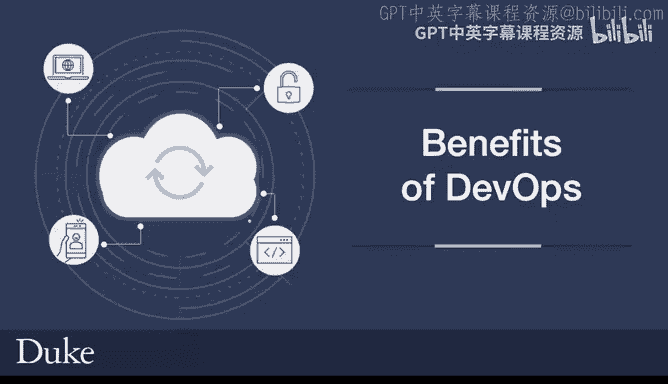
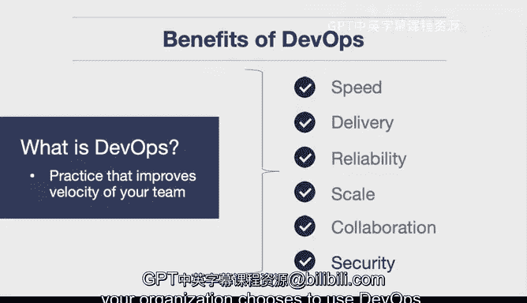

# 杜克大学《构建大规模云计算解决方案（基础、虚拟化，1-2课／共4课Building Cloud Computing Solutions at Scale》 - P52：52_05_05_DevOps的优势.zh_en - GPT中英字幕课程资源 - BV1oT421k7YQ

Let's dive into the benefits of DevOs first let's define what it is It's a practice that improves the velocity of your team and really this is a key component of DevOs why would you do something if it's not making things better and it does actually improve the speed that you can deploy software and improves the speed that your software gets to customers so that's really the reason for it so the benefits though in detail here are speed by using DevOs principles you're going to move faster as an organization that means everything is going to go faster the development of features。

 the delivery of software into production the cycle that people can develop they can create software faster。

That's one of the core components of DevOs that's a benefit also delivery as I mentioned before。

 being able to deliver features or bug fixes faster directly to your customer is a key benefit taking a year to develop something in some cases could really put your company in a situation where it's not competitive anymore but by improving the ability to deliver you're encapsulating all the benefits of DevOs Another one is reliability。

One of the things that's great about the DevOs principles is that because you're automating things and making them better。

 constantly improving things with testing and monitoring and logging。

 you're making your system much more reliable and monitoring and logging is a best practice that's encouraged with DevOs and it's going to ensure that your system has a high degree of reliability。

 also scale。So in order to operate at scale， one of the ways that you can do this is to use infrastructure as code to automate the infrastructure and also by using smaller microservices。

 you're able to scale out into a bigger level that's one of the key things about scaling that's nonintuitive is that the simpler you make something so these smaller services the easier it is to scale because each of these systems is by itself really easy to understand and easy to maintain and you can build and build and build on those until you get to an incredible scale Also collaboration is a key aspect of DevOs what it means is that there's a shared ownership there's not the developers that develop the code and then give it to somebody else or the product manager that wants a feature and then the developer is forced to do it everybody works together to have a shared ownership and accountability and what this means is that you're reducing inefficiencies in your saving time finally with security。

This is a key problem today with many software applications is leaking data。

 giving that data to other people accidentally， and you can actually implement policy as code and then you can define and track the compliance at scale and this is one of the key aspects of DevOs is an increased level of security so in a way you can say that this alone could be one of the primary reasons that your organization chooses to use DevOs。

