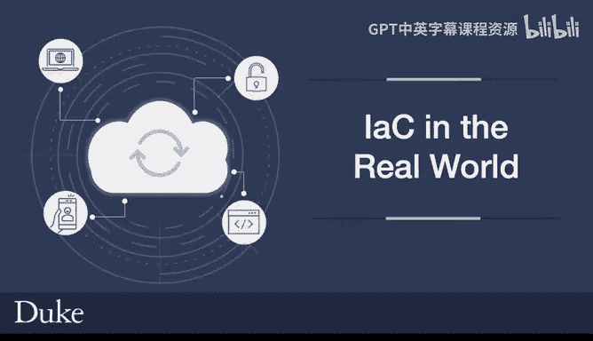

# 构建大规模云计算解决方案：1-2：现实世界中的基础设施即代码 (IaC) 🏗️

在本节课中，我们将通过一个真实的故事，来了解基础设施即代码在现实世界中的重要性、威力以及潜在的风险。

## 概述

我们将从一个真实的运维事故案例开始，这个故事展示了基础设施即代码如何成为一家公司的“救命稻草”，同时也揭示了错误使用它可能带来的问题。通过这个案例，我们将深入理解为什么基础设施即代码是现代软件工程的关键组成部分。

## 一个真实世界的 IaC 故事

上一节我们概述了本节课的主题，本节中我们来看看这个具体的故事。

我当时在湾区一家软件即服务公司担任工程主管。公司的创始人在凌晨两点打电话给我，告诉我一切都宕机了。他说，什么都不存在了，我们的整个基础设施都被删除了。

我们的服务托管在亚马逊云上。我查看了我们的仪表盘，确实没有任何服务器可用。那真是一段艰难的时期。我开车到办公室，试图弄清楚发生了什么。后来我们开始查明原因：发生的情况是，有一些关于即将退役的虚拟机的警告邮件被忽略了。这些邮件躺在公司创始人的垃圾邮件文件夹里。云服务商最终因为这些虚拟机是旧版本而将它们下线。实际上我们提前几个月就收到了通知，但直到它们最终被删除，我们才注意到。

因此，从零开始恢复我们整个公司的唯一方法，就是使用基础设施即代码。

## 恢复过程与挑战

上一节我们了解了事故的起因，本节中我们来看看具体的恢复过程与遇到的挑战。

我所做的是，去查看我们的构建系统，该系统使用了一个名为 **Puppet** 的基础设施即代码系统。这是一个较老的系统，在2010年左右非常流行。结果我发现我无法运行它。我试图找出问题所在，后来我们确定，那个版本的 Puppet 与我们使用的版本不同。我们对它进行了一些调整和修改。我必须找到我们使用的那个特定版本的 Puppet，它基本上能解锁我们的整个生态系统，并让我们从零开始重建公司。

幸运的是，我在一台机器上找到了它。之前的一位开发人员制作了他们自己的 Puppet 版本，并将其放在了一台机器上。我们找到了它，并重新创建了一切。

这个过程花了好几天，但我们没有倒闭。

## 经验教训与总结

上一节我们看到了如何使用 IaC 进行恢复，本节中我们来总结从这个故事中获得的经验教训。

这个故事的寓意，我认为有两点。第一点是，不要随意分叉或更改基础设施即代码系统，使用默认标准可能是最佳实践。第二点则是，基础设施即代码的力量有多么强大。一方面，我们能够通过重新执行其指令来重建整个基础设施乃至整个公司。

但另一方面，如果没有这样的能力，情况会多么危险。完全恢复一个基础设施可能需要数月时间。

因此，基础设施即代码是现代软件工程的一个关键组成部分，我们将在本课程的后续部分更详细地讨论它。

## 总结

本节课中，我们一起学习了一个关于基础设施即代码的真实案例。我们看到了 IaC 在灾难恢复中的决定性作用，也认识到遵循标准实践和维护 IaC 可重现性的重要性。这个故事生动地说明了为什么 IaC 是构建可靠、可扩展云解决方案的基石。