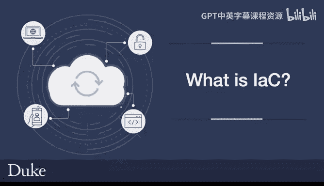
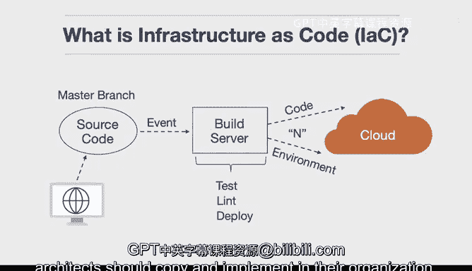

# 构建大规模云计算解决方案：1-2：什么是基础设施即代码 (IaC) 🏗️

在本节课中，我们将学习**基础设施即代码**的核心概念。我们将了解它的定义、工作原理、优势以及为何它是现代云部署的必备实践。

## 概述

基础设施即代码字面意思是将基础设施与项目的源代码一同进行版本控制。这意味着你可以拥有一个可重复、幂等的流程，用于部署和配置你的云环境。

## 什么是基础设施即代码？

基础设施即代码是指将基础设施的定义以代码的形式，与项目源代码一同进行版本管理。这意味着部署和配置云环境的过程是可重复且幂等的。

在实践中，这意味着不仅代码本身会被部署，其运行环境也会被一同部署。这样做的好处是，你可以基于代码定义，构建出多个不同的环境。

## 工作原理与流程

上一节我们介绍了IaC的基本概念，本节中我们来看看它的典型工作流程。基础设施即代码的使用流程通常由一个事件触发。

这个触发事件通常是向主分支推送代码。推送代码后，构建服务器会执行标准的源代码管理流程，例如运行测试、代码检查和一些部署步骤。

与此同时，实际的物理基础设施也会被同步部署出去。这可以包括配置负载均衡器、正确设置存储或创建用户权限等。

## 核心优势

以下是采用基础设施即代码带来的主要好处：

*   **可重复性与一致性**：所有环境都通过代码模板定义，避免了手动配置的差异。
*   **版本控制与审计**：基础设施的变更像代码一样被记录和追踪，易于审计和回滚。
*   **提升效率与自动化**：环境创建和销毁可以完全自动化，加速开发和部署周期。
*   **降低风险与保障业务连续性**：消除了对特定人员（“关键员工”）手工操作的依赖。即使人员变动，环境也能被准确重建。

## 与传统方式的对比

传统部署方式就像是“雪花式部署”，即每个环境都是独特的。需要人工介入，点击各种按钮进行配置。

当你询问操作人员他们具体做了什么时，他们可能无法准确复现，因为过程过于复杂。这正是基础设施即代码要解决的核心问题。

## 总结

本节课中我们一起学习了基础设施即代码。它是进行云部署的最佳实践，如果你没有使用它，就不能算是在用现代方式进行部署。

它在可重复性和业务连续性方面解决了许多问题。没有基础设施即代码，可能会引发严重问题，例如关键员工离职后无人知晓其之前的配置操作。因此，基础设施即代码是所有云解决方案架构师都应采纳并在其组织中实施的最佳实践。