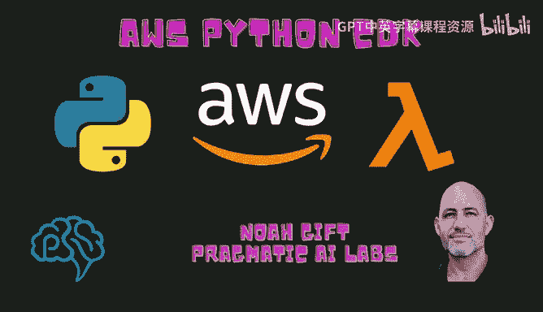
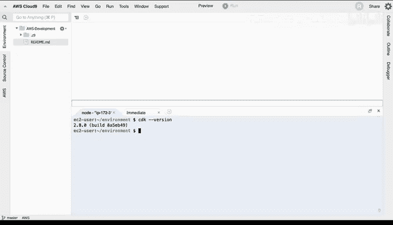
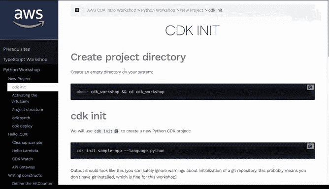
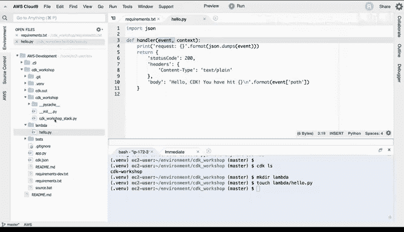
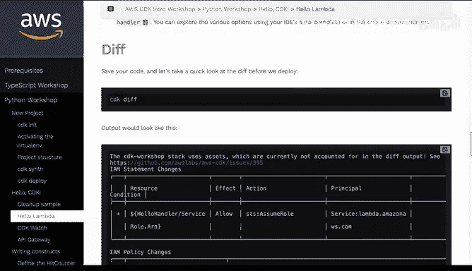
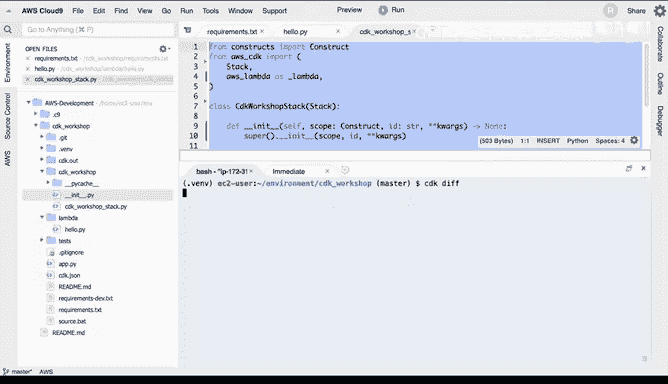
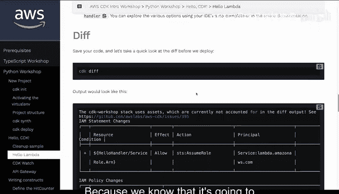
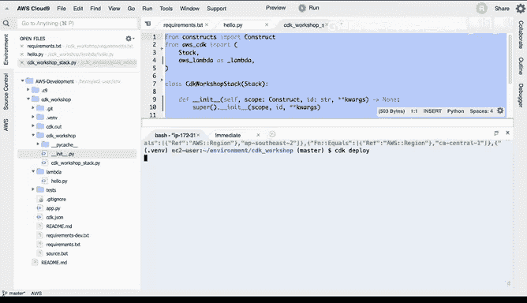
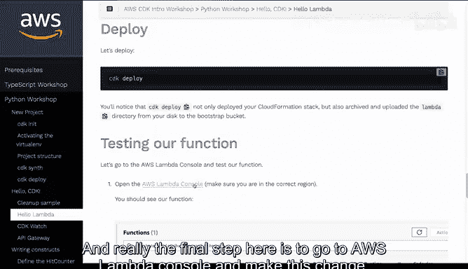
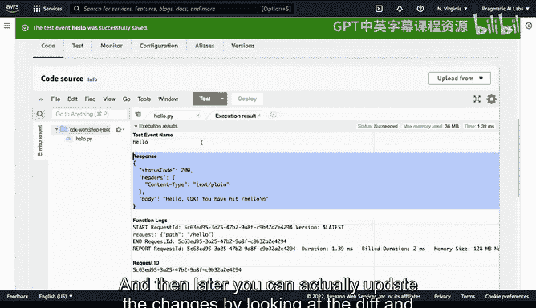

# 杜克大学《构建大规模云计算解决方案（基础、虚拟化，1-2课／共4课Building Cloud Computing Solutions at Scale》 - P58：58_05_08_AWS CDK for Python入门示例.zh_en - GPT中英字幕课程资源 - BV1oT421k7YQ

Hi， my name is Noah Gift and today I'm going to talk to you about AWS CDK with Python。

 we're going to build a project that will deploy something in just a few minutes using the AWS Cloud9 environment and infrastructure as code。

 let's go ahead and get started。🎼。

Allright， so here we're inside of AWS cloud 9， a perfect environment for working with CDK。

 First step what I'm going to do is I'm going to run this official documentation command。

 just make sure that I've got the right version of CDk good that's the latest version。

 next up I'm gonna look at this initialization structure inside of a official AWS workshop I'll go through here and copy this。

 I'll put this inside this goes through and it makes this workshop directory and notice now I'm inside of it the next thing I'll do is I'll create a sample app so we'll go through here。

 run this command。 now I've got this sample app I can scroll up here and make sure that I do what it tells me to do So first step here I create the virtual environment and I've sourced it great and now the next thing I'm going need to do is make sure that I install what's inside this requirements file let's take a look real quick what's inside of here。

 this is all of the Python code that lets me。

CKSo these are critical first steps once I've got this going now I'm ready to actually go through and run other commands when the installation finishes perfect。

And if I go through here and I type in， for example， CDKLS。

 this should make me confident that CDK is working。And it looks like it is working。

 it's thinking about the stacks there we go， perfect next up now I'm going to go back to this documentation here。

 I'm going to go to the Ho CDK and go to Ho Lada。It asked me to create a directory called Lambda inside of the CDK workshop and then create this file inside so let's go ahead and copy this。

 go inside of here， let's make a directory called Lambda perfect and then I'll touch Lambda。

Let's see the name it wants us to do is hello。pyy， that looks great， hello。WpyY。

And if I go inside of here， I can just paste this in very simple lambda Lambda functions are Python functions in the case of the Python language that accept an event。

 very， very straightforward and they run inside of AWS Next step。

 what I can do is install the Lambda construct library。 So how do we do this。

 This is an interesting question。 Well， one way to do it would be to take this constructs code here and let's go over to our project and go into the section that actually has。

All of our infrastructure built in and where would that be well we would just need to look inside for that particular stack and in this case we have it right here。

 CDK Work stops and stack let's go ahead and double click this。

And let's copy the whole thing， delete it and replace it so this is going to deploy our code here from CDK perfect now that I've got that inside the stack。

 I can scroll down here and go to CDK diF and this will show me what is the local versus remote version since we've never deployed anything there should be a pretty big diff that's go ahead and run this diff。

And we can see that it's going to go through and look at AWS。

 look at what we've got locally and see if there's changes。

 in fact there is right because we know that it's going to need to deploy this change to AWS so now that I've got that running。

 I just type in CDK deploy let's go here next CDK deploy and we can actually push this into AWS。

This will take just a second， perfect， do we want to deploy these changes， yes， we do。

And now in this case we can say please run CDK bootsottrap inside we've got a problem。

 so these are pretty common things that happen inside of CDK deployment， let's go ahead and do that。

 let's type in CDK bootsottrap。Perfect。And this will make sure that the bootstrapping is created so that we can do the changes on AWS。

One nice thing about doing this in the cloud 9 environment is it really is ideally suited for working with CDK because it gives you such great feedback and you know that it has the role level privileges in order to make these changes。

Okay， now we go， we see this as actually making changes and I can watch this and make it make sure that it deploys。

 but I'm going to go back to the documentation here and double check that everything is working and really the final step here is to go to ABs Lambda console and make this change som while this thing is going here。

I'm going to also open up a console to Lambda。And we go through here。

 we should see a last modified filter， and this will populate once we've got this thing complete。

 so I can just wait for this thing to go。Okay， it looks like it's deployed。

 it took about 77 seconds not too bad considering how much work it's doing。

 If we go back to this Lambda console there we go， 20 seconds ago we created it。

 let's go to this console， we know that it's very straightforward to test this out because it's a very simple Lambda function I'm going click on test I'm going go through here and say hello and then for here let's just make something simple。

 just say like events and then say hi there we go let's go ahead and format the J create the event go through a test and oh it says we have a stack trace here。

 it wasn't looking for a payload like that it's actually looking for something else and so we could go through and test that out let's go ahead and configure another test event In fact we can just go look at the documentation。

And see what they want us to send so you could go through and configure a more complex test event。

 but the the main idea here is that in fact， if we look at our code here， we can see that it doesn't。

It looks like it's looking for the word path inside the event and so we could just put that word path inside。

 let's go ahead and do that， let's just say path。Path is。Hello。

 and let's go ahead and save this format， save。Test it。

There we go now we got rid of the stack tray so pretty straightforward to go through and use the CDK system to deploy your changes and then later you can actually update the changes by looking at the diff and then deploying them again。

