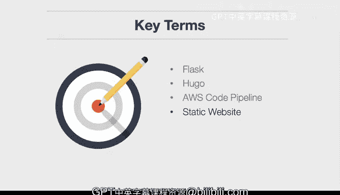

# 杜克大学《构建大规模云计算解决方案（基础、虚拟化，1-2课／共4课Building Cloud Computing Solutions at Scale》 - P59：59_05_02_持续流水线介绍.zh_en - GPT中英字幕课程资源 - BV1oT421k7YQ

In this lesson， we dive into developing continuous pipelines for software。

 These are called continuous delivery pipelines。 Let's look at the learning objectives。 First。

 I explain what continuous delivery is。 So what is the problem that it solves and why would you want to use it。

Next， we develop continuous delivery pipelines， these pipelines will allow us to automatically deploy software applications。

Let's look at a few of the key terms that come up in this lesson First there's flask。

 Flask is a microservice web framework that's available in Python。

 it's a common and popular framework that's used to build microservices。

Hgo is a static hosted website technology that's built in the language go。

 it's very popular because of the speed it takes in generating static assets like HTML files。

AWS code Pipe is a continuous integration and continuous delivery system that's integrated into the AWS platform。

 we use it in this lesson to deploy a Hugo website。Let's also talk about static websites。

 static websites are serverless websites that have assets that are generated and placed into a location where they can be accessed all around the world。

 so static websites are a very popular technology that is a cloud native technology。

