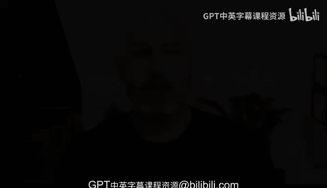

# 构建大规模云计算解决方案：1-2：持续交付概览

在本节课中，我们将要学习持续交付的核心概念。我们将通过一个真实案例来理解它是什么，以及为什么它在现代软件工程中至关重要。

## 什么是现实世界中的持续交付？

为了阐明持续交付的概念，我将分享我职业生涯中的几个故事。

其中一个故事发生在我任职于一家电影制片厂期间。这是一家由迪士尼资助的制片厂，当时我们面临着严重的交付问题。我们认为，如果无法解决技术问题，公司甚至可能倒闭。

## 我们如何实施持续交付

我们采取的措施之一是创建一个自动化流程。以下是该流程的核心步骤：

首先，我们建立了一个自动化流程，每当源代码被提交到版本控制系统时，就会自动触发检查。

其次，我们设置了一个包含数据库**预发布版本**的环境，所有变更都会首先在这个环境中进行验证。

## 持续交付的本质

一旦我们建立了这个自动化流程，我们就能将其应用到生产环境中，执行相同的步骤。

本质上，持续交付是一系列**质量控制关卡**的集合。通过这些关卡，你可以持续地改进产品。

我们正是这样做的。我们逐步推进，每天可能进行一两次小更新，持续地让生产环境中的产品变得更好一点。

## 持续改进的理念

这种“持续地变得更好一点”的理念被称为 **Kaizen**。这是一个源自日本汽车工业的持续改进过程。

所以，持续交付听起来很复杂，但实际上是许多人已经在做的事情：只是比你前一天做得更好一点。

## 不实施持续交付的后果

另一方面，如果你不实施持续交付，你实际上是在持续地让事情变得更糟。

如果没有一个自动化的流程来改进事物，那么参与其中的人虽然在做事情，但可能做得不好，并且会逐步地让事情变得越来越糟。

因此，持续交付是一种系统性的方法，旨在持续地让你的源代码控制变得更好。

## 持续交付的必要性

在现代软件工程基础设施中，这并非一个可选项。你必须进行持续交付，因为你要选择是持续地改进事物，还是持续地让事情恶化。

本节课中，我们一起学习了持续交付的基本概念。我们通过一个案例了解到，它是一套通过自动化质量关卡来持续改进软件的系统方法。其核心是 **Kaizen** 理念，即每日进行微小但持续的改进。我们认识到，在现代软件开发中，实施持续交付是必要的，因为它能系统性地提升质量，避免因手动、低效的操作而导致问题累积和恶化。