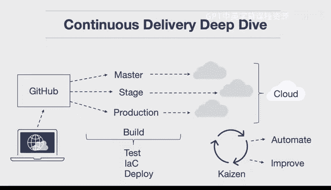

# 构建大规模云计算解决方案：1-2：持续交付深度解析 🚀

在本节课中，我们将深入探讨持续交付的核心概念、解决的问题以及其具体的工作流程。我们将了解如何通过自动化实现持续改进，并确保软件始终处于可部署状态。

## 概述

持续交付是一种软件开发实践，旨在通过自动化流程，确保代码变更能够快速、可靠地发布到生产环境。它解决了手动部署过程中的低效和错误问题，实现了真正的持续改进。

## 持续交付解决的问题

一个可能浮现的问题是：我们为什么要实施持续交付？它解决了什么问题？本质上，它解决的是“改善”问题。我之前提到的“改善”是一个意味着持续改进的概念。为了持续改进你所做的事情并使其变得更好，你必须实现自动化。为了持续改进，你必须有一套质量控制措施。因此，你需要自动测试代码，需要一个**幂等**的或能够反复部署的基础设施，并且部署过程本身也必须是自动化的，以便你能将其部署到任何需要的环境中。

**公式：持续改进 = 自动化 + 质量控制**

## 持续交付的工作流程

在实践中，其工作方式如下：开发人员忙于工作，并将代码推送到源代码控制中。在这里，根据你将代码推送到哪个分支，它会触发构建服务器的变更。

以下是该流程的关键步骤：

1.  **代码提交与触发**：开发人员将代码推送到特定的分支（如功能分支）。
2.  **自动化构建与测试**：构建服务器被触发，执行代码测试以确保没有错误，并可能进行代码链接。
3.  **基础设施即代码**：构建服务器使用 **Terraform、Pulumi、CloudFormation** 等工具查看并配置基础设施。
4.  **环境准备**：云环境被配置完成后，环境就准备就绪，可以测试你的变更。

```yaml
# 示例：一个简化的CI/CD流水线触发器配置
trigger:
  branches:
    include:
      - main
      - staging
```

## 向生产环境推进

当变更接近生产环境时，流程会进一步推进。例如，你可以将主分支合并到预发布分支。这同样会触发一个部署流程：测试代码、链接代码、执行基础设施即代码。如果有新的变更，比如需要配置一个更强大的数据库，系统就会执行此操作。

在预发布环境中，你可以进行某种负载测试。这里是你进行性能测试、确定你的应用能否承受10万用户的地方。完成这些后，你可以再次从预发布分支合并到生产分支，然后自动将这些变更部署给你的用户。

## 持续交付的本质



因此，持续交付的过程在某种程度上非常直观：你总是在让事情变得更好。这个过程是完全自动化的，完全不需要人工干预。唯一需要人工参与的地方是，最初由人将变更提交到源代码控制仓库。在此之后，就不再需要人工去按按钮或在其他地方进行修改了。

所以，这实际上是为持续交付建立质量控制清单的好方法。如果这个过程完全与人工分离，那么你就实现了持续交付。如果在这些步骤中的任何一步需要人工参与，例如需要运维人员配置机器，或者QA人员需要调整某些设置或配置，那么你还没有实现持续交付。

**核心定义**：持续交付意味着你的代码始终处于**持续改进且可部署**的状态。这并不一定意味着直接部署到生产环境，但你可以选择这样做。使用持续交付的真正优势在于，这种自动化方式能够持续改进，并以快速的方式将新变更交付给客户。

## 总结


本节课我们一起学习了持续交付的核心价值。我们了解到，持续交付通过将代码构建、测试和部署过程全面自动化，解决了手动流程的低效问题，实现了软件开发中的“持续改善”。关键在于确保从代码提交到潜在的生产部署，整个流程无需人工干预，从而保证软件始终处于高质量、可随时发布的状态。这是现代云原生应用快速、可靠迭代的基石。