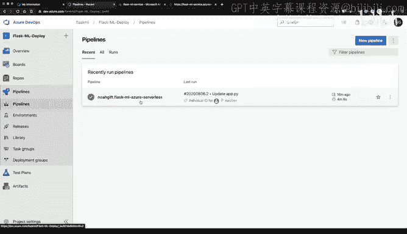
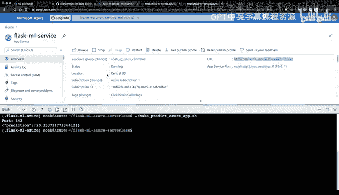
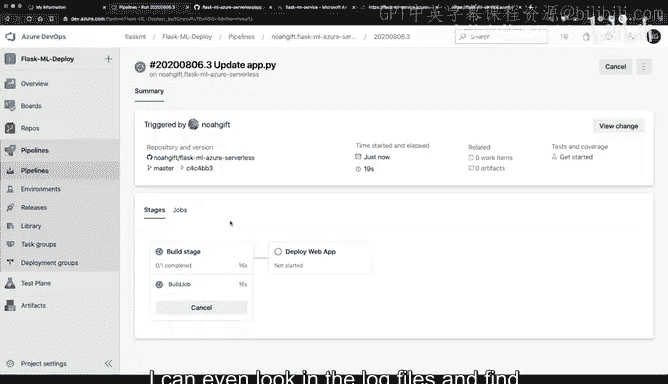
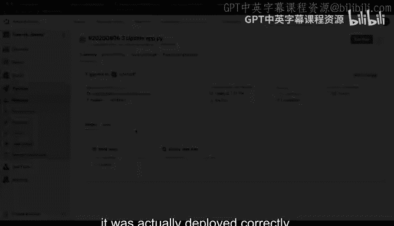
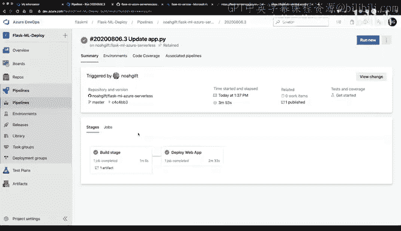
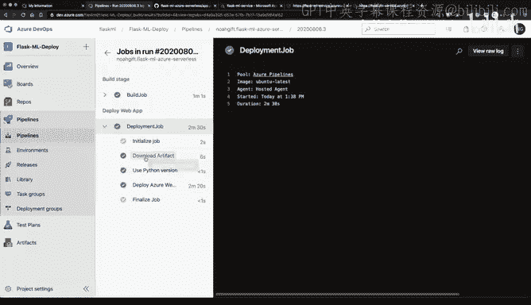
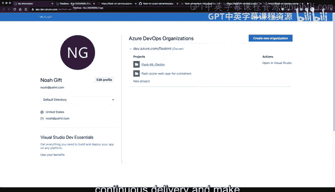

# 构建大规模云计算解决方案：1-2：使用Azure持续部署Flask机器学习应用 🚀

在本节课中，我们将学习如何使用Azure DevOps、Azure应用服务和Flask机器学习应用，完成一个端到端的持续交付流程。我们将从查看现有项目开始，通过修改代码触发自动部署，并最终验证部署结果。

---

## 概述

我们将演示一个完整的持续交付过程。首先，我们会查看一个已配置好的Azure DevOps项目及其关联的Flask机器学习应用。接着，我们将对应用代码进行一个小修改，观察Azure Pipelines如何自动检测到代码变更、触发构建和部署流程。最后，我们将验证修改后的应用是否成功上线并正常运行。

---

## 访问Azure DevOps项目

首先，我们进入Azure DevOps的组织界面。我选择了一个名为 `flaskml-deploy` 的预设项目。

接下来，查看“流水线”部分。可以看到最近运行过的应用记录。点击记录中的链接，可以跳转到关联的GitHub仓库。这证实了该应用已与Azure流水线服务成功连接。

---

## 验证应用运行状态

为了确认应用当前正在运行，我们可以打开Azure Cloud Shell。在Cloud Shell中，找到该应用的名称，并在新标签页中打开其URL。

可以看到，该服务正在运行，并且提供了一个预测API接口。我们可以通过一个名为 `make_predict_azure_app.py` 的脚本文件来调用这个API，执行机器学习预测。

运行该脚本，验证服务是否能正确处理请求。结果显示成功，证明服务运行正常。

---

## 触发持续交付

上一节我们验证了应用运行正常，本节我们来看看如何进行持续交付，即如何通过修改代码来触发自动部署。

由于Azure Pipelines已配置为自动监听代码仓库的变更，我们可以轻松地修改代码来验证这一流程。

具体操作是，进入GitHub仓库的应用代码目录，找到显示 `psyt learn prediction home from Azure pipelines` 的语句。我们将其修改为 `continuous delivery`，并添加一个额外的说明语句。

代码修改并提交后，将会触发一次新的部署事件。

---

## 观察部署流程

现在，我们回到Azure DevOps的流水线界面。在流水线列表中，应该能看到一个新的发布任务已被触发并进入队列。

点击该任务，可以逐步观察部署过程。首先，系统会构建应用程序。构建任务通常需要几分钟。

构建完成后，系统会自动部署应用程序。在部署日志中，可以找到验证部署是否成功的文件记录。

---

## 验证部署结果

部署完成后，我们需要验证修改是否已生效。在部署任务的日志中，找到“部署Web应用”的步骤，其中包含“下载构件”、“使用Python版本”等操作。

点击日志中的应用程序URL图标，在新标签页或终端中打开该URL。

以下是验证步骤：
1.  访问应用的主页URL。
2.  检查页面内容是否已更新为我们修改后的语句（即包含“continuous delivery”）。
3.  再次运行预测API脚本，确保核心功能未受影响。

此外，也可以回到Azure Cloud Shell环境，进行最终的验证。但总而言之，我们已经成功地通过Azure Pipelines完成了端到端的持续交付，并验证了代码变更已生效。

---

## 总结

本节课中，我们一起学习了使用Azure平台实施持续交付的完整流程。我们从访问配置好的Azure DevOps项目开始，验证了Flask应用的初始运行状态。随后，我们通过修改GitHub仓库中的代码，触发了Azure Pipelines的自动构建和部署流程。最后，我们观察了部署过程，并成功验证了代码变更已应用到线上服务中。这个过程展示了如何利用Azure工具链实现高效、自动化的应用更新。