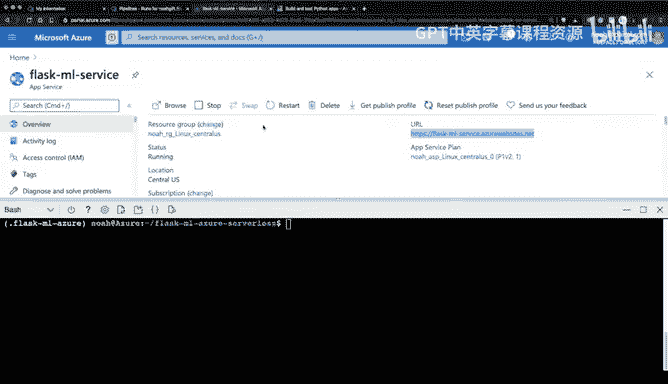
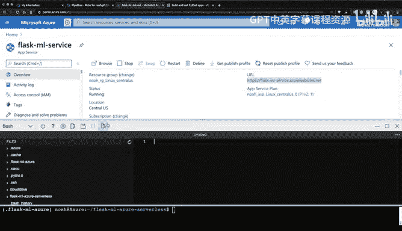
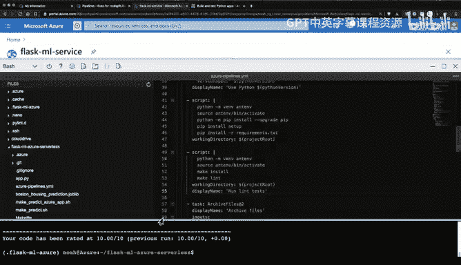
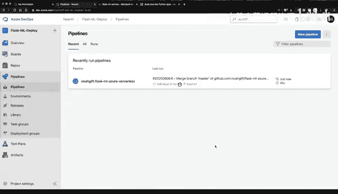

# 杜克大学《构建大规模云计算解决方案（基础、虚拟化，1-2课／共4课Building Cloud Computing Solutions at Scale》 - P63：63_05_06_使用Azure构建含代码检查的持续交付流水线.zh_en - GPT中英字幕课程资源 - BV1oT421k7YQ

One of the ways we can improve our Azure continuous delivery process is to add a quality control gate。

 There's a couple quality control gates that are simple in Python。

 One is Lnting and the other is test。 Let's make the Lint part what we covered right now。

 I'm going to go to the official Azure documentation here。

 and show you that you can either install a Lint by adding a script section to the Yal file。

 or you could add Py test and collect coverage report data， and that could show up as an artifact。

 I'm going to go ahead and do this section， right is I'm going to add this。Scrip section。

 so I'm just going to copy this。And also I'll go back again to my Azure Cloud shellll environment。

 and I'm going to select this icon for the editor。

And what's nice about this is right inside of my project。

 I can select the checkout and go to that Azure pipelines file。

And I can scroll down a little bit and find where would be a good spot。 Well。

 this looks like it's a good spot。 I've already activated a virtual environment and I've got some installation set up there。

 so I should be able to add。😊，Another section here and can paste that in。

And I will slightly tweak this though， because I'm going to use Pylint and to make it even easier。

 I'm going to show you， I can mimic what I do in the shell。 And this is why I like the make file。

 if I type in make Lint here。You can see that it runs a pilotin command with exactly the options I want。

 and I want to replicate this in this environment。 So what I will do is essentially just copy this syntax right here。

And put all of this in。To this。In fact， I can just mimic this， in fact。

 this would be the best way to do it。Go through here， mimic it。

And then instead of this these two setups here， because I've already got this stuff triggered。

 I can say。Make install。And we can say make L right。

 It actually dramatically simplifies what's happening。

 And if I go again to what they called this display name。

 why don't I just copy that syntax So we'll go through here and we'll say display name there we go。

 So this will let me see what that build step is So that looks pretty good I've got the installation。

 I've got the L and theyre also make commands so what I will do is I will run a get status here。

And commit that change。

So that change to PyLt has triggered a deployment and now I can watch it actually go in action so I can click on this link and look at the build job in practice and this will actually go through and in fact run our L so you can see that I was able to by including that command here。

Make sure that the Li actually works。 So this is really helpful is that it shows me the exact name of the deployment process step that I added and I know that my code has got an additional quality control gate that is really powerful and helps me in making sure that I don't deploy things that have problems。

