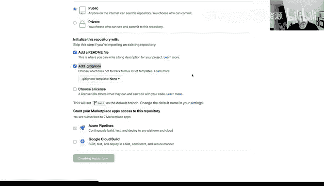
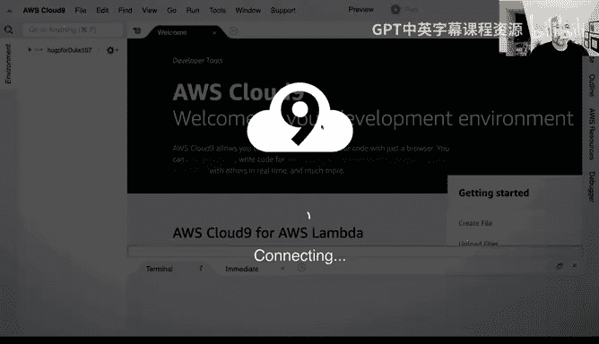
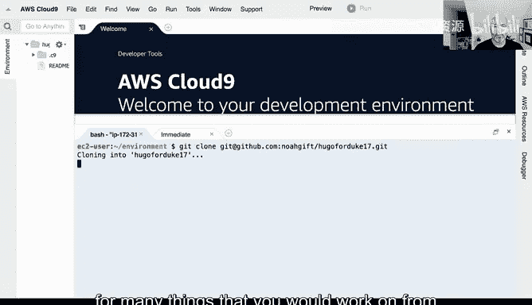

# 构建大规模云计算解决方案：1-2：为Hugo设置AWS Cloud9和GitHub初始环境 🚀

在本节课中，我们将学习如何为构建Hugo静态网站设置初始的开发环境。我们将使用AWS Cloud9作为云端集成开发环境（IDE），并将其与GitHub仓库连接，以便进行版本控制和协作。整个过程将展示如何结合基础设施即服务（IaaS）和无服务器（Serverless）架构来部署一个高可用的网站。


---

## 使用AWS Cloud9创建开发环境

首先，我们开始设置云端开发环境。使用AWS Cloud9是一个良好的实践模式，因为它提供了一个预配置的、可直接编码的环境。

以下是创建Cloud9环境的步骤：

1.  在AWS Cloud9控制台中，选择“创建环境”。
2.  将环境命名为 **`HugoForDuke107`**。
3.  在描述中注明：“这是一个用于构建Hugo网站的临时环境”。
4.  保持所有其他配置为默认值，以简化设置。
5.  点击“创建”按钮，启动环境。

在环境创建的同时，我们可以并行进行下一步操作。

---

## 在GitHub上创建代码仓库

上一节我们启动了Cloud9环境，本节中我们来看看如何准备代码存储库。我们需要在GitHub上创建一个新的仓库，用于存放Hugo网站的源代码。

以下是创建GitHub仓库的步骤：



1.  登录GitHub，点击“New repository”按钮。
2.  将仓库命名为 **`HugoForDuke17`**。
3.  在描述中填写：“Sample Hugo website for Duke class”。
4.  选择“添加README文件”选项。
5.  在“.gitignore”模板选择器中，暂时选择一个模板（例如“Node”）。我们稍后会回来修改这个文件，这是一个微妙但重要的细节。
6.  点击“创建仓库”按钮。

至此，我们创建了一个空的代码仓库。现在，让我们回到正在启动的Cloud9环境。

---

## 理解背后的架构：IaaS与Serverless



在继续配置密钥之前，有必要简要了解我们将要使用的架构。虽然本教程以实践操作为主，但理解核心概念很重要。

我们将使用**基础设施即服务（IaaS）**和**无服务器（Serverless）** 架构来部署网站。

*   **IaaS层**：我们将使用Amazon S3（一种对象存储服务）来托管Hugo生成的静态网站文件。S3提供了 **`99.999999999%`**（11个9）的持久性，这意味着数据几乎永远不会丢失，年故障时间仅为毫秒级。
*   **Serverless层**：在IaaS之上，AWS提供了无服务器服务（如CloudFront、Lambda@Edge），使我们能够托管**全球可扩展**的网站。这意味着即使像《华尔街日报》或《纽约时报》这样规模的网站，也能通过此架构支撑。

本质上，无服务器是在基础设施即服务之上构建的更高层抽象，但本项目的核心是S3存储桶。

---

## 配置SSH密钥连接GitHub

现在，我们的Cloud9环境应该已经准备就绪。接下来，我们需要创建SSH密钥对，以便Cloud9环境能够安全地与GitHub仓库通信。

**请注意**：如果这是你第一次创建Cloud9环境，才需要执行此步骤。如果已有环境，可以跳过。

以下是生成并配置SSH密钥的步骤：

1.  在Cloud9环境的终端中，运行以下命令生成密钥：
    ```bash
    ssh-keygen -t rsa
    ```
2.  在提示保存位置和输入密码时，直接按五次回车键，接受所有默认值（空密码）。
3.  生成后，使用以下命令显示公钥内容：
    ```bash
    cat ~/.ssh/id_rsa.pub
    ```
4.  复制终端中显示的整个公钥字符串。这是可以公开分享的部分。
5.  打开GitHub，点击右上角头像，进入“Settings”。
6.  在侧边栏选择“SSH and GPG keys”。
7.  点击“New SSH key”，将标题命名为“HugoKeys”，并将复制的公钥粘贴到“Key”字段中。
8.  点击“Add SSH key”确认添加。

---

## 克隆GitHub仓库到本地环境

密钥配置完成后，我们就可以将之前在GitHub上创建的仓库克隆到Cloud9环境中，开始开发工作。

以下是克隆仓库的步骤：

1.  在GitHub上，进入你刚创建的 `HugoForDuke17` 仓库页面。
2.  点击绿色的“Code”按钮，选择“SSH”选项卡，并复制提供的SSH链接（例如 `git@github.com:username/HugoForDuke17.git`）。
3.  回到Cloud9环境的终端，使用 `git clone` 命令和复制的链接来克隆仓库：
    ```bash
    git clone git@github.com:username/HugoForDuke17.git
    ```

这种从零开始设置开发环境并连接版本控制系统的流程，在你开始新项目或加入新团队时非常常见，是一个推荐的标准实践。

---



本节课中我们一起学习了如何为Hugo项目搭建初始的云端开发环境。我们完成了使用AWS Cloud9创建IDE、在GitHub建立代码仓库、理解IaaS与Serverless的基础架构概念、配置SSH密钥认证以及将远程仓库克隆到本地环境这一系列步骤。这为后续实际构建和部署Hugo网站奠定了坚实的基础。