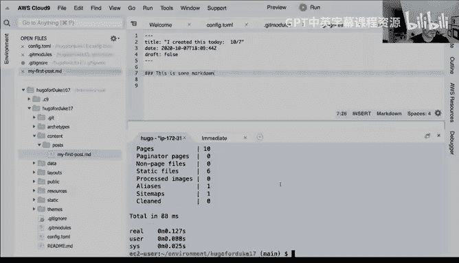

# 杜克大学《构建大规模云计算解决方案（基础、虚拟化，1-2课／共4课Building Cloud Computing Solutions at Scale》 - P65：65_05_09_在AWS Cloud9中构建Hugo目录.zh_en - GPT中英字幕课程资源 - BV1oT421k7YQ

So no， we've got this。

The Github local， the next thing I'm going to do is I'm going to download a copy of this Hugo binary and we can go to Hugo。

 Let me just get the link to it。 They have a copy of this。Right here。

 I'm just going to copy this link。And I'll just throw this in there。And inside of GitHub。

 they show you the latest releases here， and this one looks like it was released nine hours ago。

Which。Hopefully is still there isn't some big problem with it。

 that's one thing that's always a little bit spooky is is is there going to be a problem？With。

You know， if you're using a bleeding edge version， so I'm going to actually。Go to the Linux。

64 bit tar file right here。 I'm going to grab this one。

And I'm going to say copy link address that looks like that should work。

And then I'm going to just curl that or W get it either one， so it'll say W get。

And what the Wget command does is this is like a， you know。

 if you go to a website and you click a link that downloads something。

 Wget is just a command line version of it， so it's a very handy tool to be aware of if you haven't used it before so we do this and it puts it locally now once it's in my local system here。

I can uncompress this T GZ file and this is also a command that comes up all the time。

And I've used it for。Probably two decades。 and it's almost like memory now is that when you see a file that's a tar and a G Z。

 what that means is that it's a it's basically like a folder full of files that are also zipped together and compressed。

 And so it's a very common standard for Linux software。 And if you run。Tar space Z X V F。

 it's the flags that you would use to like verbosely dump out the contents of that compressed file。

 so I'm going to go ahead and do that。Just like this， and then this should uncompress locally。

There we go。 Now， I think I said last time that。We would put this into the Tilda bin directory。

And so the reasoning behind this is so that it will show up on our path and just makes things a little bit easier to deal with。

 so I'm going to actually do that I'm going to say maketer dash P。Tilda bin。

 this is not necessarily strictly necessary for us to use Hugo。

 It's just convenient to put things in your path so that I don't have to worry about where the Hugo binary is So I'm going to go ahead and make this directory using that command makeDP and if you're not familiar with makeDP what it does is it not only makes the directory but it actually does it in a way where I think it's item potent if I remember correctly is that you can run it over and over and over again and if the directory exists is just won't do anything。

 So it's kind of a nice way to create a directory and then I'm going to move this Hugo file here into the Tilde bin directory。

Till the。Let's see here。Ben。Move it into there。Okay， so now if I type in which you go。

It should show me it's in my current， it's in my users's bin directory。

 which is a good place to put your binaries。 And if I type in Hugo。Unable to， so it looks like it's。

 it's good to go。 So now that I've got Hugo running， the next step here would be to。Create a。

Basically a local website in Hugo， and the way that you do that is that you run this thing called Hugo New site。

Quick site， sorry， Hugo new。Site， quickite， Hugo new site， Quick start。 So Hugo。New。Saite。

And we'll call this quick start like that。There we go。It it says， great。

 you created this new website and then it tells you what it is you would need to do， which is。

To add some styling， so like fancy JavaScript and all kinds of things like that。

 I would I would need to to do this other stuff。 So what I'm going to do。

I I'm also going to move this if I remember correctly。

 this is probably the right way to do this is I'm going to move this directory into the project that I just checked out。

 the source control project。And the reason I'm going to do this is so that this is actually what I wanted to keep in source control because the raw template is actually the stuff that later I'm going to build programmatically and build HTML files from so that looks like that would be good to get this in here and then now that I can go inside of this directory。

If we type in get status， you'll notice that。Now get knows that this has not been versioned。And。So。

One of the things that I'm going to do here。Is that I'm going to。

Move all of the stuff that's in Quick Start。Into my current working directory。

 And and the reason for this is so that it's at the root of the the source control because we want。

 we want just basically this directory has flat and has all these files in there。

 And then I can actually just remove this。Dictory， quick start。

RightBecause basically what it'll look like now is that。Well， it should look like that。That's weird。

 Did I just screw something up？Oh， I must have moved it up too high so I can just do it again。

 I can just remove actually to make it simple here。I'm going to。Move。

I'm going to do this one more time。This this is the stuff that gets a little bit。

 it's easy to make mistakes I'm making a mistake on do this is that basically what I want to do is create a scaffolding and then dump these files inside of the source control。

 so I'm going to make it one more time。And then I'm going to CDd into Quickite， quick start here。

 and I'm going to C everything recursively。And I'm going to just be explicit here。

 I'm going to say put all the files inside of here into。Up one directory into the Hugo for Duke。

NowNow let me change into that directory。And just see here if this works。Okay， there we go。 Sorry。

 that was， it's easy to make mistakes on the shell。 And then you have extra files somewhere。

 So now if I type in get status。We should see okay， great， I've got this stuff inside of here。

The next thing I can do is I kind of type in。Gt submodule， add。

And so what this will do is it will give give it a。

Basically links to another git repo that has one section of a gett repo。

 so I have my main source control and then I have a linked folder that will be linked to a different repo so I can just go ahead and do this。

Which is。Get sub moduleule a。And then run this。 There we go。 That looks like that works。

 And then the next thing that I'll do。Is that I will go through here and paste this out into a config file。

 So the main。You know， smarts。Of Hugo here， live inside of this config file， and so this config file。

 there's not a lot going on。And I can just paste this in there。And then if I look back here。

It should。If I open this back up again。Let me just double check why that doesn't show up。Config。

 echo theme。Let's see here。So this， this guy doesn't need to exist anymore we can。

We can get rid of this。And then this one。We should just be able to put in。Theme。

 I don't know why that command does not work in echo theme。

 but basically I'm going to put inside of your theme。And put in the the name of the of the theme。

 So theme is equal to。AN A K， there you go， but so this is essentially the。

The majority of the way this thing is controlled， and I also can just get rid of some other stuff in here so I don't need this。

That looks like I can get rid of that。Now。That is weird。

 why don't I have two of these inside of here， is that what I screwed up？

I might have done something weird， which is。I don't know why it shows Hugo for Duke。Oh。

 because I'm tripping myself up。 That's that， I think， is the name of the。Of the the folder here。

 But I don't know why is showing another。Oh， it it's because I created these。When I copied the。

When I copied the folder originally， I accidentally put this data up here。So we don't want that。

We can just get rid of all this stuff， that's the problem， that's what was confusing me。Okay。

So we just have this thing and then if I look inside of here， this D lookss good， okay， great。

And if I type in get status。I can actually add in this the rest of the stuff， so add。

This git add config。As well， config。So the piece that is a little bit tricky that I was telling you about is in this Gi module section here。

That。I'm sorry not the Git Mo section， the gett ignore section。Is if we did go here。

 we should have a gi ignorer。Let's see you get status。Why do I not have a gi ignore here？

Let me first just check this in。Adding Hugo。Now notice that it's going to ask me to put some information here。

Inside， we'll save this。And then I'll。Update this as well。Do this。Okay。And then we'll reset this。

Okay。Write this out。And then。Exits， perfect。So if I push this。

 let's just double check that all this is inside of there。And when we got， we got this， Yeah。

 I thought I'd added a gi ignorere， but， but maybe I forgot to click the button for it。

 but basically the the point that I was gonna mention is that I'm just gonna to make one real quick。

 To dot gi ignorere is that。Get I nor。Is that with the get ignore what's important。

Is to ignore the public directory and the public directory。

Will be where we're going to generate assets so these assets will actually generate a bunch of HTML files and I don't want to check those in because I'm going to be changing them constantly when I make my project and so I want to put basically get ignore the public directory。

 So if I go through here and I said get status， I can add do get ignore。

So a little bit trickier than I wanted to show it， but it looks like we're good to go adding Git ignorere。

So as you can see the command line， some of the downsides is that it's super powerful and it's easy to tweak things。

 so Hugo。Is。You can run a command where it'll create a post。

 so I'm going to go ahead and run this command， which is new post。And then， if I go to。

The content here， you can say here's my first post。 I can actually。嗯。Say， you know。

 basically draft false and say， you know I'm。You know， I created this， I created this today。10，7。

And it's just literally a markdown file and just you know。This is a markdown。So once I've done this。

 then you can run this， you can run。Actually there's two ways to look at data with Hugo。

 you can either run it in a foreground mode so that it shows you a Hugo service like a Hugo web service or what you can do is you can also do Hugo as a as a statically generated asset so I think the first thing that I'm going to do is that I will。

Run it in foreground mode。 And so what I'm going to do is I'm going to go to。EWS here。

And I'm going to show you how I could open up the correct port so that I can see port 8080 running。

So if we go through here and I log back in。I'm going to find my instance here， which is EC2。

And inside this running instance。You should see。😔，Cloud。Cloud。

 we should see AWS Cloud 9 environments。EC2 dashboard， running instance。There we go。

 That's the 1 I want。 So I'm going to click on this one， and。

All I need to do is go to security here and notice that it has this security group like this is I can just tweak these rules。

 the rules to allow me to get access to port 8080， so I'm going to click on this。

And I'm going to say， I want the inbound rules to have another rule。

 and this other rule will be port 8080， so I'm going to say source everybody in the whole world。

And then the port range， so source type， the port range would be port 8080。

And I can put a description and say this is to preview Hugo。All right。

 so we'll go ahead and add that rule。And then now that I've got that running。

 I can go back here and I can type in Hugo Serve， but first。What I do here is just type this command。

Like this， which will show me what the IP address is so that I can also put this。

 I believe in the config file。Or I can tell Hugo when I bind it。Basically， what is my Ipedra。

I'm going to run this command that's in the document that I shared earlier。

 and I can go and put this IP address in there。So there we go， go here。😔，Pece this in。And then。

Could do that。And it looks like it it's running， which is great。 And if I click on this。😊。

I can actually just copy this and put this in another tab here。Go like this。M。

And hopefully this works。Be a bummer if this thing is not。Is not demoing。

 which it looks like it's hanging， which I'm not sure why that's hanging。Am I doing。3。

Maybe I need to do explicitly HTTP。So， let's see。Not sure why this one is not。Huos serve bindd。

 port 8080。😔，Well， is not that critical that it's running locally because we can work around this。

 but that is strange here because I have port 8080。Anybody in the world can access it。

And then if I go back to EC2， it's this instance。So not sure why this thing is。Is not giving me。

The ability to。Cur it， I'm going to try to curl it from my house real quick and just see if I can get access to it。

But basically。Go here。And do that。But yeah， I don't know why this thing。

This is the least important part which is that you can preview it earlier。

 but the other thing you can do is you can type in Hugo and Hugo will just generate a bunch of HTML files like that and notice how it' said it generated 10 pages now what did it do is it created a public directory and so this public directory has all of my HTML assets and if you look at the time if I timed this for example。

This will actually。It took 88 milliseconds and it generated 10 HTML pages， so it's ridiculously fast。

 so this is why you could build a huge new site， for example， using something like Hugo。

And really the next step here would be how do we get this stuff and move it over to an S3 bucket so we can serve it out you can serve out Hugo with that web service like I don't know why that wasn't the ports weren't open up but you could just put it on a server like an EC2 instance the downside to that is that what if it goes down there's problems so that's why serverless is so powerful is that I can just copy it over。

