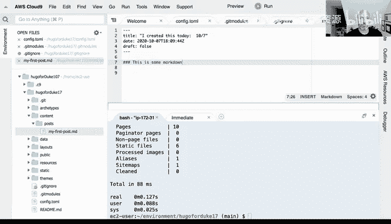
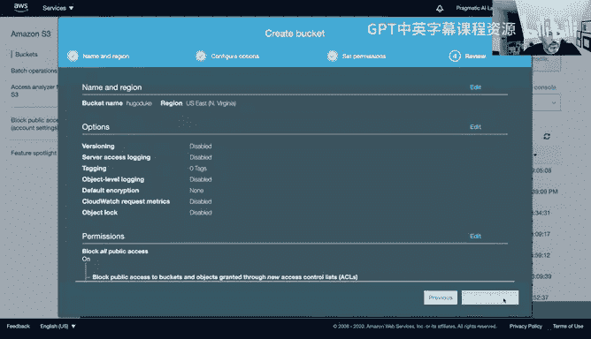
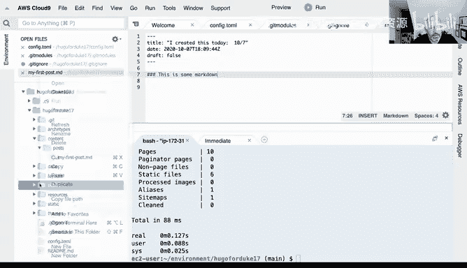
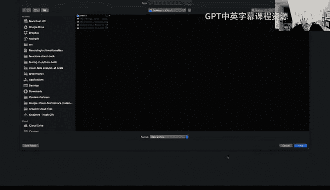
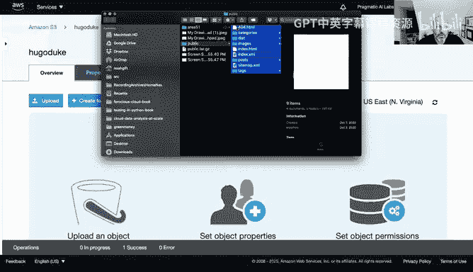
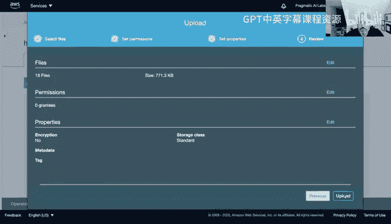
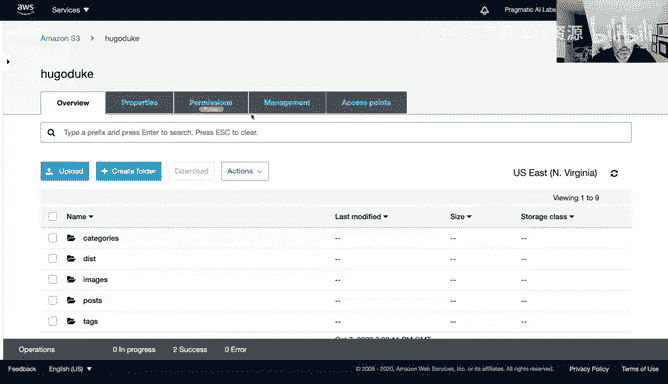
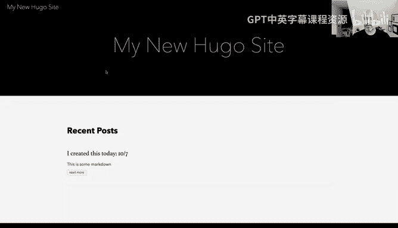

# 构建大规模云计算解决方案：1-2：将Hugo数据复制到AWS S3存储桶并配置静态网站托管 🚀


在本节课中，我们将学习如何将本地生成的Hugo网站文件上传到AWS S3存储桶，并通过配置S3的静态网站托管功能，快速部署一个高可用性的网站。整个过程展示了无服务器架构的简便与强大。



上一节我们介绍了Hugo静态网站生成器的基础使用，本节中我们来看看如何将生成的网站文件部署到云端。

## 创建S3存储桶

首先，我们需要在AWS S3服务中创建一个新的存储桶来存放网站文件。



以下是创建存储桶的步骤：
1.  快速导航到AWS管理控制台的S3服务页面。
2.  点击“创建存储桶”按钮。
3.  为存储桶命名，例如 `hugo-duke`。
4.  连续点击“下一步”，使用默认配置，直至完成创建。

> 注意：AWS账户有存储桶数量限制。如果遇到“存储桶数量超出允许范围”的错误，需要先删除一些不再使用的旧存储桶以释放配额。

## 配置静态网站托管

存储桶创建成功后，下一步是启用其静态网站托管功能。这是将S3转变为网站服务器的关键步骤。

以下是配置静态网站托管的步骤：
1.  进入新创建的存储桶。
2.  切换到“属性”选项卡。
3.  找到并点击“静态网站托管”选项。
4.  选择“使用此存储桶托管网站”。
5.  在“索引文档”字段中输入 `index.html`。
6.  （可选）在“错误文档”字段中输入 `error.html`。
7.  点击“保存”按钮。

此功能是一项无服务器技术，只需点击按钮即可获得一个具备高可靠性的网站托管环境。

## 设置存储桶策略

为了使公众能够访问我们托管的网站，必须配置存储桶策略，允许公开读取权限。

以下是设置存储桶策略的步骤：
1.  切换到存储桶的“权限”选项卡。
2.  找到“存储桶策略”部分并点击“编辑”。
3.  在策略编辑器中，输入一个允许公开读取访问的策略。策略结构如下：
    ```json
    {
        "Version": "2012-10-17",
        "Statement": [
            {
                "Sid": "PublicReadGetObject",
                "Effect": "Allow",
                "Principal": "*",
                "Action": "s3:GetObject",
                "Resource": "arn:aws:s3:::您的存储桶名称/*"
            }
        ]
    }
    ```
4.  将策略中的 `您的存储桶名称` 替换为实际的存储桶名称（例如 `hugo-duke`）。
5.  点击“保存”策略。

> 注意：如果保存策略时遇到错误，提示“阻止公共访问设置”，需要先修改存储桶的“阻止公共访问”设置，暂时允许公共访问，完成策略配置后再根据安全需求进行调整。这是云平台持续增强安全性的常见做法。

## 上传网站文件



策略配置完成后，即可将本地的Hugo网站文件上传至存储桶。



以下是上传文件的步骤：
1.  在本地计算机上，进入Hugo项目的 `public` 目录，该目录包含了生成的所有静态网站文件。
2.  可以选择将整个 `public` 目录压缩并下载到本地以便上传。
3.  回到AWS S3控制台，进入目标存储桶。
4.  点击“上传”按钮，选择或拖拽 `public` 目录下的所有文件。
5.  连续点击“下一步”，使用默认设置，直至完成上传。

这个过程演示了部署一个网站的核心流程，本质上非常简单。





## 访问网站



所有文件上传完毕后，网站即部署完成。

以下是访问网站的方法：
1.  再次进入存储桶的“属性”选项卡。
2.  找到“静态网站托管”部分。
3.  其中会显示一个以 `http://<bucket-name>.s3-website-<region>.amazonaws.com` 格式生成的端点URL。
4.  点击或复制该URL到浏览器中，即可访问刚刚部署的网站。




本节课中我们一起学习了如何利用AWS S3存储桶托管静态网站。通过创建存储桶、启用静态网站托管、配置访问策略以及上传文件，我们成功部署了一个具备专业规模、高可用性且几乎不会宕机的网站。这充分展示了云计算在简化基础设施部署方面的强大能力。