# 构建大规模云计算解决方案：1-2：在AWS Cloud9中实现Hugo自动更新 🚀

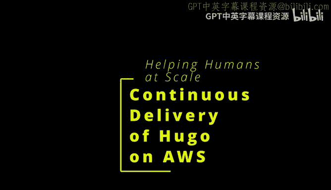

在本节课中，我们将学习如何使用Hugo静态网站生成器，结合AWS Cloud9开发环境和一系列AWS服务，构建一个能够自动更新、全球可访问的网站。我们将通过一个完整的持续交付流程，实现从代码修改到网站自动部署的全自动化。

## 概述

Hugo是一个开源的静态网站生成器，它快速、易用且无需数据库。通过将其与AWS的云服务结合，我们可以创建一个低成本、高可用性且能自动部署的网站发布系统。本节将逐步指导您完成在AWS Cloud9中设置Hugo开发环境，并配置AWS CodeBuild实现持续交付的整个过程。

## 开发环境设置与本地工作流

上一节我们介绍了课程的目标和Hugo的优势，本节中我们来看看如何搭建基础的开发环境。首先，我们需要一个与最终生产环境一致的开发环境，AWS Cloud9是一个理想的选择。

以下是设置Cloud9环境的步骤：

1.  登录AWS控制台，进入Cloud9服务。
2.  点击“创建环境”，为其命名（例如“Hugo”）。
3.  选择实例类型。为了获得更好的响应速度，可以选择配置较高的实例，例如拥有16GB内存和8个vCPU的实例。
4.  平台选择“Amazon Linux 2”，因为后续的AWS CodeBuild也将使用此平台。
5.  保留其他默认设置（如30分钟无操作超时），然后创建环境。

环境创建完成后，您将获得一个基于Bash的终端，并且已经配置了基于角色的权限，可以直接与AWS生态系统进行交互。

## 安装与配置Hugo

现在，我们已经在Cloud9中拥有了一个开发环境。接下来，我们需要在这个环境中安装Hugo并创建一个示例网站。

以下是安装Hugo的步骤：

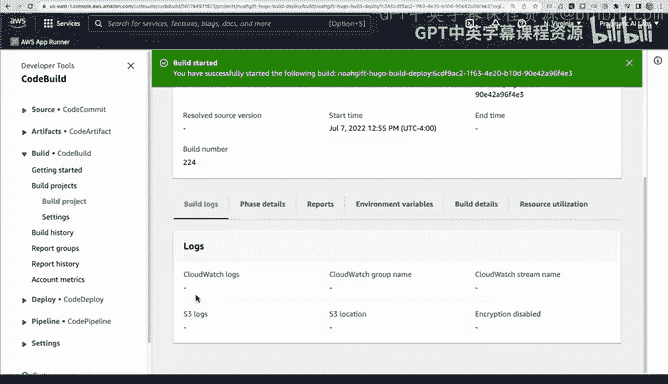

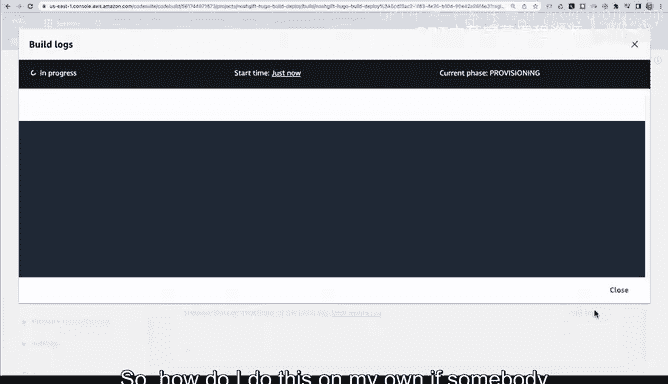

1.  访问Hugo GitHub发布页面，找到最新的64位Linux压缩包（`hugo_extended_*_Linux-64bit.tar.gz`），复制其链接地址。
2.  在Cloud9终端中，使用 `wget` 命令下载该文件。
    ```bash
    wget [复制的链接地址]
    ```
3.  解压下载的压缩包。
    ```bash
    tar -xzf hugo_extended_*_Linux-64bit.tar.gz
    ```
4.  将可执行文件复制到系统路径（如 `/usr/local/bin`）。
    ```bash
    sudo cp hugo /usr/local/bin/
    ```
5.  验证安装是否成功。
    ```bash
    hugo version
    ```

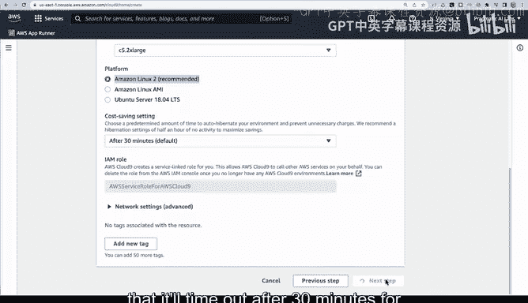

安装完成后，我们可以按照Hugo官方快速入门指南创建一个新站点。

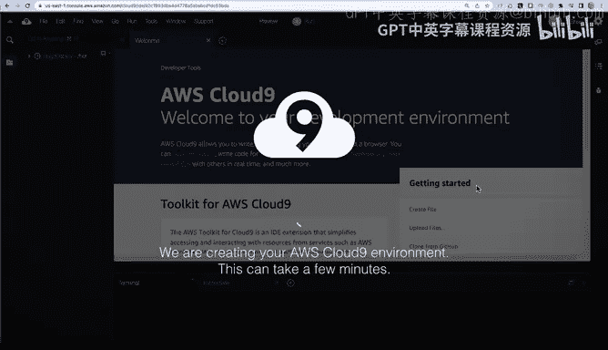

以下是创建Hugo站点的步骤：

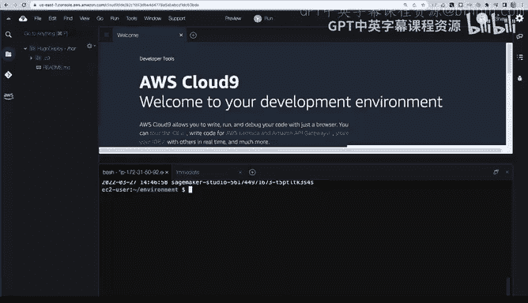

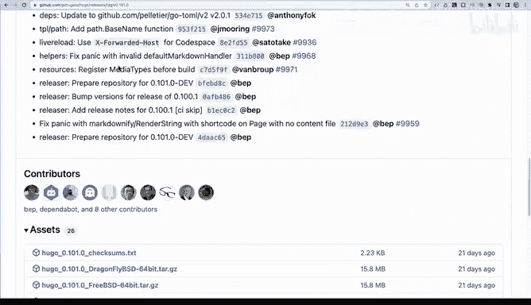

1.  使用 `hugo new site` 命令创建一个新站点。
    ```bash
    hugo new site quickstart
    cd quickstart
    ```
2.  初始化Git仓库。
    ```bash
    git init
    ```
3.  添加一个主题作为Git子模块。这里以 `ananke` 主题为例。
    ```bash
    git submodule add https://github.com/theNewDynamic/gohugo-theme-ananke.git themes/ananke
    ```
4.  将主题配置写入站点配置文件。
    ```bash
    echo 'theme = "ananke"' >> config.toml
    ```
5.  创建第一篇非草稿文章。
    ```bash
    hugo new posts/my-first-post.md
    ```
    编辑 `content/posts/my-first-post.md` 文件，将 `draft: true` 改为 `draft: false`，并添加一些内容，例如“Hello World”。

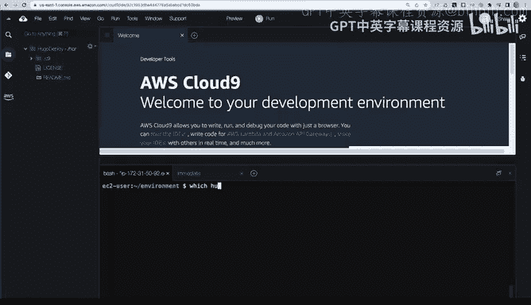

## 本地测试与远程访问

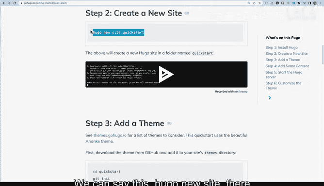

我们已经创建了一个基本的Hugo站点。为了验证其能否正常运行，并允许从外部访问进行测试，我们需要启动本地服务器并配置安全组。

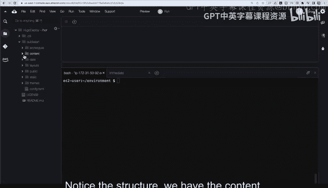

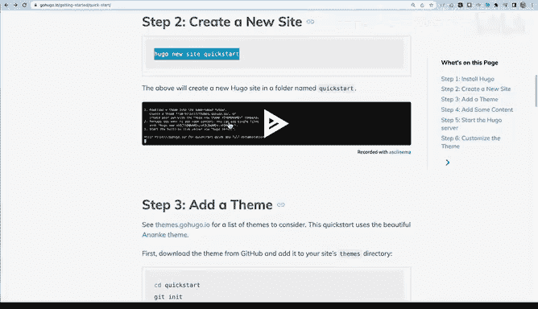

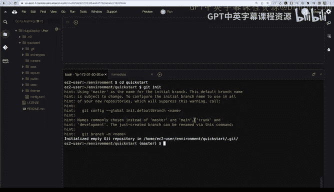

首先，在Cloud9终端中启动Hugo服务器。默认情况下，Hugo只绑定到本地回环地址（`127.0.0.1`），为了能从外部IP访问，需要指定绑定到所有网络接口。

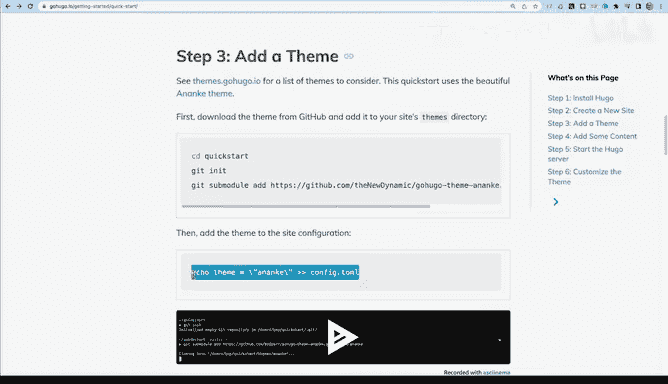

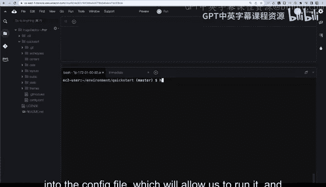

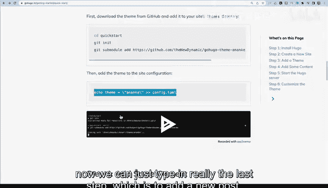

```bash
hugo server -D --bind=0.0.0.0 --baseURL=http://[您的Cloud9实例公共IP]:1313
```

命令中的 `-D` 表示包含草稿文章，`--bind=0.0.0.0` 允许外部访问，`--baseURL` 用于设置正确的基础URL。

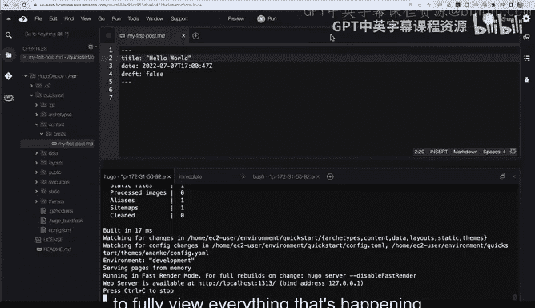

接下来，需要配置EC2实例的安全组以开放1313端口。

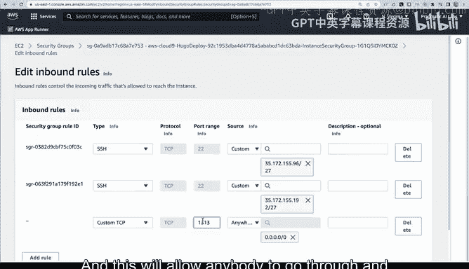

以下是配置安全组的步骤：

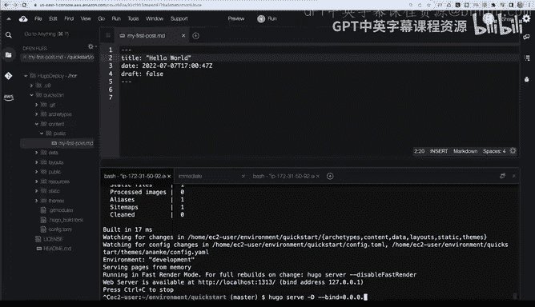

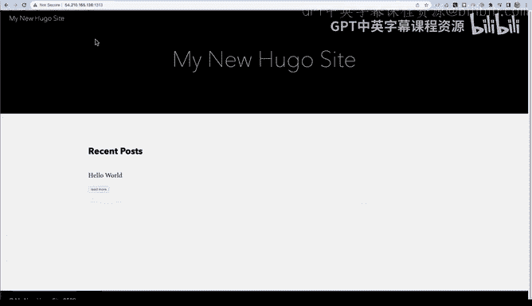

1.  在AWS控制台进入EC2服务，找到您的Cloud9环境所使用的EC2实例。
2.  点击该实例，在下方描述标签页中找到“安全组”并点击其链接。
3.  在安全组页面，点击“编辑入站规则”。
4.  添加一条新规则：类型选择“自定义TCP”，端口范围填写“1313”，来源选择“0.0.0.0/0”（允许任何IP访问）。
5.  保存规则。

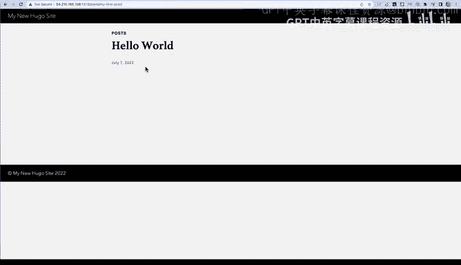

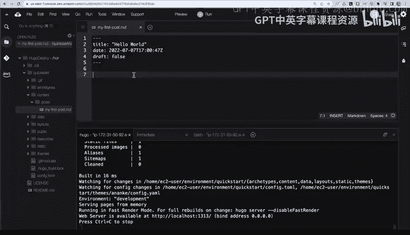

配置完成后，您就可以通过浏览器访问 `http://[您的Cloud9实例公共IP]:1313` 来查看您的Hugo网站了。在Cloud9中修改文章内容并保存，Hugo会自动重新构建，刷新浏览器即可看到更新，这演示了高效的本地开发工作流。

## 配置自动化持续交付流程

上一节我们完成了本地开发和测试，本节中我们来看看如何实现自动化部署，让每次代码提交都能自动更新生产环境网站。这需要用到AWS CodeBuild、S3和CloudFront等服务。

整个流程的核心是一个名为 `buildspec.yml` 的配置文件，它定义了CodeBuild在每次触发时需要执行的步骤。

以下是一个典型的 `buildspec.yml` 文件内容：

```yaml
version: 0.2
phases:
  install:
    commands:
      - wget https://github.com/gohugoio/hugo/releases/download/v0.88.1/hugo_extended_0.88.1_Linux-64bit.tar.gz
      - tar -xzf hugo_extended_0.88.1_Linux-64bit.tar.gz
      - sudo cp hugo /usr/local/bin/
  build:
    commands:
      - hugo
  post_build:
    commands:
      - aws s3 sync ./public s3://YOUR-BUCKET-NAME --delete
      - aws s3 cp s3://YOUR-BUCKET-NAME s3://YOUR-BUCKET-NAME --recursive --metadata-directive REPLACE --cache-control max-age=31536000
      - aws cloudfront create-invalidation --distribution-id YOUR-DISTRIBUTION-ID --paths "/*"
```


这个配置文件主要做了三件事：
1.  **安装阶段**：下载并安装指定版本的Hugo。
2.  **构建阶段**：运行 `hugo` 命令，将Markdown等内容生成静态HTML文件到 `./public` 目录。
3.  **构建后阶段**：
    *   使用 `aws s3 sync` 将 `./public` 目录下的文件同步到指定的S3存储桶。
    *   使用 `aws s3 cp` 递归地更新S3中所有文件的缓存控制头，设置较长的有效期。
    *   使用 `aws cloudfront create-invalidation` 命令使CloudFront CDN的缓存失效，确保用户立即看到新内容。

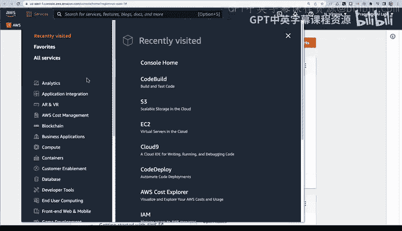

要使用这个流程，您需要提前完成以下AWS资源配置：
1.  **S3存储桶**：创建一个存储桶并启用“静态网站托管”功能。同时，需要配置存储桶策略，允许公开读取对象。
2.  **IAM角色**：创建一个供CodeBuild使用的服务角色，该角色必须拥有向上述S3存储桶写入数据以及使特定CloudFront分发缓存失效的权限。
3.  **CloudFront分发**（可选但推荐）：创建一个分发，将S3存储桶作为源站。这可以加速全球访问并启用HTTPS。
4.  **Route 53**（可选）：如果您有自己的域名，可以在此配置，将域名指向CloudFront分发或S3网站端点。

最后，在AWS CodeBuild控制台创建一个新的构建项目，将其源代码指向您的GitHub仓库，选择“Amazon Linux 2”托管镜像，并指定使用我们创建的IAM角色和 `buildspec.yml` 文件。这样，每次向GitHub仓库推送代码时，CodeBuild都会自动执行构建和部署流程。

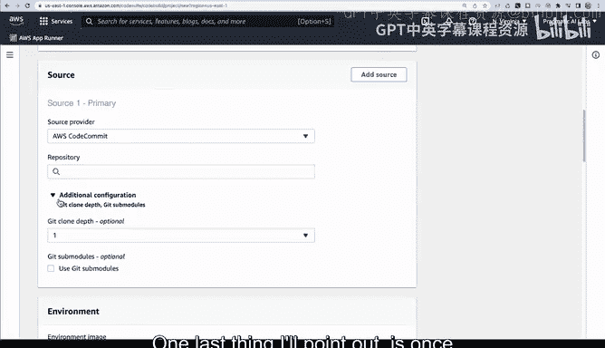

## 总结

本节课中我们一起学习了如何利用Hugo和AWS云服务搭建一个完整的持续交付静态网站系统。我们从在AWS Cloud9中设置开发环境开始，逐步完成了Hugo的安装、本地站点的创建与测试。接着，我们深入探讨了如何通过配置AWS CodeBuild、S3、CloudFront和IAM，实现从代码提交到网站全球自动部署的自动化流水线。


这套方案的优势在于：**成本低廉**（主要费用为S3存储和CloudFront流量），**高度可扩展**（能承载如纽约时报级别的流量），**安全性高**（静态文件只读），并且**完全自动化**，让开发者可以专注于内容创作。您可以使用这个系统来传播真实、有价值的信息，正如课程初衷所期望的那样。