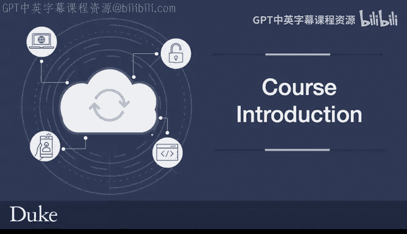
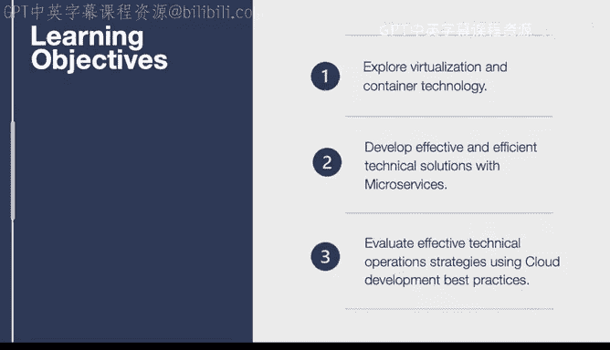
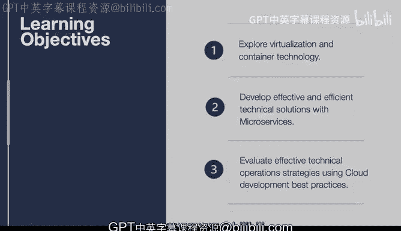

# 杜克大学《构建大规模云计算解决方案（基础、虚拟化，1-2课／共4课Building Cloud Computing Solutions at Scale》 - P69：02_01_02_课程介绍.zh_en - GPT中英字幕课程资源 - BV1oT421k7YQ

In this course， we'll learn the cloud building blocks necessary to build sophisticated applications in order to get more into the details of these building blocks。

 which include virtualization and containers， this can do things like launch a spot instance。

 which is a pens on the dollar version of a virtual machine or use Docker format containers to containerize an application and deploy it to Kubernetes。

Another thing that we'll get into is microservices and microservices are a critical component of DevOs best practices and really what a microservice is is it's a particular function that's mapped to let's say a web interface and that particular function does one thing really well and we're gonna learn how to build these effective and simple microservices we'll also get into the operational characteristics of the cloud and we'll go through some operations best practices。

 including monitoring and logging and making sure that when you build something you also have a dashboard that you can get into that shows you what's going on very similar to an airplane when you look at the instruments when you're flying。

 it gives you the correct altitude or the direction that you're headed in Now let's talk about the learning objectives for this course the learning objectives first start out with giving you the ability to evaluate virtualization and container technology so that you can make the。

choiceice based on the solution that's in your present portfolio， for example。

 you might need to use a virtual machine for a legacy application or a container for let's say a data science project。

 it really depends on the context and we'll go into those different context details。

Next we'll talk about how to develop effective and efficient technical solutions with microservices。

 as I mentioned earlier， DevOP's best practices include microservices。

 and we'll get into some of the details of how an effective microservice can simplify an application and lead to increases in productivity and really effective and highly available applications。

Next， we'll talk about how to evaluate effective technical operation strategies。

 so should you load test your application， how should you do alerts， monitoring。

 what are the different strategies that you can use to make sure that when you deploy your code。

 not only does it run effectively， but other people in your team can help maintain it。

