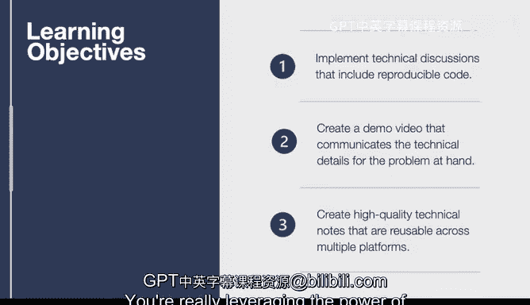

# 杜克大学《构建大规模云计算解决方案（基础、虚拟化，1-2课／共4课Building Cloud Computing Solutions at Scale》 - P6：06_02_02_技术讨论介绍.zh_en - GPT中英字幕课程资源 - BV1oT421k7YQ

In this lesson， we discuss how to develop effective technical discussions。

The techniques covered can instantly help you become more impactful in both individual and group projects。

 let's dive into the learning objectives。First， we talk about how to implement technical discussions that include reproducible code。

 so for example GitHub itself can hold notebooks， it can hold the markdown language。

 it can hold many things that allow you to show exactly what you want to do and then another user can check that out and run it step by step and this is a key point in a technical discussion。

We'll also go into how to create a 30 second to two minute demo video that communicates the technical details for the problem at hand。

One of the key things in the world we live in in post COVID 19 is the ability to communicate electronically and asynchronously。

 and this is one of the key things that we'll cover in this course and we'll follow up on that on many other lessons。

We're also going to get into how to create high qualityality technical notes that are reusable across multiple platforms a good example of this is if you create your documentation and markdown。

 you can later turn that into a book， you could turn it into some notes that are used in source control。

 you can use that in many different forms， including web pages and when you can create something once but then reuse it multiple times。

 you're really leveraging the power of effective technical communication。

