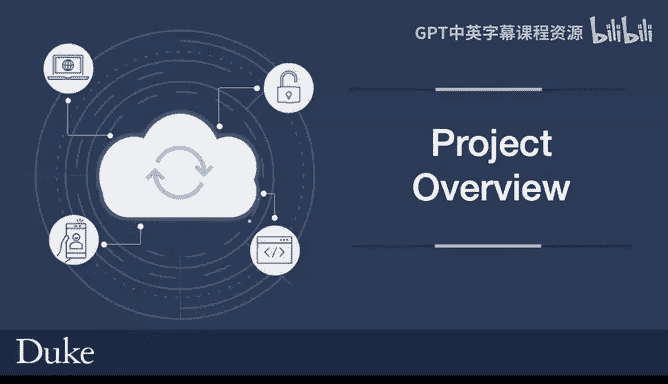
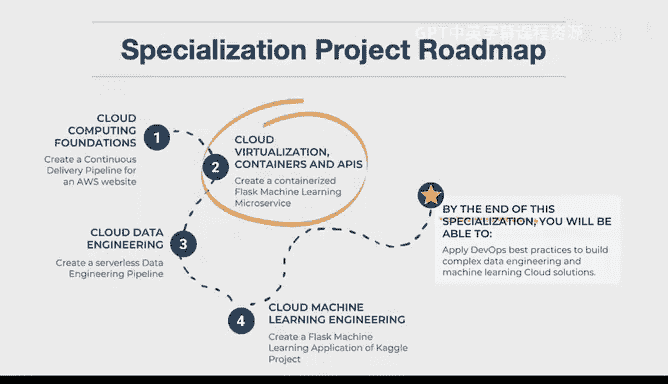
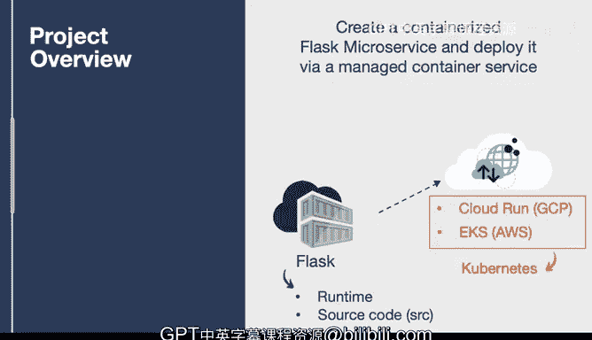

# 构建大规模云计算解决方案：课程二：项目概述 🚀

在本节课中，我们将一起学习课程二的最终项目。你将创建一个容器化的 Flask 微服务，并将其部署到一个托管的容器服务中。我们将逐步解析项目中的核心概念，确保你能清晰地理解每个部分。

## 项目简介

你将构建的项目是一个容器化的 Flask 微服务。这意味着你需要创建一个独立的、包含所有运行时和源代码的工作单元，并将其部署到云服务商提供的托管容器平台上。

## 核心概念解析

上一节我们介绍了项目的整体目标，本节中我们来详细看看其中涉及的关键术语。

### 容器

容器是一个独立的工作单元。它通常采用 Docker 格式，包含了部署应用所需的所有运行时环境和源代码。其核心公式可以表示为：

**容器 = 运行时环境 + 应用程序源代码**

这是容器与常规应用程序的一个关键区别。常规应用可能依赖外部环境，而容器将一切打包在一起，确保了环境的一致性。

### 微服务

关于微服务，我们将在后续课程中深入探讨。简单来说，微服务是一个单一用途的应用程序。它专注于做好一件事，就像一个厨房小刀或搅拌机，功能专一且高效。

### 托管容器服务

在云平台上，有多种托管的容器服务可供选择。每个主要的云服务提供商都提供此类服务。以下是几个例子：

*   **Cloud Run**：这是谷歌云平台（GCP）上的一项全托管容器服务。你只需提供一个 Docker 格式的文件，将其推送到容器注册表（存放容器的地方），该服务就能自动将其转换为一个可用的 Web 服务。
*   **AWS EKS**：这是亚马逊云科技（AWS）平台上的服务，用于在 Kubernetes 环境中管理容器。

你可以灵活选择最适合你工作流程的托管服务来部署你的容器。

## 总结

本节课中，我们一起学习了课程二最终项目的概述。我们明确了项目目标是构建一个容器化的 Flask 微服务，并解析了“容器”、“微服务”和“托管容器服务”这三个核心概念。在接下来的实践中，你将有机会亲手实现这个项目。