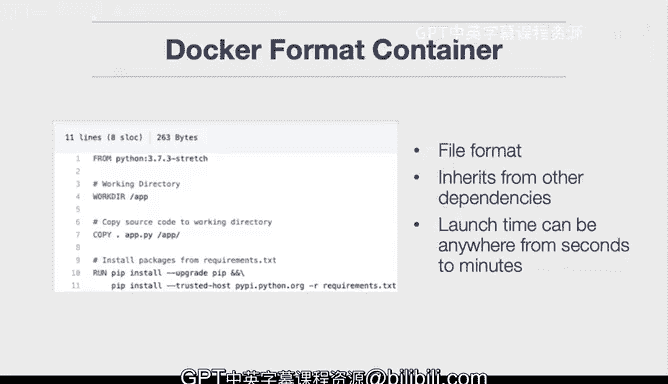

# 杜克大学《构建大规模云计算解决方案（基础、虚拟化，1-2课／共4课Building Cloud Computing Solutions at Scale》 - P73：06_02_02_虚拟机简介.zh_en - GPT中英字幕课程资源 - BV1oT421k7YQ

In this lesson we dive into virtual machines， virtual machines are a critical component of cloud computing。

 and they allow you to do things like run a guest operating system inside of a host。

Let's talk about some of the things we'll cover， it'll be containers versus virtual machines。

 how spot instances work， and also how to launch a spot instance and also how to launch a GCP virtual machine let's go through the learning objectives。

First， we're going to evaluate different virtualization abstractions。

 so what are the appropriate ways to virtualize an application， what are the tradeoffs。

 and what are some of the things that you need to be aware of。

We'll also talk through how to build solutions with virtual machines。

 Virual machines are still widely used in the cloud。

 and we'll talk through some of those key characteristics of building virtual machines。

 Let's go through some of the key terms that we cover in this course。 First， we get into a container。

 A container allows you to build cloud native applications。

 including things that use the Kubernetes orchestration service。

 It's also at Devops best practice to use containers to build your applications。

And what it does is it includes the runtime along with your code。

 and one other key characteristic of a container is that they can launch in milliseconds。

Let's also talk through some of the key characteristics of virtual machines one is they're used for monolithic applications。

 so let's say you have a web framework where it's been running for 10 years。

 you could port it over to a virtual machine and that would be an appropriate use case It also allows you to run an operating system inside of another operating system let's say you're running a Mac OS10 and you want to run Linux inside of it that would be a good use case for a virtual machine。

Finally， unlike containers， the launch time could be anywhere from seconds to minutes。

 and this is a key difference in why there may be some use cases where containers could be more appropriate。

Let's talk through a Docker format container a Docker format container is really just a flat file that has some key directives inside and if you notice I inherit from Python 373 here and then I assign some directories where I put my code into and then I installed the software inside that's really the key difference with the Docker format container is it the file where you tell it what operating system code or the runtime should live inside of your source control project it's a file format and inherits from other dependencies and then also it launch time can be in seconds to minutes so that's the key characteristics of a Docker container。

