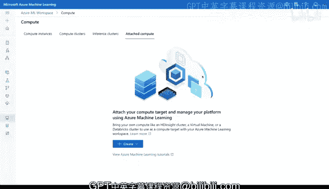

# 构建大规模云计算解决方案：1-2：在Azure机器学习工作室中创建计算集群 🚀

在本节课中，我们将学习Azure机器学习工作室中的核心计算选项，包括计算实例、计算集群和推理集群。我们将了解它们各自的用途、配置方法以及如何根据不同的工作负载选择合适的类型。

---

## 探索Azure计算选项

上一节我们介绍了Azure机器学习工作室的界面。本节中，我们来看看其中几种核心的计算资源类型。

在这个界面中，我们可以看到**计算实例**、**计算集群**，以及**推理集群**。那么它们之间有什么区别呢？

---

## 计算实例：用于交互式开发

计算集群是您可以启动并配置Jupyter Notebook环境的地方。我们可以直接创建一个。

如果我选择“新建”，并输入名称，例如“Jupyter-demo”。在这里，我可以在CPU和GPU之间进行选择，这取决于我要解决的问题类型。我还可以在不同规格的虚拟机大小之间切换。此外，如果需要，我还能通过SSH连接到该实例。配置完成后，我点击“创建”。

创建过程通常需要几分钟时间。

---

## 计算集群：用于弹性训练

现在，让我们也看看计算集群。如果进入计算集群部分并选择“新建”，操作类似。我可以将其命名为“demo-cluster-2”。同样，我可以在GPU和CPU之间切换。

例如，如果我打算进行自动化机器学习或深度学习，那么GPU对于这类特定工作负载来说就非常合适。这里还有一个重要的设置是虚拟机优先级。点击后可以看到，“专用”意味着它始终存在。但很多时候，对于实验任务，我认为“低优先级”是更好的选择，因为它实际上也能降低成本。我可以在这里切换不同规格的虚拟机大小。

然后，我可以选择节点的最小和最大数量。这里需要重点指出的是：如果您不希望在某些时段（例如夜间没有作业运行时）产生费用，您应该将最小节点数设置为**0**。然后，您可以设置它能够弹性扩展到某个数量，比如我想扩展到4个节点，之后就可以点击创建。

这样做的好处是，集群在不需要时会保持空闲状态，而当我需要时，它可以迅速准备就绪。

---

## 推理集群：用于大规模预测

接下来，我们看看第三种类型：基于Kubernetes的推理集群。如果我在这里创建它，您会看到它利用Kubernetes来执行大规模推理或预测。

创建推理集群的过程与其他类型（计算实例、计算集群）非常相似。您需要输入一个名称（我们称之为“k8s-cluster”），并选择一个区域（例如“美国中部”）。同样，我可以选择不同的虚拟机类型。我们可以保留默认的节点数量，然后点击“创建”。

---

## 附加集群：连接外部服务

最后一种计算实例类型是**附加集群**。例如，假设您正在使用Databricks（一个托管的Spark环境），我可以将其作为附加集群连接到Azure机器学习工作室。

---

## 总结与回顾

本节课中，我们一起学习了Azure机器学习工作室中的主要计算选项。

*   **计算实例**：主要用于交互式开发，例如运行Jupyter Notebook。
*   **计算集群**：用于弹性扩展，执行模型训练任务，支持按需启动以节省成本。
*   **推理集群**：专为大规模模型预测而优化的环境，基于托管的Kubernetes服务。

理解这些选项的区别，将帮助您根据开发、训练和部署的不同阶段，高效且经济地配置云计算资源。

