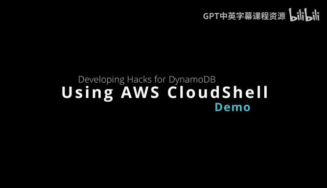
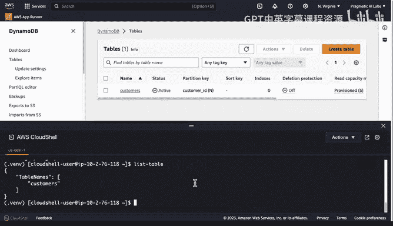

# 杜克大学《构建大规模云计算解决方案（基础、虚拟化，1-2课／共4课Building Cloud Computing Solutions at Scale》 - P79：12_02_11_AWS Cloud Shell.zh_en - GPT中英字幕课程资源 - BV1oT421k7YQ

Here we have one of the most underused resources for development and configuration。

 which is the AWS Cloudhell。 If we take a look here。

 you can toggle it on and off in any of the console user interfaces Now。

 let me show you a few of the things here that are interesting。

 you can see that I deactivated a Python virtual environment。 So if you wanted to， for example。

 automatically get a particular set of Python code to load what you could do is you could use VI here。

And you can look at your bash RRC file， and you can actually activate a Python virtual environment automatically every time you actually log into a shell。

 So this can be pretty helpful。 So if I went through here， for example， and I typed in source。

Tilda bash or sea。You'll see it now loads this Python virtual environment。

 So what this means is that if I wanted to， I to install， for example， Bodo 3。

I could easily install Bo 3 and start developing against it。 Now。

 that by itself is actually pretty cool。 But another thing you can do that's shell based。

 And let's go ahead and deactivate this。😊，Is that I also can programmatically talk to other resources like。

 for example， dynamo Db。 and one of the things I could do here is actually create a new table。

 You can see that there are no tables here currently and if I wanted to programmatically create one let's go ahead and paste the command inside and we can see here AWS dynamo Db create table I create a table called customers。

 and then all I need to do is do the return。 and what this is gonna do is allow me to programmatically start building stuff via this cloud channel environment。

 So this is very handy as a kind of quick way to programmatically control things because AWS。

 you also have a command and tool based SDK。 And so then if I wanted to do things like list tables。

 for example， like a type an AWS dynamo。DB list tables。

And this really is a very efficient way to get started when you're developing is to kind of go back and forth and actually put this stuff inside of this Cloud shellll and just test your ideas out in many cases it's going to be much quicker than clicking through the goI and doing all the things you're doing and even in many cases quicker than developing it in code。

 Now let's go ahead and take a look at one other trick we can do that I'll close with。

 which is if we go back into the ba RRC file。 if you find yourself doing a lot of commands over and over again what you may want to do is type in these aliases inside of your bashRC file。

 and this will happen that it'll load automatically every time you open up your shell so we can say here that we're gonna to do an alias。

Called scan T。And what we can do is just put in this command so we can actually type in AWS。Dynamo。

DB。List tables。And actually， we want to change it to not be scan table。 We want to do list。

List table。😔，And let's go ahead and save this。And let's do a refresh here。

 so we'll say a source tilde bash our sea。And now if we type in listist table。

 notice that it actually shows up automatically autocomplets。And as well， if I type in alias。

 it'll actually show up here。As well as one of the aliases that's available。

 So if we go ahead and run that， we just have in a list table。

 Now we can actually list the table automatically。 So there are a lot of really key innovations that you can put inside of your workflow by creating aliases inside of the Cloud channel environment and as a developer in some scenarios。

 this actually might be the most efficient way to develop against a service on AWS。

