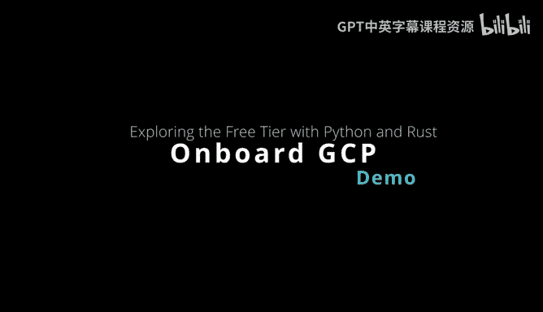
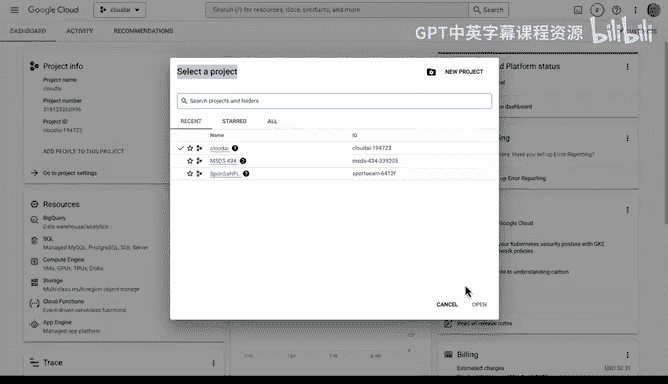
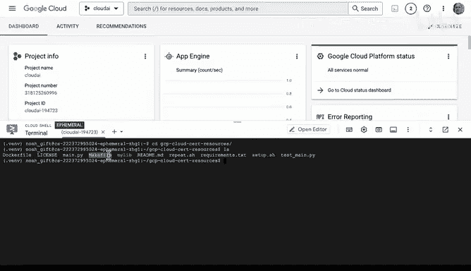
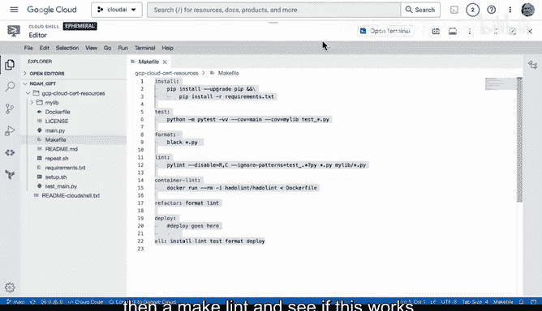
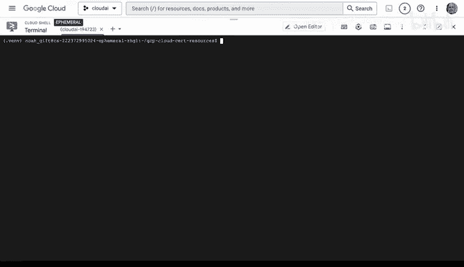
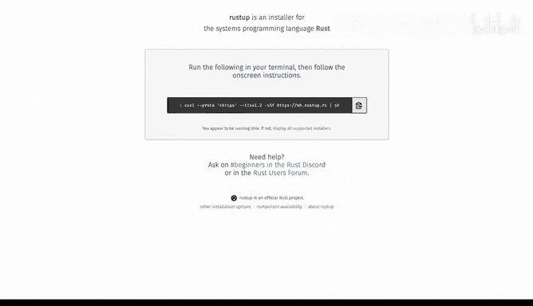
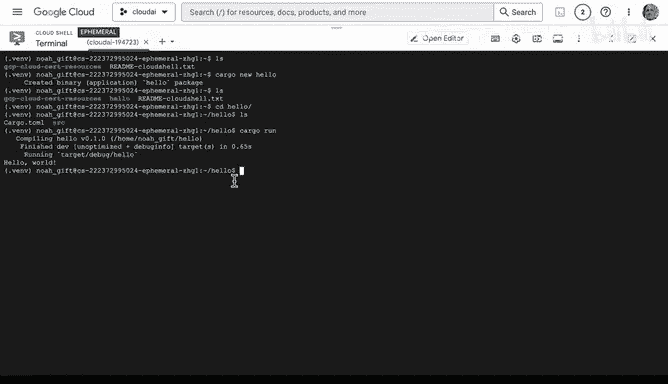
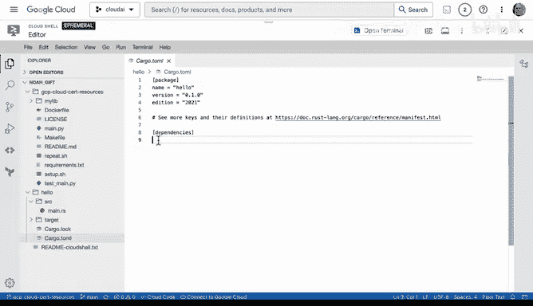
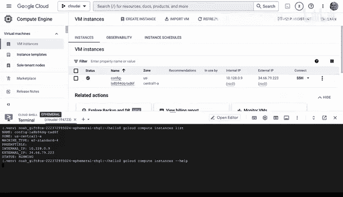
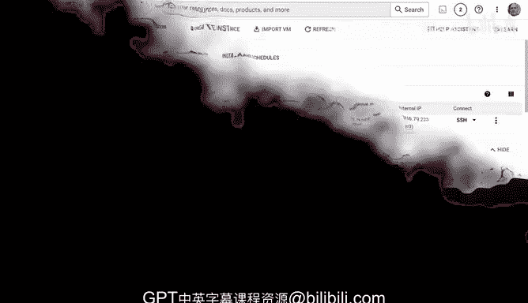

# 构建大规模云计算解决方案：P80：13_02_12_Google Cloud Shell



## 概述

在本节课中，我们将学习如何开始使用Google Cloud Platform。我们将从了解免费套餐开始，然后重点探索一个核心工具——Google Cloud Shell。我们将学习如何在Cloud Shell中设置开发环境，运行Python和Rust代码，并初步了解如何通过命令行管理云资源。

---

## Google Cloud 免费套餐

首先，我们来看看Google Cloud的免费套餐。

如果你从Google Cloud免费套餐开始，你可以访问20种免费产品。你还会获得**$300的免费额度**，但需要在三个月内使用完毕。免费套餐包含的部分产品有：
*   Compute Engine
*   Cloud Storage
*   BigQuery
*   Kubernetes
*   App Engine
*   Cloud Run
*   Cloud Build
*   Stackdriver
*   Filestore
*   Pub/Sub
*   Cloud Functions
*   Vision AI
*   Speech-to-Text
*   Natural Language API
*   AutoML

这里确实提供了大量的免费服务。接下来，让我们开始实际操作。

---

## 进入云控制台

我将进入云控制台仪表板。你可以在这里看到所有内容的概览。首先，我们有项目信息。在项目信息中，你可以决定例如如何向项目添加人员、配置项目设置等。



此外，中间的仪表板显示了一些最近访问过的服务。右边还有一个资源标签页，显示你可以切换查看的不同资源，例如，如果你想启动一台虚拟机。右侧还会显示状态信息。

当你使用Google Cloud时，这里将是你最常使用的起点。请注意，我在这里选择了一个项目。如果我想创建一个新项目，我会点击“选择项目”并创建一个新项目。

---

## 启动Cloud Shell

当你初次接触Google Cloud Platform时，我建议你启动**Cloud Shell**。让我们开始操作。

Cloud Shell非常方便，因为你可以立即在这个环境中开始构建解决方案、尝试各种想法。

我喜欢做的第一件事是创建一个Python虚拟环境，以便测试Python项目并在Cloud Shell中运行它们。我将首先执行以下操作：

```bash
python3 -m venv .venv
```

这将在我的主目录下创建一个隐藏的虚拟环境目录。操作成功。

然后，我喜欢编辑我的`.bashrc`文件。在这里，我可以添加一行命令来自动激活Python虚拟环境：

```bash
source ~/.venv/bin/activate
```

这是一个实用的小技巧。现在，每次我打开这个环境时，Python虚拟环境都会自动激活，这解决了许多与Python相关的奇怪问题。

---

## 克隆并运行代码

如果我想进入一个存放代码的仓库，例如这里有一些Python代码，并且我不想推送更改回去，我可以进入这个环境并直接执行`git clone`。让我们开始操作：

```bash
git clone <你的仓库URL>
```





现在，我有了我的Python代码。如果我进入这个仓库目录，可以看到我有一个测试文件和其他一些内容。

我喜欢使用`Makefile`，因为它允许我使用快捷命令。我们甚至可以进入编辑器查看代码，这是Google Cloud平台内部一个很好的资源。

在这个目录中，我们有一个`Makefile`。你可以看到我可以执行`install`、`test`、`format`、`lint`、`container`、`refactor`等命令。这包含了在Google Cloud环境中工作时非常常见的一些操作。

让我们返回并测试一下，只需执行`make install`，然后执行`make lint`，看看是否有效。

```bash
make install
```

这将进入我的`requirements.txt`文件并安装所有包。安装完成后，我可以继续并检查我的代码：





```bash
make lint
```

看起来我们的代码检查成功了。你甚至可以查看这个文件，看看`main`函数里有什么，这是一个非常简单的应用程序。

---

## 安装Rust环境

现在Python可以工作了，我们还能做什么？我们还可以安装Rust。我将访问`rustup.rs`，复制安装命令，然后在这里粘贴执行。这将下载Rust环境，包括`cargo`和`clippy`（代码检查工具）。基本上，这提供了成为Rust开发者所需的一切。

我喜欢用Rust编程的原因之一是，根据你所做的事情，它的性能可能比Python好**40倍到1000倍**。因此，如果你想进行高性能计算，这通常是一个非常好的选择。

安装程序已经将其添加到了我的路径中。所以如果我在这里，实际上可以运行`cargo`。我可以创建另一个“Hello World”项目：

```bash
cargo new hello
```

这将在这里创建一个示例目录。进入目录后，与Python不同，我不需要执行任何额外步骤，可以直接运行：

```bash
cargo run
```





它编译并输出了我们的“Hello, world!”。如果我们想查看该项目的结构，可以看到这是一个非常简单的“Hello World”文件。如果我想要添加依赖项，例如GCP SDK，我可以在这里的`Cargo.toml`文件中完成。

这是一个开发者需要做的一些事情的很好概述。同样，我认为Python和Rust是两种非常理想的编程选择。

---

## 管理虚拟机实例

我要做的最后一件事是启动一台虚拟机并查看它。这里已经有一台正在运行的实例。如果我想创建一个新的，可以点击“创建实例”并启动某种类型的机器。

例如，如果我想启动一个微型实例，你可以看到我将花费的成本估算会显示在这里，包括月度估算。实际上它是按小时计费的。如果我选择一台非常大的机器，可以看到在这个特定环境中，一台32核的机器每月大约需要**$500**。因此，确保查看你启动的机器的不同指标非常重要。

由于我已经有一台正在运行的机器，我需要做的就是通过命令行来查询它。在Google Cloud的教程中，查看如何通过命令行列出机器是非常常见的操作。

我的历史命令中已经有一条相关记录。查看历史命令也是一个获得快捷方式的好方法：

```bash
history
```

如果我输入`gcloud compute instances list`，可以看到我实际上可以控制它。我甚至可以通过使用这个基础命令来启动东西：

```bash
gcloud compute instances
```

如果你需要更多关于特定命令的信息，可以随时运行`help`。Google Cloud确实是一个以命令行导向的服务。因此，如果你理解命令行，使用Google Cloud将会有很好的体验。

---

## 总结





本节课中，我们一起学习了如何开始使用Google Cloud Platform。我们首先了解了免费套餐的内容，然后深入探索了Cloud Shell这个强大的工具。我们学习了如何在其中设置Python虚拟环境、克隆代码仓库并使用`Makefile`运行项目。接着，我们安装了Rust开发环境并运行了简单的程序。最后，我们了解了如何通过云控制台和`gcloud`命令行工具来查看和管理虚拟机实例。希望你能亲自尝试这些命令，开始你的Google Cloud之旅。