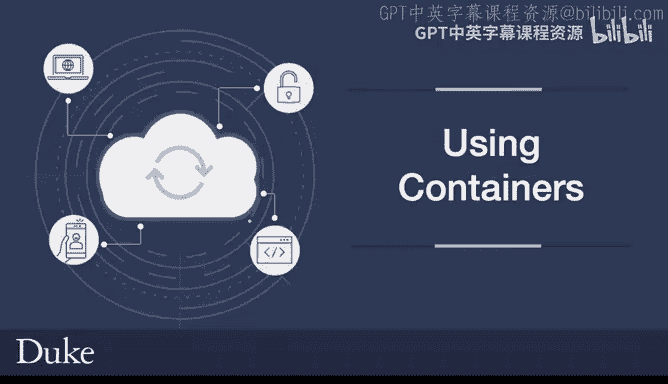
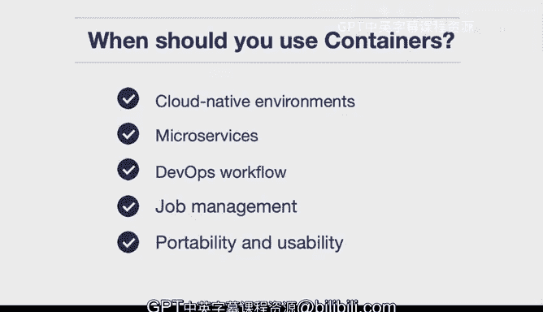

# 杜克大学《构建大规模云计算解决方案（基础、虚拟化，1-2课／共4课Building Cloud Computing Solutions at Scale》 - P82：15_02_03_容器使用实践.zh_en - GPT中英字幕课程资源 - BV1oT421k7YQ

When should you use containers， This is a very relevant question in the modern cloud era。

 and there are a few really compelling reasons first。If you want to build a cloud native environment。

 oftentimes containers can be an excellent choice because of all of the advancements that are happening in the cloud like managed container services where you take a container deploy it as a service and it's really the simplest possible way to deploy an application also with cloud native。

 there are many cloudmanaged Kubernetes services that can take care of things so oftentimes cloud nativeative is a great reason to use a container。

 Another one is microservices microservices are a way of solving a problem and a very efficient and simple way where one service does one thing and it works really well with a container。

 a container allows you to basically build something that's reproducible and fits in this microservice workflow。

Another one is Devops， so you may be asking yourself， you know what are the Devops best practices。

 Well， one of them would be to reproduce the environment as well as the source code。 So in this case。

 DevOs allows you to programmatically build the container as well as programmatically build out the source code and deploy it into an ecosystem using infrastructure as code。

 So Devops workflows work really well with containers。

 Another one that's maybe intuitive in a way is job management where you'll see that a lot of times when you're building jobs over and over again and you're reproducing these jobs that oftentimes the containerbased workflow works very well。

 So that's why many build service companies or software as or service build companies are using containers to manage their workloads。

 Finally， portability and will also say usability。Is another key component and in fact in DevOs and data science these are two domains where portability can really pay dividends so for example if you're a data scientist and you have a whole environment that does some let's say a drug discovery workflow and you give someone your source control code and inside of that source control repository there's no way to reproduce the runtime well giving them the source code didn't really solve a problem for them but with a container it allows the runtime as well to be included and this is a key takeaway is this this runtime when you're able to package it in with your project it's completely reproducible which is a key ten of science so there are many good reasons there's more than this。

 but these are a few of the top reasons for using containers。

