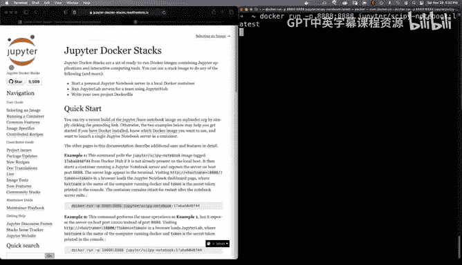

# 构建大规模云计算解决方案：1-2：从Docker Hub运行容器 🐳

在本节课中，我们将学习如何从Docker Hub获取并运行一个容器。Docker Hub是创建、管理和交付容器最便捷的平台。我们将以运行一个Jupyter Notebook容器为例，展示如何快速搭建一个复杂的数据科学工作环境，而无需在本地进行繁琐的配置。

---

## 访问Docker Hub

根据官方文档，Docker Hub是创建、管理和交付容器最简便的方式。我们可以访问Docker Hub网站，选择登录或直接浏览现有的容器镜像。

以下是访问Docker Hub的步骤：
1.  打开浏览器，访问 Docker Hub 网站。
2.  你可以选择登录账户，也可以直接浏览公共仓库。
3.  在搜索栏中，可以查找你需要的容器镜像，例如 “jupyter”。

---

## 拉取容器镜像

一个很好的例子是Jupyter。如果想在macOS或Windows上搭建一个基于Jupyter的环境，过程可能相当复杂。但通过Docker，我们可以简化这一流程。

在Jupyter的Docker Hub页面向下滚动，可以找到`docker pull`命令。复制该命令，在终端中粘贴并执行，即可下载由Jupyter专家创建并维护的、功能完整的Jupyter Notebook环境镜像。

**命令示例**：
```bash
docker pull jupyter/scipy-notebook
```
执行此命令后，我们就下载了最新的Jupyter镜像。这个生态系统的强大之处在于，之后我们可以轻松尝试不同版本或更复杂的Jupyter配置，而完全不影响本地环境。

---

## 运行容器



现在，让我们看看如何实际使用这个镜像。我们可以使用`docker run`命令来启动容器。

如果想运行最新版本的镜像，可以使用以下命令：
```bash
docker run -p 8888:8888 jupyter/scipy-notebook:latest
```
其中，`-p 8888:8888`将容器内的8888端口映射到宿主机的8888端口，`:latest`指定拉取最新的镜像标签。

执行此命令后，Docker会启动一个包含了所有最新特性和依赖的Jupyter Notebook实例。这极大地简化了环境配置，避免了因环境差异导致的混乱。

启动后，你可以在终端看到Jupyter实例的运行日志。它默认在前台运行，并会输出一个带有令牌（token）的访问URL。

---

## 使用Jupyter Notebook

现在，Jupyter实例已经运行。如果你正在学习Python或数据科学，这可能是最推荐的工作流程之一，尤其适合初学者。

在浏览器中打开终端提供的URL（通常是 `http://localhost:8888`），即可进入Jupyter界面。

在Jupyter界面中，你可以点击“New”按钮，然后选择“Python 3”来创建一个新的Notebook，或者选择“Terminal”来打开一个终端。

让我们快速尝试一下。选择打开一个终端，输入命令`uname -a`，你会发现容器内部实际上运行着一个Linux系统。这是容器环境非常强大的一点。你甚至可以运行`top`命令来查看进程情况。

这是一种极其强大的本地开发方式，无需维护复杂的本地工作流。

---

## 在容器中进行数据分析

接下来，我们新建一个Python 3 Notebook，并尝试一些操作。这是一个常见的数据科学工作流。

首先，导入pandas库：
```python
import pandas as pd
```
然后，创建一个DataFrame。这里我们使用一个关于糖消费量的研究数据URL：
```python
df = pd.read_csv('你的数据CSV文件URL')
```
接着，我们可以使用`df.describe()`方法来查看数据的描述性统计信息。这个数据集展示了美国各州及不同教育水平的糖摄入量，其中存在教育水平与糖摄入量之间的负相关关系。

最后，我们可以进行简单的可视化。使用`df.plot()`即可生成图表。

**核心概念**：整个过程展示了如何在不触碰操作系统的情况下，开发复杂的应用程序。容器本身为你解决了环境依赖问题。

---

## 总结

本节课中，我们一起学习了如何从Docker Hub拉取并运行容器镜像。我们以Jupyter Notebook为例，演示了通过几条简单的Docker命令，就能快速获得一个功能完整、隔离的复杂应用运行环境。


无论是Jupyter Notebook、Postgres数据库还是大数据系统，使用容器都是简化系统搭建、快速入门系统工程的高效方式。它消除了环境配置的障碍，让开发者能更专注于应用本身。