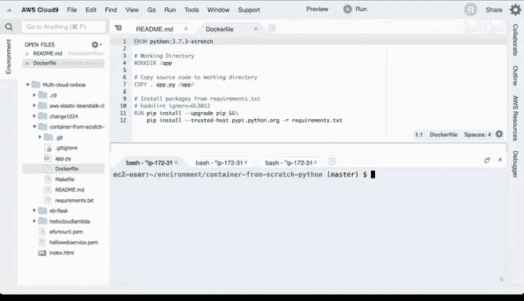

# 杜克大学《构建大规模云计算解决方案（基础、虚拟化，1-2课／共4课Building Cloud Computing Solutions at Scale》 - P85：18_02_08_从零构建Docker容器项目.zh_en - GPT中英字幕课程资源 - BV1oT421k7YQ

Let's look at a very simple project that allows you to build a container from scratch。

 there's only a few files necessary。 first， let's look at this Docker file。Inside this Docker file。

 you can see that I inherit from Python 3。This is the core image where the core developers have expertise that I don't have and I use their expertise。

 I make an app directory， I copy an application file and then I go through here and install third party packages great so that's the Docker file well what about the application file let's go ahead and take a look at that。

If look at this application file， you can see that it's a very simple kmelan tool that accepts a name and then prints out what your name is so it's a hello world kmelan tool So how do we containerize this and get this working Well let's go ahead and clone this project into AWS cloud9 which is a cloud based development environment I'm going to go ahead and copy this。

Go over to this environment and type in gett clonelogne。There we go， now I'm going to CDd into there。

And what we'll see here is again the same structure for the project and what I'm going to do is I'm going to read the readme here to see how I could actually go through here and。

Run this project， so the instructions say that in order to run it。

 I would just need to run in this command。And first we'll run it and then I'll explain it so you can see here Docker run dash I。

 the name of the repository where this is stored， which is externally located。In of。Docker hubub。

 and then I pass in some parameters just like this， so let's go ahead and run this。Great。

 so you can see here what happens is now that I've run at once。嗯。

I can put in different parameters and use it over and over again。

 but the whole idea is that the runtime is located somewhere else now。Now。

 if I want to run this locally， I could actually put in a Docker build command。

 so let's go ahead and put this inside of this repo， let's say Docker build dashtag。

I'll call this tag app and I'll run dot and what the dot says is just look inside this current working directory and build what's in this Docker file。

 so let's go ahead and do that。Here we go， so it's running it locally。

And then if I want to look at this and run it， I can actually say Docker image LS。

 and it'll show me the latest copies， here we go， where here's the app。

 and so if I want to run this locally， I could just say I could slightly change this readme file。

 come in and say Docker run。

Dash IT in this case， instead of putting this remote image， what I'll do is I'll use a local one。

And then I'll do the same thing， I'll just put in these commands and this will run the local version of that image。

There we go， so you can see that you can use a Docker container that's hosted somewhere else or you can actually build it yourself and actually customize it and push it somewhere else。

