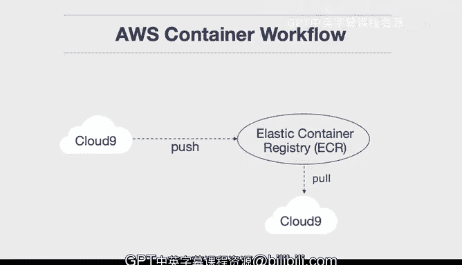

# 构建大规模云计算解决方案：1-2：推送项目至AWS ECR注册表 📦

在本节课中，我们将学习如何在AWS上使用容器化工作流。具体来说，我们将使用Cloud9环境作为核心开发场所，构建一个容器镜像，并将其推送到AWS的私有容器注册表——弹性容器注册表（ECR）。随后，我们将在另一个全新的Cloud9环境中拉取并运行该容器，从而体验容器化带来的“一次构建，随处运行”的强大能力。

上一节我们介绍了容器化开发的基本概念，本节中我们来看看如何将其应用于AWS云平台。

## 创建ECR仓库

首先，我们需要在AWS上创建一个容器注册表仓库来存储我们的镜像。

以下是创建ECR仓库的步骤：
1.  登录AWS管理控制台，导航到“弹性容器注册表（ECR）”服务。
2.  点击“创建仓库”。
3.  为仓库命名，例如 `container-scratch`。
4.  保持其他设置为默认，然后点击“创建仓库”。

仓库创建成功后，系统会显示用于推送镜像的命令。我们稍后会用到这些命令。

## 在开发环境中构建并推送镜像

接下来，我们回到最初的Cloud9开发环境。假设该环境中已有一个包含 `Dockerfile` 和应用程序源代码的项目。

以下是推送镜像到ECR的完整流程：
1.  **登录ECR**：使用AWS CLI提供的命令进行身份验证，以便Docker客户端可以与ECR通信。
    ```bash
    aws ecr get-login-password --region <region> | docker login --username AWS --password-stdin <account-id>.dkr.ecr.<region>.amazonaws.com
    ```
2.  **构建Docker镜像**：在项目根目录下，使用Docker构建镜像。
    ```bash
    docker build -t container-scratch .
    ```
3.  **为镜像打标签**：为本地镜像打上符合ECR仓库地址的标签。
    ```bash
    docker tag container-scratch:latest <account-id>.dkr.ecr.<region>.amazonaws.com/container-scratch:latest
    ```
4.  **推送镜像**：将打好标签的镜像推送到远程ECR仓库。
    ```bash
    docker push <account-id>.dkr.ecr.<region>.amazonaws.com/container-scratch:latest
    ```

在云环境中执行此操作的一大优势是网络带宽。Cloud9实例与ECR注册表之间的数据传输发生在AWS云内部，速度极快。这比从本地慢速网络连接推送要高效得多，能显著节省容器开发时间。

## 在新环境中拉取并运行镜像

当镜像正在推送时，我们可以准备第二个环境。我们创建一个新的Cloud9环境，命名为“pull-container”。这是一个全新的、干净的环境，无需安装任何依赖。

镜像推送完成后，我们切换到新的Cloud9环境。

以下是拉取并运行镜像的步骤：
1.  **登录ECR**：同样，在新环境中需要先登录ECR才能拉取私有镜像。可以使用命令行历史快速找回登录命令。
    ```bash
    # 从历史记录中执行之前的登录命令
    aws ecr get-login-password ... | docker login ...
    ```
2.  **拉取镜像**：从ECR仓库拉取我们刚刚推送的镜像。
    ```bash
    docker pull <account-id>.dkr.ecr.<region>.amazonaws.com/container-scratch:latest
    ```
3.  **运行容器**：基于拉取的镜像启动一个容器。运行命令可能与开发时类似，但镜像来源变为ECR。
    ```bash
    docker run -p 8080:8080 <account-id>.dkr.ecr.<region>.amazonaws.com/container-scratch:latest
    ```

执行后，应用程序将在新环境中成功运行。我们可以多次运行此命令，验证其可重复性。

## 核心概念与总结

回顾整个流程，其核心架构可以概括为以下模式：
```
[开发环境：构建镜像] --> [推送至ECR注册表] --> [任何环境：拉取并运行镜像]
```




本节课中我们一起学习了完整的AWS容器工作流。关键收获在于，你可以在一个位置（如Cloud9）进行开发并将变更推送至中央仓库（ECR），团队中的其他成员或生产服务器可以轻松地拉取这些变更，并精确复现你的开发环境。这为团队协作和应用部署提供了一种高效、一致的云原生开发方式。