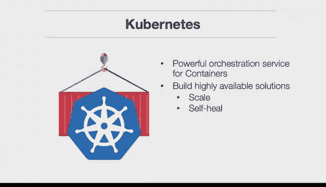
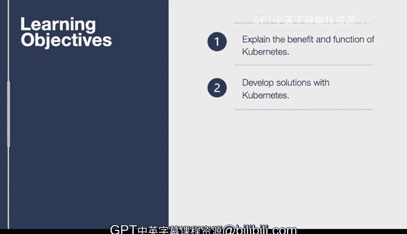

# 构建大规模云计算解决方案：1-2：Kubernetes入门 🚀

在本节课中，我们将深入学习Kubernetes。Kubernetes是一个强大的容器编排服务，它允许你构建高可用性的解决方案，以及能够自动扩展和自我修复的解决方案。

我们将探讨一些关键的学习目标。首先，我们会了解Kubernetes究竟是什么，它存在的原因是什么，它是如何开发的，以及为什么谷歌要开源Kubernetes。我们还将学习如何使用Kubernetes开发一个解决方案，以便你能亲自动手，利用Kubernetes服务构建一个编排层。

---

## 什么是Kubernetes？🤔

上一节我们概述了课程目标，本节中我们来看看Kubernetes的核心定义。

Kubernetes是一个开源的容器编排平台，用于自动化部署、扩展和管理容器化应用程序。它最初由谷歌设计并开源，现在由云原生计算基金会（CNCF）维护。

Kubernetes将构成应用程序的容器分组为逻辑单元，以便于管理和发现。它旨在提供“以容器为中心的基础架构”。

---

## 为什么需要Kubernetes？🔍

了解了Kubernetes是什么之后，本节我们来探讨其产生的原因和必要性。

随着微服务架构和容器技术（如Docker）的普及，应用程序被分解为许多小型、独立的服务。手动管理这些容器的部署、网络连接、扩展和故障恢复变得极其复杂且容易出错。

Kubernetes解决了以下核心问题：
*   **自动化部署与扩展**：可以声明期望的应用程序状态，Kubernetes会自动将实际状态调整至期望状态。
*   **服务发现与负载均衡**：Kubernetes可以为容器组分配IP地址和DNS名称，并能在它们之间负载均衡流量。
*   **自我修复**：它会重启失败的容器、替换和重新调度容器，并杀死不响应用户定义健康检查的容器。
*   **密钥与配置管理**：可以存储和管理敏感信息（如密码）和应用程序配置，而无需将其嵌入容器镜像。

---

## Kubernetes的核心架构 🏗️

现在我们已经知道了Kubernetes解决的问题，接下来我们剖析其核心架构组件。

一个Kubernetes集群由一组称为**节点**的机器组成。这些节点分为两类：**控制平面**和**工作节点**。

以下是主要组件及其功能：

**控制平面组件（管理集群）**
*   **kube-apiserver**：公开Kubernetes API，是控制平面的前端。
*   **etcd**：一个高可用的键值存储，用作Kubernetes所有集群数据的后备存储。
*   **kube-scheduler**：监视新创建的、未指定运行节点的Pod，并选择节点让Pod在上面运行。
*   **kube-controller-manager**：运行控制器进程，这些控制器处理集群级别的常规任务，例如节点故障、副本数量维护等。

**工作节点组件（运行容器）**
*   **kubelet**：一个在集群中每个节点上运行的代理，它确保容器在Pod中运行。
*   **kube-proxy**：维护节点上的网络规则，实现Kubernetes服务概念。
*   **容器运行时**：负责运行容器的软件，例如Docker、containerd。

---

## 关键概念与对象 📦

理解了架构，本节我们介绍一些你必须掌握的核心Kubernetes对象。

**Pod**
Pod是Kubernetes中可以创建和管理的最小可部署计算单元。一个Pod封装了一个或多个应用容器、存储资源、唯一的网络IP以及控制容器运行方式的选项。
```yaml
apiVersion: v1
kind: Pod
metadata:
  name: myapp-pod
spec:
  containers:
  - name: myapp-container
    image: nginx:latest
```

**Deployment**
Deployment为Pod和ReplicaSet提供声明式更新。你描述一个期望状态，Deployment控制器就会以受控速率将实际状态更改为期望状态。它是管理无状态应用的标准方式。
```yaml
apiVersion: apps/v1
kind: Deployment
metadata:
  name: nginx-deployment
spec:
  replicas: 3
  selector:
    matchLabels:
      app: nginx
  template:
    metadata:
      labels:
        app: nginx
    spec:
      containers:
      - name: nginx
        image: nginx:1.14.2
```

**Service**
Service定义了一组Pod的逻辑集合和访问它们的策略。Service使Pod之间的相互发现和通信成为可能，并为外部访问提供稳定的IP地址和DNS名称。
```yaml
apiVersion: v1
kind: Service
metadata:
  name: my-service
spec:
  selector:
    app: MyApp
  ports:
    - protocol: TCP
      port: 80
      targetPort: 9376
```

---

## 动手实践：部署一个简单应用 🛠️

理论需要结合实践，本节我们将通过一个简单示例，体验如何使用Kubernetes部署一个Nginx应用。

1.  **创建Deployment**：使用上面的Deployment YAML示例，创建一个运行3个Nginx副本的部署。
    ```bash
    kubectl apply -f nginx-deployment.yaml
    ```

2.  **查看部署状态**：检查Deployment和它创建的Pod是否正常运行。
    ```bash
    kubectl get deployments
    kubectl get pods
    ```

3.  **创建Service**：使用上面的Service YAML示例，创建一个Service来暴露这个Nginx部署。
    ```bash
    kubectl apply -f nginx-service.yaml
    ```



4.  **访问应用**：获取Service的外部访问地址（例如使用`kubectl get svc`查看`CLUSTER-IP`或在云环境中查看`EXTERNAL-IP`），然后在浏览器中访问该IP地址，你应该能看到Nginx的欢迎页面。

---



## 总结 📝

本节课中我们一起学习了Kubernetes的基础知识。我们从了解Kubernetes作为容器编排平台的定义和必要性开始，然后深入探讨了其核心架构，包括控制平面和工作节点的各个组件。接着，我们学习了Pod、Deployment和Service这三个关键对象的概念和作用。最后，我们通过一个部署Nginx的简单示例，将理论知识付诸实践。

掌握这些基础概念是构建和管理大规模、高可用容器化应用的第一步。在后续课程中，我们将基于此，探索更高级的Kubernetes特性和实践。