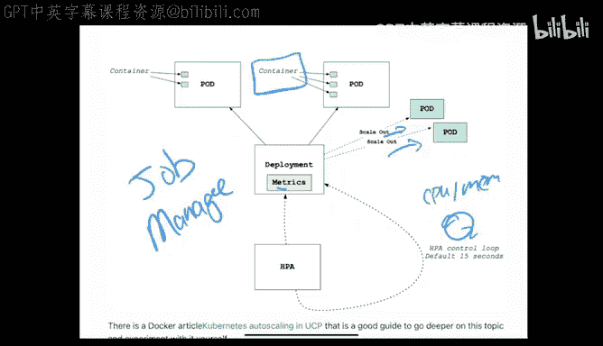

# 杜克大学《构建大规模云计算解决方案（基础、虚拟化，1-2课／共4课Building Cloud Computing Solutions at Scale》 - P91：24_02_03_Kubernetes架构概览.zh_en - GPT中英字幕课程资源 - BV1oT421k7YQ

Let's talk through Kubernetes which is a orchestration layer for containers。

 there's a couple ways to install it， one is Docker desktop is a great way to install it either on Windows or on Mac。

If you're a more advanced user， you could actually go through here and do a cube CTL command and you could use these curl commands。

 but let's get into the overview now so what is Kubernetes and how did actually get it start well it started in 2014 and it was developed by Google and it's a useful tool for containerized applications。

 So really the idea is it's a container orchestration system right that's the key difference and Amazon has one that hosts the Kubernetes service Google has one called Gke and Microsoft has one called AK so there's a lot of different places to use these containers and in particular。

 a few of the big capabilities of Kubernetes are highly available architecture， auto scaling。

 rich ecosystem service discovery， health management。

 secrets andration management There's a lot of things that come with。

Kubernetes that you get for free so let's go through and look at a basic workflow and walk this through so the first thing you would do this is really step number one is you would create a Kubernetes cluster the next step would be you could deploy your application right so you go through here push a application into the cluster and then number three you would want to expose the port so this means that your internal port would be exposed to let's say a web browser or a mobile client now when there's more traffic and the traffic is know exceeding the demands of the current environment you could tell the application to automatically scale up and then later so that would be step number four and then later potentially you'd want to do another update using let's say continuous delivery and that would happen by pushing changes automatically to the cluster so what is the cluster architecture。

In general， it looks something like this where your entire cluster when you say cluster。

 there's a lot of stuff going on underneath the hood。 and in particular。

 one of the things to be aware of is a node right so if you see this is kind of the basic structure right of a node。

 but let's dig into those details。 So first up we have actual containers themselves。

 So if you look at a Docker format container that Docker format container would be one of these but you can have multiple containers running inside something called a pod And so that's what this does is a pod goes through here。

And you could run some series of containers inside and then have a IP address associated with it。

 alternately you also can have multiple pods all running inside of a Kubernetes node so you can have multiple containers inside of a pod and you can have multiple pods inside of a node Now the master is where all of the controls take place so this Kubernetes API here allows the orchestration to these different nodes and so that's really the reason for this Kubernetes architecture is that you can scale things up and down and you have control over you know starting and stopping containers and so it's a jobs orchestration system so it's really like the puppet master of your system So where can you run these things well as I mentioned before you can run it with Amazon A you can run it on Google through Google GkeE or Azure with their Kubernetes service you also。

If you're using Docker， you can actually run it locally and here's a good example of a very simple Kubernetes application where you could expose it on port 8080 and that would be the service and then inside of here you would have your endpoints where things would get set up and you can have a separate database that would live here。

When you want to deploy it， you could just say Docker stack deploy so you can also do complex Kubernetes based applications locally on your laptop Now let's get into the killer feature of Kubernetes which is the ability to auto scale up and down and the way that works。

Is via this thing called the horizontal pod autoscalealar。

 So let's kind of scroll through and take a look at this。

 So what happens is that this H control loop is going through and just constantly you know in a loop looking at the different metrics from the system and looking for health metrics like。

 you know， maybe CPU。Memory， things like that and if there's a threshold that's met what happen is the nodes will actually scale out and there'll be more nodes that go up and so this is really the core architecture and why Kubernetes in general works really well for job management is that it has the ability to listen to everything that's happening。

 look at the health metrics and kind of scale things up and down so in a nutshell。

 that's what containers are inside of Kubernetes that they're all isolated inside of this master architecture and Kubernetes is the thing that controls it and so if it's been something that mystifies you before this is a way of kind of simplifying things and really looking at the fact that underneath the hood here you've got a container and you've got a system that orchestrates that container and really that's Kubernetes in a nutshell。

