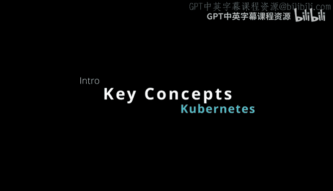
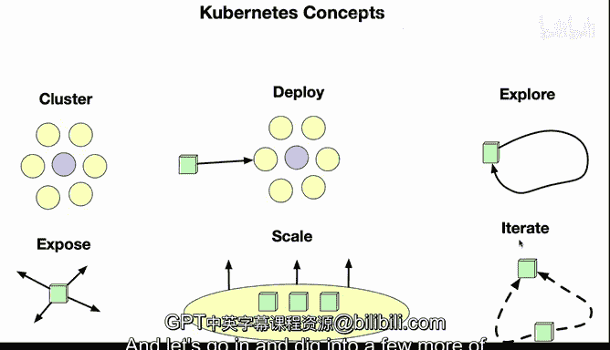

# 构建大规模云计算解决方案：1-2：Kubernetes核心概念 🚢

在本节课中，我们将学习Kubernetes的几个核心概念。这些概念是理解和使用Kubernetes进行容器编排的基础。我们将逐一介绍集群、部署、探索、暴露、扩展和滚动更新，并解释它们如何协同工作以管理容器化应用。

## 集群（Cluster）

首先，我们来讨论集群。集群的核心概念是一组由API控制的节点集合。

这个集群可以运行在你的虚拟机上，也可以存在于基于云的环境中，或者在你自己的数据中心里。集群具备可扩展性，这意味着你可以根据需要增加或减少节点数量。

## 部署（Deployment）

上一节我们介绍了集群，本节中我们来看看如何将应用部署到集群中。部署是指将容器化应用程序移入集群并启动它的过程。

这是一种非常常见的实践。以下是部署的典型步骤：
*   你可以从一个公共容器注册中心（如DockerHub）获取容器镜像。
*   然后将该镜像移入你的部署系统，并在Kubernetes集群中启动它。

## 探索（Exploring）

一旦你的应用部署完成并运行起来，下一步就是探索和迭代。这意味着你可以对已部署的应用程序进行测试、调试和功能迭代，以不断改进它。

## 暴露（Exposing）

在应用部署并经过初步探索后，通常需要将其提供给外部用户使用。暴露的概念就是将你的应用程序公开到外部世界。

具体做法是通过一个公共端口来提供服务，使其他用户或系统能够访问你的应用。

## 扩展（Scaling）

当应用对外提供服务后，可能会面临流量增长的压力。扩展功能使你能够响应特定事件（如CPU使用率过高或内存不足）。

以下是扩展的机制：
*   监控到资源指标达到阈值。
*   自动或手动为已部署的应用程序提供更多资源（例如，增加Pod副本数）。

## 滚动更新（Rolling Update）

最后，一个非常常见的用例是为你的应用程序发布新版本，即进行滚动更新。

这个过程允许你迭代容器化应用程序的多个版本，实现不停机升级。以下是其工作方式：
*   逐步用新版本的Pod替换旧版本的Pod。
*   确保在更新过程中，服务始终可用。

这些是使用Kubernetes时最常见的一些场景。在接下来的课程中，我们将更深入地探讨其中一些场景。

本节课中，我们一起学习了Kubernetes的六大核心概念：**集群**、**部署**、**探索**、**暴露**、**扩展**和**滚动更新**。理解这些概念是掌握Kubernetes容器编排技术的第一步。