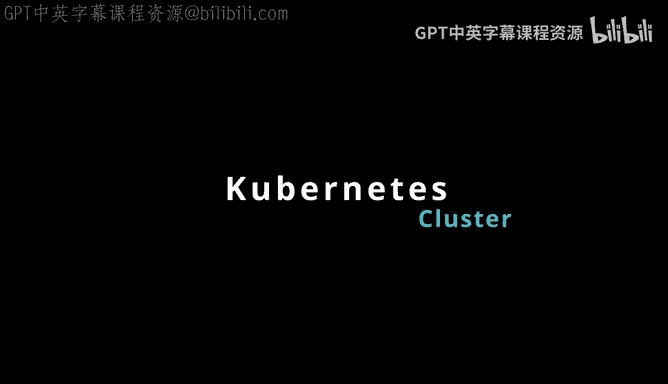
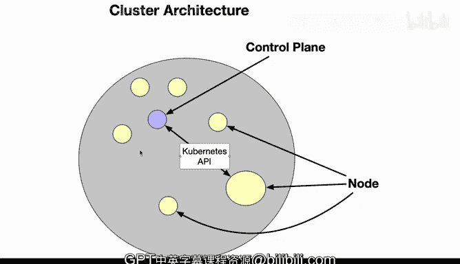

# 构建大规模云计算解决方案：1-2：Kubernetes集群架构

在本节课中，我们将学习Kubernetes集群的基本架构，了解其核心组件及其协作方式。

## 概述

Kubernetes集群架构包含几种不同类型的资源。首先，有一个协调整个集群的控制平面。节点则是运行具体工作负载的工作者。

上一节我们介绍了云计算的基本概念，本节中我们来看看Kubernetes如何组织这些计算资源。

## 核心组件

以下是Kubernetes集群的两个主要组成部分：

*   **控制平面**：这是集群的大脑，负责协调所有活动。在上图中，它用紫色圆点表示。
*   **节点**：这些是实际运行应用程序的工作者。集群中有多个节点，它们通过**Kubernetes API**与控制平面进行通信。

## 架构详解

从集群示意图中可以看到，所有节点都处于控制平面的管理之下。它们处理不同类型的工作负载，具体取决于您所构建的Kubernetes架构。

一个节点可以运行在物理计算机、虚拟机或集群环境中。理解这一点很重要：Kubernetes集群是一个逻辑上的概念集群，而其物理节点可能分布在多种不同的地理位置或基础设施中。

## 总结

本节课中我们一起学习了Kubernetes集群的基础架构。我们了解到集群由**控制平面**和**工作节点**组成，控制平面负责协调，节点负责执行任务，它们共同通过Kubernetes API协作，形成一个统一的计算资源池。