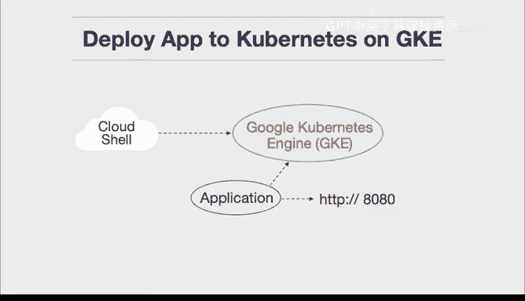
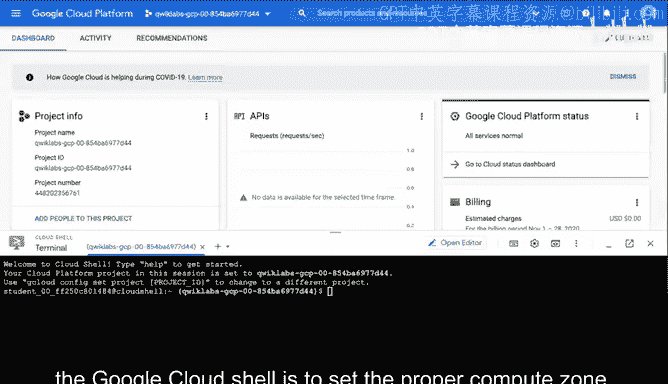
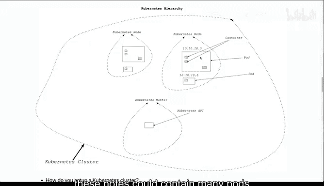
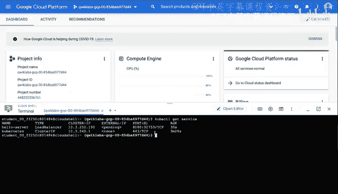
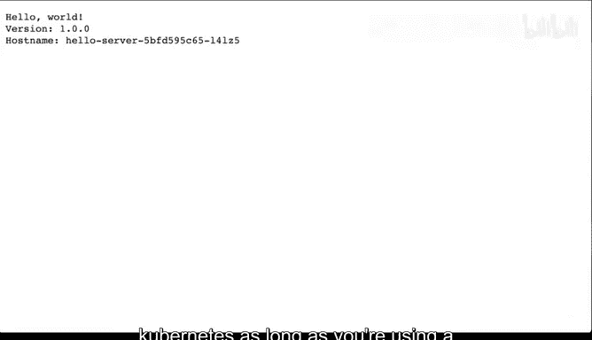
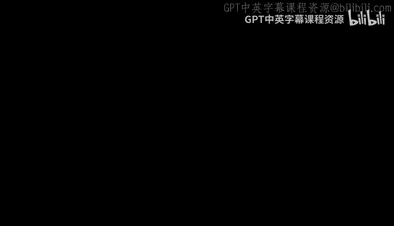

# 构建大规模云计算解决方案：1-2：在GKE上部署应用到Kubernetes 🚀

在本节课中，我们将学习如何在Google Kubernetes Engine上部署一个应用程序。我们将从创建集群开始，然后推送应用镜像，最后通过负载均衡器将应用暴露到互联网上。

---

上一节我们介绍了Kubernetes的基本概念，本节中我们来看看如何实际操作。首先，我们需要理解Kubernetes集群的基本架构。它是一个可以弹性伸缩的复杂系统，由**主节点**控制多个**工作节点**，每个工作节点包含多个**Pod**，而每个Pod又可以运行多个**容器**。

接下来，我们进入Google Cloud控制台开始设置。

## 设置计算区域与创建集群





在Google Cloud Shell上运行任何操作的第一步是设置正确的计算区域。这决定了我们的资源将在哪个地理位置被创建和运行。

以下是具体步骤：

1.  使用以下命令设置计算区域（例如 `us-central1-a`）：
    ```bash
    gcloud config set compute/zone us-central1-a
    ```
2.  使用以下命令创建一个名为 `cloud-for-data` 的Kubernetes集群。这个过程可能需要几分钟时间。
    ```bash
    gcloud container clusters create cloud-for-data
    ```
    此命令会在后台自动配置集群的所有组件，包括主节点和工作节点。

集群创建成功后，我们可以看到其详细信息，包括名称、位置、主节点版本、IP地址、机器类型、节点版本和节点数量（例如3个）。

## 认证集群与部署应用

现在集群已经运行，我们需要对其进行认证，以便能够通过 `kubectl` 命令控制它。

以下是具体步骤：



1.  获取集群的认证凭据：
    ```bash
    gcloud container clusters get-credentials cloud-for-data
    ```
2.  部署一个示例应用。我们将从Google Container Registry拉取一个名为 `hello-server` 的镜像并创建部署。
    ```bash
    kubectl create deployment hello-server --image=gcr.io/google-samples/hello-app:1.0
    ```

## 创建服务与访问应用

应用部署完成后，我们需要创建一个Kubernetes服务来暴露它。这里我们将创建一个负载均衡器类型的服务，它将自动处理流量并具备伸缩能力。

以下是具体步骤：

1.  将部署的应用通过负载均衡器在端口8080上暴露：
    ```bash
    kubectl expose deployment hello-server --type=LoadBalancer --port 8080
    ```
2.  检查服务的状态，以获取外部访问IP地址。初始状态可能为 `Pending`。
    ```bash
    kubectl get service hello-server
    ```
    需要多次运行此命令，直到 `EXTERNAL-IP` 字段从 `pending` 变为一个具体的IP地址（例如 `35.222.100.99`）。
3.  使用获得的外部IP地址和端口（`8080`）在浏览器中访问应用，例如 `http://35.222.100.99:8080`。此时应能看到应用成功运行的页面。



## 清理资源

在实验或开发环境完成后，及时清理资源以避免产生不必要的费用非常重要。但在生产环境中，删除集群需要格外谨慎。

以下是删除集群的步骤：

1.  运行以下命令删除我们创建的集群：
    ```bash
    gcloud container clusters delete cloud-for-data
    ```
2.  在提示确认时输入 `y`。集群及其所有相关资源将被删除。



---



本节课中我们一起学习了在Google Kubernetes Engine上部署和管理应用的完整流程。我们首先创建并配置了Kubernetes集群，然后部署了容器化应用，接着通过负载均衡服务将应用暴露给外部访问，最后清理了所有资源。这个过程展示了利用云平台的高级抽象能力，可以相对轻松地运行和管理复杂的Kubernetes应用，这正是云计算的关键优势之一。