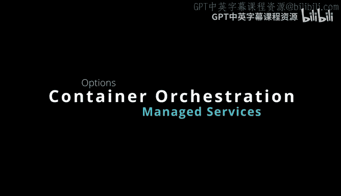
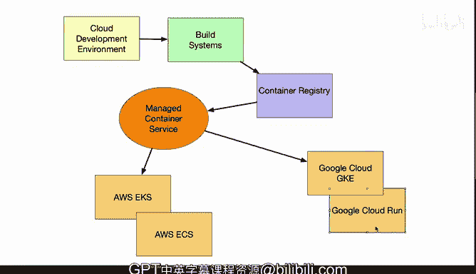

# 杜克大学《构建大规模云计算解决方案（基础、虚拟化，1-2课／共4课Building Cloud Computing Solutions at Scale》 - P97：30_02_10_容器编排方案对比.zh_en - GPT中英字幕课程资源 - BV1oT421k7YQ

Here we have several different options on managing containerbased deployment services。

 but they have a lot of similarity。 So in this scenario you could be in a cloudbased development or。

 maybe you're an AWS cloud 9 or you're in the Google cloud development Or in a cloud workstation or potentially in GiHub and as you're developing you can test things locally build containers。

 but then eventually as you go to production， you'll go through and push this through a build system。

 So in the case of Gitthub， it could be Github actions in the case of AWS it could be AWS build system but the idea is these containers get pushed to a container registry and typically if you're in a cloud provider you'll use your cloud provider container registry。

 but you also could use other public registries like Dockerhub and then from here there's a managed container service and there's lots of different options for managed container services。

 typically someone would want to use the highestle service that's possible。

That's efficient in terms of cost and so in terms of AWS。

 instead of you going to maybe a virtual machine and setting up your own cluster。

 you could actually use a managed Kubernetes cluster with AWS EKS。

 Likewise you could use an alternative like a homegrown container orchestration service with AWS ECS and there's a lot of services in AWS that communicate with this。

Other cloud platforms， it's kind of a similar thing。 If you go to Google Cloud， you go to GkeE。

 For example， you could push something directly into the managed Kubernetes service because it'll be much easier since they're going to manage that service for you or you could even use a very highleve service like Google Cloud run where it's actually trivial to deploy something to Kubernetes because you have a container and you just run one command and it pushes it into production。

 So in general， this is the overlay that you should expect when dealing with cloudbased systems and typically you do not want to deploy things through your own self-managed Kubernetes cluster。

 you want to actually let the other experts do the heavy lifting for you。

