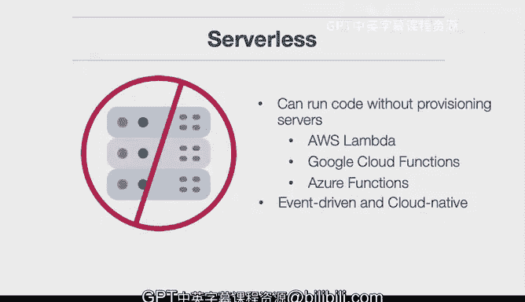

# 杜克大学《构建大规模云计算解决方案（基础、虚拟化，1-2课／共4课Building Cloud Computing Solutions at Scale》 - P99：32_03_02_微服务架构简介.zh_en - GPT中英字幕课程资源 - BV1oT421k7YQ

In this lesson， we tackle a microserv architecture。We learn about how theyre small。

 specialized and autonomous services that are all rage in new cloud native architectures。

 Let's cover the learning objectives for this lesson。 First。

 we apply Devops best practices to microservices。 Even though microservices themselves are a huge advancement。

 They're also a part of a larger Devopps practice， which includes continuous delivery continuous integration and also best practices around monitoring and alerting。

 Well， also evaluate different types of microservice architectures。

 including event driven web services and other architectures that can lead to the success of your project or the failure of your project。

 depending on how you do it。 Now， let's talk about serverless itself， one of the key terms here。

 So serverless means that you can run code without provisioning servers。

 And this is one of the best advancements。In the modern era of computing。

That you can ask for and that you don't need to worry about the low level details of provisioning machines。

A good example of this would be AWS Lambda， which is a eventbased service that also can map to let's say。

 object creation events or web service events or any event really on the AWS platform。

 Google Cloud functions is another service that has a similar architecture to AWS Lambda where it can map to different events and also Azure functions is a good example as well a service that can map to different events so in a nutshell serverless is a new paradigm that's a event drivenn that's cloud native。

