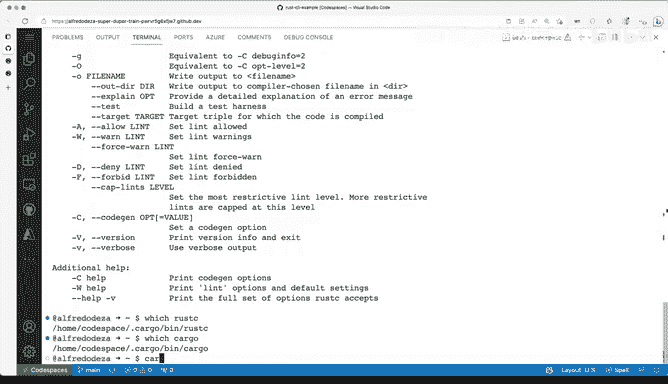

# 004：安装Rust 🛠️

在本节课中，我们将学习如何在您的计算机上安装Rust编程语言。我们将以Linux系统为例，演示一个简单直接的安装过程，该方法同样适用于Mac系统。如果您使用的是Windows系统，也可以找到相应的安装程序。

## 概述

安装Rust的过程非常直接。本示例将使用Linux系统进行演示。如果您使用的是Mac电脑，在终端中执行相同的命令同样有效。如果您既不使用Linux也不使用Mac，可以查看其他支持的安装程序，例如为Windows系统下载可执行的Rust安装程序。因此，您有多种不同的选择。

## 安装步骤

以下是安装Rust的具体步骤。我们将使用一个命令，该命令会下载一个脚本并通过shell执行。

首先，我切换到终端。这里有一个正在运行的终端。让我们先查看一下当前系统的类型。在这个例子中，我运行的是Linux操作系统。为了确认，我可以查看`/etc/os-release`文件的内容。这里显示是Ubuntu 20.04，这是一个长期支持版本。所以，这是一个基于Debian的Linux操作系统，没有问题。

现在，清空屏幕并粘贴安装命令。命令中使用了`curl`工具，协议是HTTPS，这没问题。它会使用TLS版本，并带有一些额外的标志。这个命令将下载脚本并执行文件。如果您不熟悉管道符`|`，它的作用是获取内容然后执行它们。现在，我按下回车键。

接下来会发生的是，安装程序被下载，并且我看到了几个不同的选项。让我向上滚动一点。我看到了“欢迎使用Rust”的提示。安装程序会为我动态创建一些东西，例如像`cargo`这样的实用工具会有其单独的目录。我们稍后会深入探讨`cargo`是什么以及它如何工作。但这个安装过程会设置好一切，非常方便。一些将被更新的内容会放在这些配置文件中，这些文件将帮助我为安装的工具获取正确的路径。

让我们继续查看选项。在Linux上，这将安装默认版本的Rust。默认配置文件是没问题的。修改PATH环境变量吗？是的，我希望修改PATH变量。这意味着我终端中可用的命令将被更新，以包含Rust及其所有其他工具。

所以，我选择继续并完成安装。在绝大多数情况下，这都是您想要使用的选项。在某些特殊情况下，您可能希望进行一些自定义安装和调整，这当然也可以。但对于本课程，我们将继续进行常规安装。

我输入`1`然后按回车。这需要一点时间，让我们等待它完成。很好，Rust现在已经安装完成，一切似乎都成功完成了。

## 验证安装

那么，如何验证安装是否成功呢？您可能想做的第一件事就是输入`rustc`命令。但如果您立即这样做，可能会得到“命令未找到”的错误。这是为什么呢？因为我还没有更新我的PATH环境变量。

如果我执行`echo $PATH`，输出会很长，因为它指向了许多包含可执行文件的不同路径，但这些路径中没有一个包含实际存放Rust二进制文件和所有额外工具的路径。

因此，我需要运行`source $HOME/.cargo/env`这个命令。让我们执行它。

现在，如果我再次输入`rustc`，您将看到完整的帮助菜单。如果我执行`which rustc`来查看这个命令来自哪里，您会看到它来自我主目录下的`.cargo/bin`目录。了解这一点很有用，这也是我们验证Rust可执行文件位置的方式。

我向上滚动，可以看到我得到了帮助菜单以及`rustc`的许多不同选项。其他工具也已经被安装，例如`cargo`。所以，如果我输入`which cargo`，它会指向我主目录下的`.cargo`子目录。如果我输入`cargo --help`，清屏后再运行一次，我们也会得到许多输出选项。

## 总结

总而言之，这是一种非常直接的安装Rust的方法，非常简洁，非常容易遵循，特别是如果您不进行额外调整，只是按照提示操作。请记住，我必须在命令行中调用`source`命令，这确保了Rust工具链中安装的可执行文件在我的系统中可用。

本节课中，我们一起学习了如何通过官方脚本在Linux/Mac系统上安装Rust，如何通过修改PATH环境变量使命令生效，以及如何使用`rustc`和`cargo --version`等命令来验证安装是否成功。