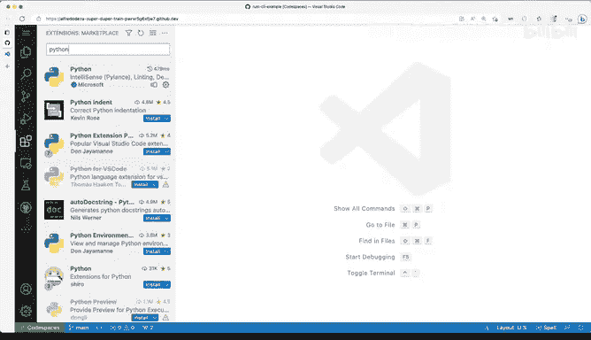

# 008：同步你的设置 🔄

在本节课中，我们将学习如何在不同的 Visual Studio Code 实例之间同步你的设置、配置和扩展。这个功能对于确保你在任何地方工作都能获得一致的开发体验至关重要。

---

上一节我们介绍了 Visual Studio Code 的基本界面，本节中我们来看看如何通过设置同步功能，让你的开发环境保持一致。

我推荐启用设置同步功能。它允许你在不同的 Visual Studio Code 实例之间同步你的设置、配置以及所有可以在 VS Code 中更改的内容。你可以选择同步哪些项目，但我强烈建议启用此功能。

你可能会问，我只有本地桌面上的一个 VS Code，为什么要启用同步？因为在某些情况下，例如我们稍后将使用的 Codespaces，它允许你在云端使用 VS Code。这意味着你本地的环境可能与云端的版本不匹配，因此你会希望启用配置同步功能。

现在，我将引导你完成操作。让我们从我的本地 VS Code 版本开始。

这是我的本地 VS Code。我需要进入的菜单在这里。由于视频录制，菜单可能被截断，但如果你点击左下角的齿轮图标，你会看到最底部显示“设置同步已开启”。点击此处，我可以进行配置或查看同步设置。

让我们看看配置界面是什么样子。我选择同步所有内容。但你可能不想同步某些代码片段或快捷键，你完全可以在这里进行配置。

一个需要注意的重要选项是“扩展”同步。这意味着，我在这里本地安装的任何扩展，当我在其他地方安装 VS Code 时，它都会自动拉取并安装这些扩展。这无疑是确保我的扩展始终可用的好方法。

那么，如果我在其他地方有另一个 VS Code 实例，这意味着什么？这需要你登录账户。让我们看看这个非本地的 VS Code 实例。

这是另一个 VS Code 实例。我需要在这里点击“管理”按钮，然后系统会提示我开启设置同步。

让我们看看点击后会发生什么。系统会询问是否确认开启。我选择“是，登录并开启”。

当你尝试登录时，你可以选择要使用的账户。我使用 GitHub 账户，因为它对我来说很常用。点击登录后，你可以看到设置同步正在开启，并开始尝试获取我所有的配置设置。

接下来，扩展将开始安装，你会看到蓝色的下载图标，这表示正在安装。这就是因为我启用了设置同步，它非常有用。

如果我查看正在安装的内容，我可能会有 Rust 分析器。再看看我的设置，可能有一些 Markdown 相关的配置。我肯定安装了很多不同的东西，可能还有 Python 相关的扩展。你可以看到 Python 扩展也安装了，因为我偶尔会写 Python 代码。

因此，这就是为什么这个功能会很有用，尤其是在本课程中。我们有时会使用本地 VS Code，但也会在云端通过 Codespaces 使用 VS Code。

我知道我们还没有介绍 Codespaces，这将在后续课程中涉及。但你现在就应该启用设置同步，以便之后无论你在何处使用 VS Code，你的设置和配置都已准备就绪。

---

本节课中我们一起学习了如何启用和配置 Visual Studio Code 的设置同步功能。通过登录账户，你可以在不同设备或云端环境（如 Codespaces）中保持编辑器设置、快捷键和扩展的一致性，从而提升开发效率和体验。这是一个简单但强大的工具，能确保你的 Rust 开发环境随时随地都处于熟悉和高效的状态。