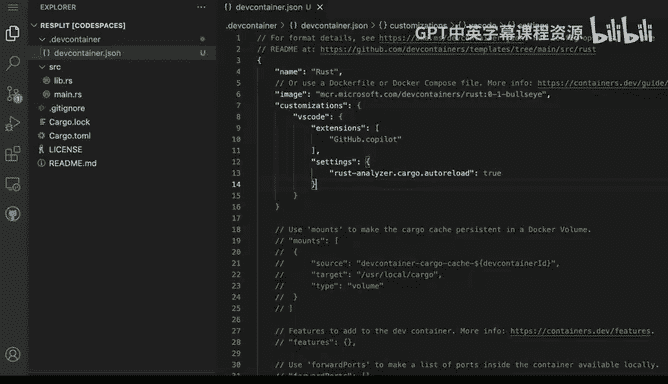

# 021：自定义编辑器 🛠️

在本节课中，我们将学习如何在开发容器中自定义Visual Studio Code编辑器，特别是如何通过配置自动安装扩展和设置，以确保每次创建新的开发环境时都能获得一致且个性化的体验。

## 概述

上一节我们介绍了开发容器的基本概念。本节中，我们来看看如何通过修改开发容器配置文件，来自动化安装像Github Copilot这样的编辑器扩展，并统一其他编辑器设置，从而实现开发环境的标准化。

## 自定义编辑器扩展

我们希望定制编辑器环境。具体操作是，对现有项目进行一些配置更改。这个项目与我们之前使用的项目相同，已经配置了开发容器，这没有问题。


我推荐的做法之一是安装Github Copilot扩展。以下是具体步骤：

1.  打开VSCode的扩展面板。
2.  搜索“Github Copilot”。
3.  点击安装按钮。

安装完成后，扩展会启用并开始工作。你可以在编辑器界面上看到它已激活的提示。


## 实现配置自动化

然而，为每一个新的代码空间手动重复此安装过程并不是一个好主意。我们的目标是实现自动化，让环境配置标准化。我们将通过修改开发容器配置文件来实现这一点。

操作方法是，在已安装的Github Copilot扩展旁边，点击齿轮图标，然后选择“添加到devcontainer.json”。

点击后，系统会提示配置已更改。我们可以先不立即重建容器，而是查看具体更改了哪些内容。

关闭当前提示，打开文件资源管理器，找到并打开 `.devcontainer/devcontainer.json` 文件。你会看到文件中新增了一个 `customizations` 部分，其中 `vscode` 的 `extensions` 列表里现在包含了Github Copilot。

```json
{
  "customizations": {
    "vscode": {
      "extensions": [
        "GitHub.copilot"
      ]
    }
  }
}
```

## 理解配置的重要性

这个改动非常重要，因为现在我可以将此配置文件提交到版本库中。下次我打开一个新的代码空间时，Github Copilot扩展将自动安装并可供使用。这就是实现标准化设置的关键，它能确保我每次都能获得完全一致的开发环境。

就像我们在本地VSCode中管理扩展一样，在开发容器配置中，我们不仅可以管理扩展，还可以统一其他设置。

## 自定义编辑器设置

除了扩展，我们还可以配置编辑器设置。例如，如果我想针对Rust语言进行一些特定设置，比如调整rust-analyzer的行为，我可以在配置文件中添加 `settings` 部分。

以下是添加自动重载设置的示例：

```json
{
  "customizations": {
    "vscode": {
      "extensions": [
        "GitHub.copilot"
      ],
      "settings": {
        "rust-analyzer.checkOnSave.command": "clippy",
        "rust-analyzer.checkOnSave.extraArgs": ["--", "-D", "warnings"]
      }
    }
  }
}
```

通过这种方式，我可以开始为我的环境进行各种定制，并确保每次使用代码空间打开这个特定项目时，所有设置都是统一应用的。

保存配置文件后，我可以选择重建容器，这些设置就会立即生效。此后，每次启动环境，这些配置都会自动应用。



## 总结


本节课中我们一起学习了如何配置你的文本编辑器环境。我们主要掌握了通过修改 `devcontainer.json` 文件来自动安装VSCode扩展和统一编辑器设置的方法。这样就能确保团队协作或个人在不同机器上都能获得完全一致的开发体验。接下来，我们将看看如何对环境本身进行一些修改。