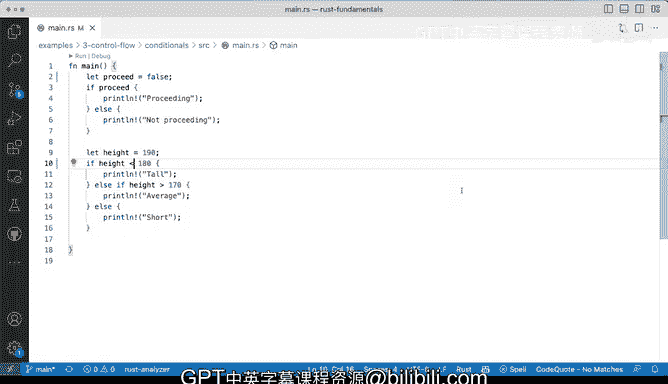

# 029：控制流基础 🚦


在本节课中，我们将要学习Rust中控制流的基础知识。控制流是编程的核心概念之一，它允许程序根据条件执行不同的代码块。我们将通过简单的示例来理解`if`、`else if`和`else`语句的使用方法。

## 基础语法与结构

上一节我们介绍了Rust的基本结构，本节中我们来看看控制流语句的语法。Rust中的控制流语句使用`if`、`else if`和`else`关键字，其基本结构如下：

```rust
if condition {
    // 条件为真时执行的代码
} else if another_condition {
    // 另一个条件为真时执行的代码
} else {
    // 所有条件都不满足时执行的代码
}
```

## 第一个示例：布尔条件

以下是使用布尔变量进行条件判断的示例。我们首先声明一个布尔变量，然后根据其值执行不同的代码块。

```rust
fn main() {
    let proceed = true;
    if proceed {
        println!("This is proceeding");
    } else {
        println!("Nope, not proceeding");
    }
}
```

在这个例子中，变量`proceed`被赋值为`true`。由于条件`if proceed`评估为真，程序将输出“This is proceeding”。如果将`proceed`的值改为`false`，程序将输出“Nope, not proceeding”。

## 第二个示例：数值比较

接下来，我们看看如何使用比较运算符进行条件判断。以下示例根据身高值输出不同的分类。

```rust
fn main() {
    let height = 190;
    if height > 180 {
        println!("That's tall");
    } else if height > 170 {
        println!("Average");
    } else {
        println!("Short");
    }
}
```

程序首先检查`height > 180`。如果为真，输出“That's tall”。如果为假，则检查`else if height > 170`。如果这个条件为真，输出“Average”。如果所有条件都不满足，则执行`else`块，输出“Short”。

## 常见错误与调试

在编写控制流语句时，初学者常会忘记语句结束的分号。例如，以下代码会导致编译错误：

```rust
let proceed = true  // 缺少分号
if proceed {
    println!("This is proceeding");
}
```

编译器会给出明确的错误信息，指出在特定行和列期望一个分号。按照提示添加分号即可修复错误。

## 总结



本节课中我们一起学习了Rust控制流的基础知识。我们了解了`if`、`else if`和`else`语句的基本语法，并通过布尔条件和数值比较两个示例实践了它们的用法。我们还讨论了常见的语法错误及其调试方法。掌握这些基础控制流语句是编写逻辑清晰程序的重要一步。