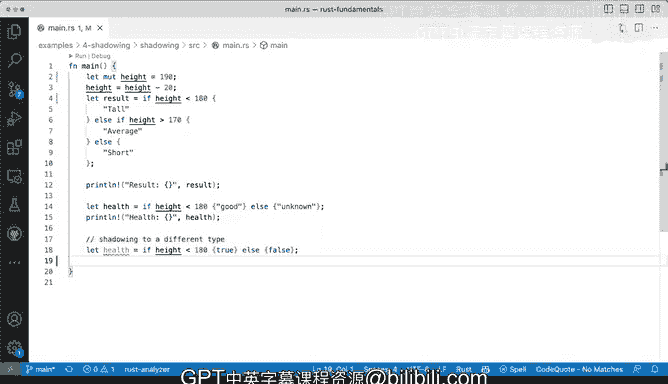

# 030：变量遮蔽演示


## 概述

在本节课中，我们将要学习Rust语言中的一个特性：**变量遮蔽**。我们将了解什么是变量遮蔽，如何在Rust中使用它，以及在使用过程中需要注意的一些重要事项，特别是与变量可变性和类型系统相关的细节。

---

## 变量遮蔽的概念

变量遮蔽是许多编程语言中常见的特性，Rust语言也支持这一特性。

变量遮蔽指的是定义一个变量后，**重新声明**同一个变量名并赋予它新的值。这个新值可以与之前的值类型相同，也可以不同。

## 基础遮蔽演示

以下是变量遮蔽的一个基础示例。

```rust
let height = 190;
let height = height - 20;
```

在这个例子中，我们首先定义了一个名为`height`的变量，其值为190。随后，我们使用`let`关键字再次声明`height`，将其重新赋值为原值减去20的结果。

## 可变性与遮蔽的区别

上一节我们介绍了基础的变量遮蔽。本节中我们来看看变量遮蔽与可变变量赋值之间的一个重要区别。

如果我们尝试直接修改一个不可变变量的值，编译器会报错。

```rust
let height = 190;
height = height - 20; // 错误：不能给不可变变量赋值
```

错误信息提示我们正在尝试修改一个不可变变量。为了使上述代码正常工作，我们需要将变量声明为可变的。

```rust
let mut height = 190;
height = height - 20; // 正确：可变变量可以重新赋值
```

请注意，使用`mut`关键字是**重新赋值**，而使用`let`进行遮蔽是**重新声明**一个新变量，只是名字相同。这是两个不同的操作。

## 结合条件表达式的遮蔽

Rust中的`if-else`块可以用作表达式并返回一个值，这个特性可以与变量遮蔽结合使用。

以下是结合条件表达式进行变量遮蔽的示例。

```rust
let height = 170;
let result = if height > 180 {
    "tall"
} else if height > 160 {
    "average"
} else {
    "short"
};
```

在这段代码中，`if-else`表达式根据`height`的值计算出结果字符串（“tall”、“average”或“short”），然后将这个结果赋值给新声明的变量`result`。注意，`if`和`else`分支的代码块末尾没有分号，这表明它们是一个表达式，其值是代码块中最后一行语句的值。

## 遮蔽时改变变量类型

变量遮蔽的一个独特之处在于，重新声明变量时，可以将其更改为完全不同的类型。

以下是改变变量类型的遮蔽示例。

```rust
let health = if height < 180 { "good" } else { "unknown" };
let health = true; // 将字符串类型的 health 遮蔽为布尔类型
```

我们首先将`health`定义为一个字符串类型（“good”或“unknown”）。随后，我们再次使用`let`声明`health`，并将其赋值为布尔值`true`。Rust编译器允许这样的操作。

## 重要注意事项

虽然Rust允许通过遮蔽更改变量类型，但开发者需要谨慎使用这一特性。

Rust是一门强类型语言，其类型系统是保证代码安全性和正确性的重要基石。随意更改变量类型可能会破坏类型安全带来的好处，使代码难以理解和维护。除非有充分的理由（例如在某些循环控制结构中），否则应避免仅仅为了便利而更改变量的类型。保持变量类型的清晰和一致，是编写高质量Rust代码的良好实践。

---

## 总结



本节课中我们一起学习了Rust的变量遮蔽特性。我们了解到变量遮蔽允许我们使用`let`关键字重新声明同名变量，并可以赋予其新的值，甚至可以是不同的类型。我们区分了变量遮蔽与使用`mut`进行重新赋值的不同。同时，我们也探讨了如何将遮蔽与条件表达式结合使用，并强调了在强类型语言的上下文中，虽然可以更改变量类型，但应当非常谨慎，并有充分的理由。理解这些概念有助于我们更灵活且安全地使用Rust进行编程。