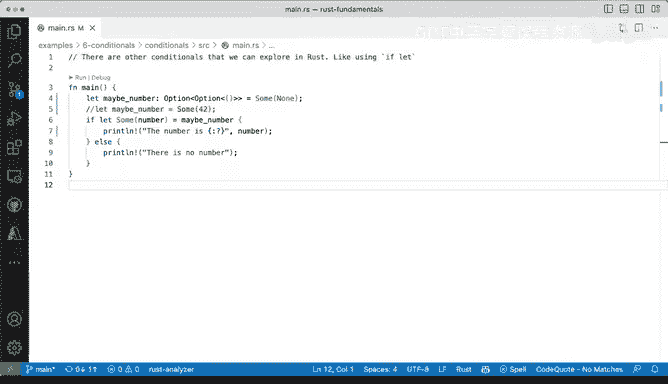

# 034：Rust条件语句


在本节课中，我们将学习Rust中一种特殊的条件语句用法，它允许我们在`if let`表达式中同时进行模式匹配和变量绑定。我们将通过一个具体的例子来演示这种语法，并理解其工作原理。

## 从变量定义开始

首先，我们定义一个变量`maybe_number`，它是`Psalm 42`的结果。实际上，`maybe_number`将是一个`Option<i32>`类型的值。

```rust
let maybe_number = Some(42);
```

## 理解 `if let` 语法

上一节我们定义了一个`Option`类型的变量。本节中我们来看看如何使用`if let`语法来处理它。

`if let`允许我们检查`maybe_number`是否是`Some`变体，并且如果是，则将其内部的值绑定到一个新变量上。

```rust
if let Some(number) = maybe_number {
    println!("number is {}", number);
}
```

在这段代码中，`number`是一个在`if let`分支内即时创建的变量。如果`maybe_number`是`Some(42)`，那么`number`将被赋值为`42`，并且代码块内的语句会执行。

## 运行示例代码

以下是运行上述代码的步骤和预期结果。

我们快速运行这段代码，可以看到输出是`number is 42`。这符合我们的预期。

## 处理 `None` 情况

现在，让我们修改代码，将`maybe_number`改为`None`，看看会发生什么。

```rust
let maybe_number: Option<i32> = None;
if let Some(number) = maybe_number {
    println!("number is {}", number);
}
```

当我们尝试运行这段代码时，会遇到一个错误。错误信息指出`Option<i32>`没有实现`std::fmt::Display` trait，因此无法直接用于`println!`宏。

## 解决编译错误

为了解决这个错误，我们需要遵循编译器的建议，使用`?`操作符或者明确处理`None`的情况。但在这个例子中，我们遇到了另一个问题：需要类型注解。

编译器在`maybe_number`为`None`时，无法推断出其具体类型。因此，我们需要显式地告诉编译器`maybe_number`的类型。

```rust
let maybe_number: Option<i32> = None;
```

通过添加类型注解`Option<i32>`，我们明确了变量的类型，使得编译器能够正确处理后续的`if let`表达式。

## 最终代码与总结

修改后的完整代码如下所示：

```rust
fn main() {
    let maybe_number: Option<i32> = None;
    if let Some(number) = maybe_number {
        println!("number is {}", number);
    }
}
```

运行这段代码，程序将不会打印任何内容，因为`maybe_number`是`None`，`if let`分支不会执行。



本节课中我们一起学习了Rust中`if let`条件语句的用法。这是一个将模式匹配和变量赋值结合在一起的语法糖。你可能会在其他语言中看到不同的写法，但在Rust中，这是一种常见且实用的模式，特别是在处理`Option`或`Result`枚举时。通过本节的学习，你应该能够理解并开始使用这种简洁的条件赋值方式。